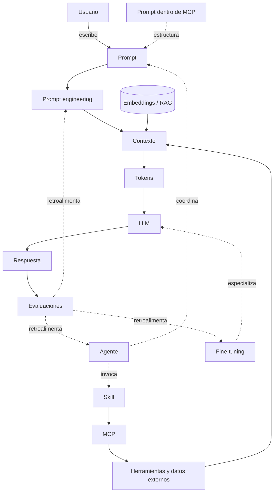

# Conceptos de IA Moderna

## Introduccion

Este libro explica, paso a paso, las piezas fundamentales de un sistema moderno de inteligencia artificial. No es un manual academico ni un recorrido superficial: es una guia que combina rigor tecnico con claridad para que cualquier persona que trabaje con sistemas de IA —ya sea como desarrollador, product manager, arquitecto o entusiasta informado— pueda entender como funcionan estas tecnologias desde adentro.

La inteligencia artificial moderna no es un bloque monolitico. Es una composicion de conceptos que se encajan: instrucciones bien formuladas, modelos capaces de procesar lenguaje, representaciones matematicas de significado, sistemas que conectan modelos con el mundo real, y agentes que coordinan todo eso para completar tareas complejas. Entender cada pieza por separado —y como se relacionan— es lo que permite construir, mejorar y evaluar sistemas de IA con criterio.

La idea es avanzar desde lo mas cercano al usuario hasta lo mas interno del sistema:

1. [Prompt](01-prompt.md)
2. [Prompt engineering](02-prompt-engineering.md)
3. [Contexto](03-contexto.md)
4. [Tokens](04-tokens.md)
5. [LLM](05-llm.md)
6. [Embeddings](06-embeddings.md)
7. [Fine-tuning](07-fine-tuning.md)
8. [Skill](08-skill.md)
9. [MCP](09-mcp.md)
10. [Prompt dentro de MCP](10-prompt-en-mcp.md)
11. [Agente](11-agente.md)
12. [Evaluaciones (LLM Evals)](12-evaluaciones.md)
13. [RPI (Research, Plan, Implement)](12-rpi.md)
14. [QRSPI](13-qrspi.md)
15. [RAG y Agentic RAG](14-rag.md)

## Como leer esta guia

Cada archivo sigue la misma estructura:

- Definicion simple
- Explicacion tecnica
- Ejemplo practico
- Relacion con los demas conceptos

Tambien se usan analogias para que las ideas sean mas faciles de visualizar sin perder precision.

## Flujo general

Una forma simple de ver todo el sistema es esta:

1. Una persona escribe un prompt.
2. El sistema agrega contexto util.
3. Todo eso se convierte en tokens.
4. Un LLM procesa esos tokens y genera una respuesta.
5. Un agente puede decidir si basta con responder o si conviene hacer pasos adicionales.
6. Si hace falta buscar informacion, usar herramientas o llamar servicios, pueden intervenir skills o MCP.
7. Si el sistema fue especializado para una tarea concreta, puede haber pasado por fine-tuning.
8. Si necesita buscar similitud semantica entre textos, puede usar embeddings.
9. Si el sistema necesita responder con informacion externa o especifica, puede usar RAG para recuperar documentos relevantes como contexto; si ademas necesita razonar sobre como buscar, puede usar Agentic RAG.
10. En todo momento, las evaluaciones (evals) miden si el resultado es bueno y si los cambios mejoran o empeoran el sistema.

## Diagrama del flujo general

## Analogía general

Imagina un restaurante:

- El prompt es lo que pide el cliente.
- El prompt engineering es la forma de redactar el pedido para que cocina lo entienda sin errores.
- El contexto es la informacion extra: alergias, ingredientes disponibles, hora del dia.
- Los tokens son las piezas pequenas en las que el sistema divide el pedido.
- El LLM es la cocina que interpreta y prepara la respuesta.
- Los embeddings son una forma de ordenar recetas parecidas cerca unas de otras.
- El fine-tuning es entrenar a la cocina para especializarse en un tipo de comida.
- Un agente es el jefe de cocina que decide que hacer primero, que herramienta usar y cuando pedir apoyo.
- Un skill es una capacidad extra, como un horno especial o un sumiller.
- MCP es el protocolo para conectar cocina con otras estaciones y herramientas.
- El prompt dentro de MCP es la instruccion concreta que se envia a traves de esa infraestructura.
- Las evaluaciones son los catadores y controles de calidad que comprueban que cada plato sale como debe.
- RPI es el proceso de trabajo del chef: primero revisa que hay en la despensa, despues planifica el menu del dia y recien entonces empieza a cocinar.
- QRSPI extiende ese proceso: el chef primero aclara que tipo de comensal llegara, luego investiga ingredientes disponibles, sintetiza una propuesta de platos, planifica la preparacion e implementa paso a paso.
- RAG es como enviar a un asistente a los archivos del restaurante antes de que el chef responda: el chef recibe los documentos relevantes y responde basandose en ellos, no en suposiciones. Agentic RAG es cuando el propio chef decide que buscar, cuanto buscar y evalua si lo que le trajeron es suficiente antes de preparar el plato.

## Resumen general

Un sistema moderno de IA no es solo un modelo aislado. Normalmente combina instrucciones, contexto, modelos, representaciones numericas, componentes de orquestacion y mecanismos de integracion con herramientas externas. Entender estos conceptos en conjunto permite ver el flujo completo: alguien pide algo, un agente organiza los pasos, el sistema prepara contexto, el modelo procesa la informacion y, si hace falta, se apoya en componentes externos para responder mejor.

Los patrones de trabajo como RPI y QRSPI agregan una capa de disciplina operativa: no solo importa tener los componentes correctos, sino tambien en que orden usarlos y como separar el razonamiento de la ejecucion.

RAG y Agentic RAG completan el cuadro al resolver como un sistema accede a informacion externa en tiempo real: RAG recupera documentos relevantes como contexto antes de que el LLM responda; Agentic RAG convierte esa recuperacion en un proceso activo donde el agente razona sobre como y cuanto buscar hasta tener fundamento suficiente para responder.

## Como usar este libro

Cada capitulo puede leerse de forma independiente, pero el orden propuesto tiene una logica: los primeros conceptos (prompt, contexto, tokens, LLM) son los mas fundamentales. Los siguientes (embeddings, fine-tuning, skill, MCP) son componentes que se agregan sobre esa base. Los ultimos (agente, evaluaciones, RPI, QRSPI) son patrones de orquestacion y disciplinas de trabajo que integran todo lo anterior.

Si eres nuevo en este campo, te recomendamos leer en orden. Si ya tienes experiencia, puedes saltar directamente al capitulo que necesitas y usar las secciones "Relacion con los demas conceptos" para navegar hacia referencias cruzadas.