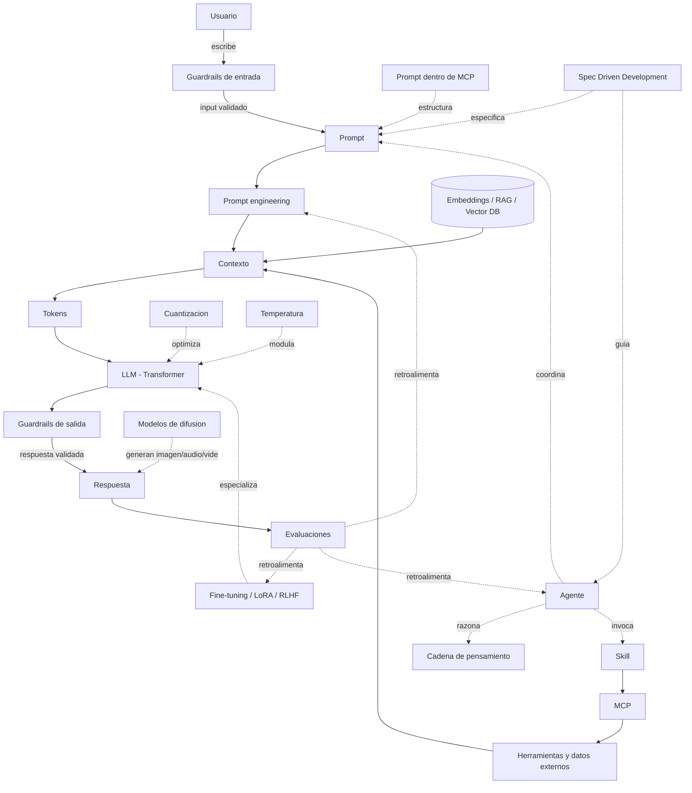

# Conceptos de IA Moderna

## Introduccion

Este libro explica, paso a paso, las piezas fundamentales de un sistema moderno de inteligencia artificial. No es un manual academico ni un recorrido superficial: es una guia que combina rigor tecnico con claridad para que cualquier persona que trabaje con sistemas de IA —ya sea como desarrollador, product manager, arquitecto o entusiasta informado— pueda entender como funcionan estas tecnologias desde adentro.

La inteligencia artificial moderna no es un bloque monolitico. Es una composicion de conceptos que se encajan: redes neuronales que aprenden patrones, modelos capaces de procesar lenguaje, representaciones matematicas de significado, sistemas que conectan modelos con el mundo real, y agentes que coordinan todo eso para completar tareas complejas. Entender cada pieza por separado —y como se relacionan— es lo que permite construir, mejorar y evaluar sistemas de IA con criterio.

El libro esta organizado en partes que avanzan de los fundamentos teoricos a la construccion practica de sistemas:

### Parte 1 — Fundamentos

1. [Redes neuronales](17-redes-neuronales.md)
2. [Transformer y atencion](19-transformer.md)
3. [Aprendizaje por transferencia (transfer learning)](18-transfer-learning.md)

### Parte 2 — Hablar con el modelo

4. [Prompt](01-prompt.md)
5. [Prompt engineering](02-prompt-engineering.md)
6. [Cadena de pensamiento (chain of thought)](25-chain-of-thought.md)
7. [Contexto y ventana de contexto](03-contexto.md)
8. [Tokens](04-tokens.md)
9. [LLM](05-llm.md)
10. [Temperatura](20-temperatura.md)
11. [Alucinaciones](21-alucinaciones.md)

### Parte 3 — Representaciones y datos

12. [Embeddings](06-embeddings.md)
13. [Base de datos vectorial](26-vector-database.md)

### Parte 4 — Especializar y optimizar modelos

14. [Fine-tuning](07-fine-tuning.md)
15. [RLHF (Reinforcement Learning from Human Feedback)](22-rlhf.md)
16. [LoRA](23-lora.md)
17. [Cuantizacion](24-cuantizacion.md)

### Parte 5 — Construir sistemas con IA

18. [Skill](08-skill.md)
19. [MCP](09-mcp.md)
20. [Prompt dentro de MCP](10-prompt-en-mcp.md)
21. [Agente](11-agente.md)
22. [RAG y Agentic RAG](14-rag.md)
23. [Guardrails](15-guardrails.md)

### Parte 6 — Disciplina y proceso

24. [Evaluaciones (LLM Evals)](12-evaluaciones.md)
25. [RPI (Research, Plan, Implement)](12-rpi.md)
26. [QRSPI](13-qrspi.md)
27. [Spec Driven Development](16-spec-driven-development.md)

### Parte 7 — Mas alla del lenguaje

28. [Modelos de difusion](27-diffusion.md)

## Como leer esta guia

Cada archivo sigue la misma estructura:

- Definicion simple
- Explicacion tecnica
- Ejemplo practico
- Analogia facil
- Diagrama
- Relacion con los demas conceptos
- Idea clave
- Resumen del capitulo

Tambien se usan analogias para que las ideas sean mas faciles de visualizar sin perder precision.

## Flujo general

Una forma simple de ver todo el sistema es esta:

1. Una persona escribe un prompt.
2. El sistema agrega contexto util.
3. Todo eso se convierte en tokens.
4. Un LLM (una red neuronal con arquitectura Transformer) procesa esos tokens y genera una respuesta.
5. La temperatura controla cuanto se aleja de la respuesta mas probable.
6. Un agente puede decidir si basta con responder o si conviene hacer pasos adicionales, posiblemente usando cadena de pensamiento para razonar paso a paso.
7. Si hace falta buscar informacion, usar herramientas o llamar servicios, pueden intervenir skills o MCP.
8. Si el sistema fue especializado para una tarea concreta, puede haber pasado por fine-tuning, RLHF o LoRA, y desplegarse cuantizado para ahorrar coste.
9. Si necesita buscar similitud semantica entre textos, puede usar embeddings almacenados en una base de datos vectorial.
10. Si el sistema necesita responder con informacion externa o especifica, puede usar RAG para recuperar documentos relevantes como contexto; si ademas necesita razonar sobre como buscar, puede usar Agentic RAG.
11. Las alucinaciones —respuestas que suenan bien pero son falsas— son un riesgo permanente que se mitiga con RAG, citas, temperatura baja y validacion.
12. En todo momento, las evaluaciones (evals) miden si el resultado es bueno y si los cambios mejoran o empeoran el sistema.
13. Los guardrails son las capas de control que rodean todo el sistema: validan lo que entra y lo que sale para garantizar que el sistema opere dentro de limites seguros y predecibles.
14. Spec Driven Development define el comportamiento esperado antes de implementar: la especificacion actua como contrato que guia al agente o al desarrollador y permite verificar automaticamente que el resultado es correcto.
15. Mas alla del texto, los modelos de difusion generan imagenes, audio y video a partir de prompts, completando el panorama de la IA generativa moderna.

## Diagrama del flujo general

## Analogía general

Imagina un restaurante:

- El prompt es lo que pide el cliente.
- El prompt engineering es la forma de redactar el pedido para que cocina lo entienda sin errores.
- La cadena de pensamiento es el chef pensando en voz alta los pasos antes de cocinar, en lugar de improvisar.
- El contexto es la informacion extra: alergias, ingredientes disponibles, hora del dia.
- Los tokens son las piezas pequenas en las que el sistema divide el pedido.
- El LLM es la cocina que interpreta y prepara la respuesta, construida sobre redes neuronales con arquitectura Transformer.
- La temperatura es cuanto se permite la cocina improvisar fuera de la receta clasica.
- Una alucinacion es cuando el cocinero, sin saber bien la receta, sirve algo plausible pero incorrecto.
- Los embeddings son una forma de ordenar recetas parecidas cerca unas de otras.
- La base de datos vectorial es el archivo donde estan guardadas todas esas recetas listas para buscar por parecido.
- El fine-tuning es entrenar a la cocina para especializarse en un tipo de comida.
- RLHF es cuando comensales prueban platos por pares y la cocina aprende cuales gustan mas.
- LoRA son notas al margen del recetario que adaptan la cocina a un estilo nuevo sin reescribir el libro.
- La cuantizacion es servir la misma carta en una cocina mas pequena ahorrando equipamiento.
- Un agente es el jefe de cocina que decide que hacer primero, que herramienta usar y cuando pedir apoyo.
- Un skill es una capacidad extra, como un horno especial o un sumiller.
- MCP es el protocolo para conectar cocina con otras estaciones y herramientas.
- El prompt dentro de MCP es la instruccion concreta que se envia a traves de esa infraestructura.
- Las evaluaciones son los catadores y controles de calidad que comprueban que cada plato sale como debe.
- RPI es el proceso de trabajo del chef: primero revisa que hay en la despensa, despues planifica el menu del dia y recien entonces empieza a cocinar.
- QRSPI extiende ese proceso: el chef primero aclara que tipo de comensal llegara, luego investiga ingredientes disponibles, sintetiza una propuesta de platos, planifica la preparacion e implementa paso a paso.
- RAG es como enviar a un asistente a los archivos del restaurante antes de que el chef responda: el chef recibe los documentos relevantes y responde basandose en ellos, no en suposiciones. Agentic RAG es cuando el propio chef decide que buscar, cuanto buscar y evalua si lo que le trajeron es suficiente antes de preparar el plato.
- Los guardrails son las normas del restaurante: los filtros de la cocina que aseguran que ningun plato con ingredientes prohibidos llegue a la mesa, que el personal no revele recetas secretas y que el menu solo incluya lo que el restaurante esta habilitado para ofrecer.
- Spec Driven Development es el plano detallado que el chef y el cliente acuerdan antes de que empiece la preparacion: define exactamente que plato se esperaba, con que ingredientes y en que presentacion. Si el plato final no coincide con el plano, se corrige antes de salir de la cocina.
- Los modelos de difusion son como un artista que dibuja el plato del menu a partir de una descripcion: no cocinan, pero generan la imagen visual del resultado.

## Resumen general

Un sistema moderno de IA no es solo un modelo aislado. Normalmente combina instrucciones, contexto, modelos, representaciones numericas, componentes de orquestacion y mecanismos de integracion con herramientas externas. Entender estos conceptos en conjunto permite ver el flujo completo: alguien pide algo, un agente organiza los pasos, el sistema prepara contexto, el modelo procesa la informacion y, si hace falta, se apoya en componentes externos para responder mejor.

En la base estan las redes neuronales y la arquitectura Transformer, que hacen posible que un LLM aprenda a procesar lenguaje. Sobre esos fundamentos, tecnicas como el aprendizaje por transferencia, fine-tuning, RLHF, LoRA y cuantizacion permiten especializar y desplegar modelos de forma practica. Parametros como la temperatura modulan su comportamiento, y riesgos como las alucinaciones se gestionan con RAG, guardrails y evaluaciones.

Los patrones de trabajo como RPI y QRSPI agregan una capa de disciplina operativa: no solo importa tener los componentes correctos, sino tambien en que orden usarlos y como separar el razonamiento de la ejecucion. La cadena de pensamiento es un patron transversal: hacer que el modelo razone paso a paso antes de responder mejora dramaticamente la calidad en tareas complejas.

RAG y Agentic RAG completan el cuadro al resolver como un sistema accede a informacion externa en tiempo real, apoyados en embeddings y bases de datos vectoriales. Los guardrails son la ultima capa del sistema: los mecanismos de control que validan entradas y salidas para garantizar que el sistema opere dentro de limites seguros, sin contenido danino, sin fuga de informacion sensible y dentro del dominio habilitado.

Spec Driven Development completa el cuadro desde el origen: antes de que cualquier componente entre en accion, la especificacion define exactamente que debe hacer el sistema, cuales son sus contratos y como se verifica que los cumple. En sistemas con IA generativa, la especificacion es el insumo principal del modelo y el criterio contra el que se evalua su output.

Finalmente, los modelos de difusion muestran que la IA generativa no se limita al lenguaje: las mismas ideas de redes neuronales profundas y entrenamiento a gran escala producen imagenes, audio y video, ampliando el conjunto de capacidades que un sistema moderno puede combinar.

## Como usar este libro

Cada capitulo puede leerse de forma independiente, pero el orden propuesto tiene una logica:

- Los **fundamentos** (redes neuronales, transformer, transfer learning) explican como funciona la IA por dentro.
- **Hablar con el modelo** cubre las piezas mas cercanas al usuario: prompt, contexto, tokens, LLM, temperatura y alucinaciones.
- **Representaciones y datos** introduce embeddings y bases de datos vectoriales, base de toda busqueda semantica.
- **Especializar y optimizar modelos** agrupa fine-tuning, RLHF, LoRA y cuantizacion: como adaptar y desplegar modelos en la practica.
- **Construir sistemas con IA** integra todo en sistemas reales: skills, MCP, agentes, RAG y guardrails.
- **Disciplina y proceso** trata los patrones operativos: evaluaciones, RPI, QRSPI y Spec Driven Development.
- **Mas alla del lenguaje** muestra que las mismas ideas se aplican a imagenes, audio y video con modelos de difusion.

Si eres nuevo en este campo, te recomendamos leer en orden. Si ya tienes experiencia, puedes saltar directamente al capitulo que necesitas y usar las secciones "Relacion con los demas conceptos" para navegar hacia referencias cruzadas.
