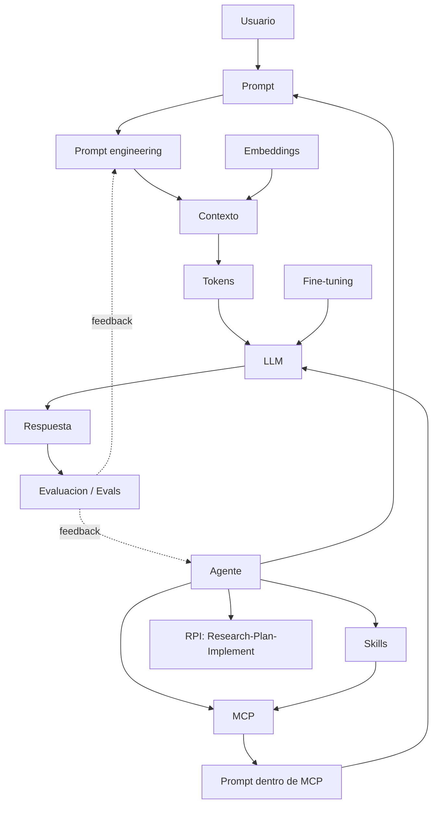
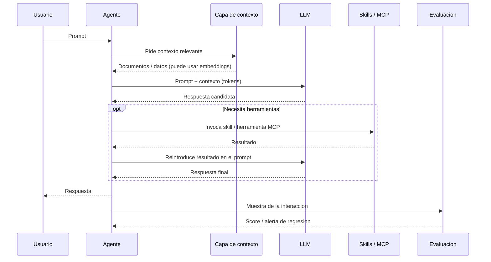

# Conceptos de IA Moderna

Esta carpeta explica, paso a paso, las piezas mas comunes de un sistema moderno de inteligencia artificial.

La idea es avanzar desde lo mas cercano al usuario hasta lo mas interno del sistema:

1. [Prompt](01-prompt.md)
2. [Prompt engineering](02-prompt-engineering.md)
3. [Contexto](03-contexto.md)
4. [Tokens](04-tokens.md)
5. [LLM](05-llm.md)
6. [Embeddings](06-embeddings.md)
7. [Fine-tuning](07-fine-tuning.md)
8. [Skill](08-skill.md)
9. [MCP](09-mcp.md)
10. [Prompt dentro de MCP](10-prompt-en-mcp.md)
11. [Agente](11-agente.md)
12. [RPI (Research, Plan, Implement)](12-rpi.md)
13. [Evaluacion (Evals)](13-evaluacion.md)

## Mapa de conceptos

## Como leer esta guia

Cada archivo sigue la misma estructura:

- Definicion simple
- Explicacion tecnica
- Ejemplo practico
- Relacion con los demas conceptos

Tambien se usan analogias para que las ideas sean mas faciles de visualizar sin perder precision.

## Flujo general

Una forma simple de ver todo el sistema es esta:

1. Una persona escribe un prompt.
2. El sistema agrega contexto util.
3. Todo eso se convierte en tokens.
4. Un LLM procesa esos tokens y genera una respuesta.
5. Un agente puede decidir si basta con responder o si conviene hacer pasos adicionales.
6. Si hace falta buscar informacion, usar herramientas o llamar servicios, pueden intervenir skills o MCP.
7. Si el sistema fue especializado para una tarea concreta, puede haber pasado por fine-tuning.
8. Si necesita buscar similitud semantica entre textos, puede usar embeddings.
9. La calidad de las respuestas se mide con un proceso de evaluacion (evals), que detecta regresiones cuando algo cambia.

## Analogía general

Imagina un restaurante:

- El prompt es lo que pide el cliente.
- El prompt engineering es la forma de redactar el pedido para que cocina lo entienda sin errores.
- El contexto es la informacion extra: alergias, ingredientes disponibles, hora del dia.
- Los tokens son las piezas pequenas en las que el sistema divide el pedido.
- El LLM es la cocina que interpreta y prepara la respuesta.
- Los embeddings son una forma de ordenar recetas parecidas cerca unas de otras.
- El fine-tuning es entrenar a la cocina para especializarse en un tipo de comida.
- Un agente es el jefe de cocina que decide que hacer primero, que herramienta usar y cuando pedir apoyo.
- Un skill es una capacidad extra, como un horno especial o un sumiller.
- MCP es el protocolo para conectar cocina con otras estaciones y herramientas.
- El prompt dentro de MCP es la instruccion concreta que se envia a traves de esa infraestructura.
- La evaluacion (evals) es el sistema de control de calidad: catadores con una rubrica que prueban platos representativos antes de cambiar la carta y vuelven a probar muestras del servicio en vivo.

## Resumen general

Un sistema moderno de IA no es solo un modelo aislado. Normalmente combina instrucciones, contexto, modelos, representaciones numericas, componentes de orquestacion, mecanismos de integracion con herramientas externas y un proceso de evaluacion que mide si todo eso funciona en conjunto. Entender estos conceptos juntos permite ver el flujo completo: alguien pide algo, un agente organiza los pasos, el sistema prepara contexto, el modelo procesa la informacion, si hace falta se apoya en componentes externos para responder mejor, y un sistema de evals valida que la calidad se mantenga cuando algo cambia.