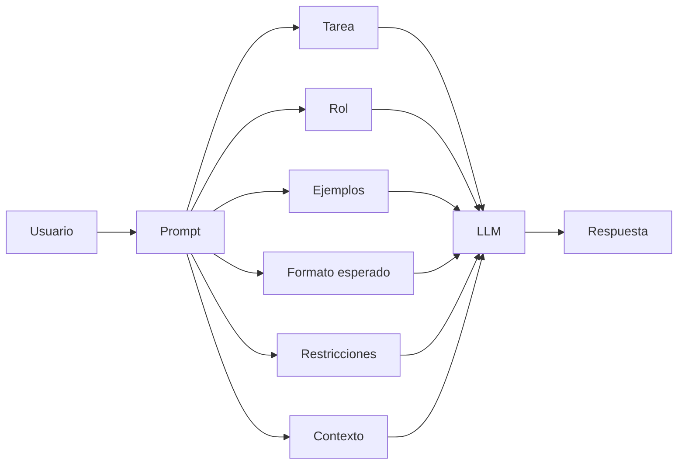

# Prompt

## Introduccion

Toda interaccion con un sistema de inteligencia artificial comienza con una instruccion. Esa instruccion —sea una pregunta, un pedido, un conjunto de reglas o una combinacion de todo eso— es lo que se conoce como prompt. Aunque a primera vista parece algo simple, el prompt es la pieza mas visible del sistema y, al mismo tiempo, una de las mas influyentes en la calidad del resultado.

Entender que es un prompt, como se estructura y por que ciertos prompts funcionan mejor que otros es el primer paso para trabajar con sistemas de IA de forma efectiva.

---

## Definicion simple

Un prompt es la instruccion o entrada que una persona le da a un sistema de IA para pedirle algo.

Dicho de forma sencilla: es la manera de decirle a la IA que quieres que haga.

---

## Explicacion tecnica

En sistemas basados en modelos de lenguaje, un prompt es el texto de entrada que condiciona la salida del modelo. Puede incluir preguntas, instrucciones, ejemplos, restricciones de formato, contexto adicional o una combinacion de todo eso.

Desde el punto de vista tecnico, el prompt no es solo una frase suelta. Es parte del estado de entrada que el modelo recibe antes de generar tokens de respuesta. Un prompt puede contener:

- una tarea: "resume este texto"
- una restriccion: "hazlo en tres lineas"
- un rol: "actua como profesor"
- ejemplos previos: "entrada -> salida"
- contexto: datos del problema, documentos o instrucciones del sistema

Cuanto mejor definido este el prompt, mas facil es que el modelo produzca una salida util y estable.

### Tipos de prompt

En la practica, no todos los prompts son iguales. Los sistemas modernos distinguen varios tipos:

**Prompt de sistema (system prompt):** instruccion base que define el comportamiento global del asistente. No la escribe el usuario directamente; la configura el desarrollador o la plataforma. Establece el tono, las restricciones, el rol y el formato esperado para toda la conversacion.

Ejemplo de system prompt:
```
Eres un asistente de soporte tecnico para una empresa de software. Responde siempre en espanol, con tono profesional y amigable. No proporciones informacion sobre precios ni facturacion. Si el problema excede tu capacidad de resolucion, indica que escalaras el ticket.
```

**Prompt de usuario (user prompt):** el mensaje que el usuario escribe en cada turno de la conversacion. Es el input mas visible y directo.

**Prompt de asistente (assistant prompt o few-shot examples):** en algunos sistemas, se incluyen respuestas previas del asistente como parte del contexto inicial, para mostrar al modelo ejemplos del estilo de respuesta esperado antes de que empiece a responder preguntas reales.

**Prompt encadenado (chained prompt):** en flujos complejos, la salida de un primer prompt se usa como entrada de un segundo. Esto permite dividir tareas complejas en pasos.

### Estructura de un prompt bien diseñado

Un prompt efectivo suele tener algunos o todos de estos elementos:

1. **Rol o persona:** le dice al modelo desde que perspectiva debe responder.
2. **Tarea:** describe claramente que debe hacer.
3. **Contexto:** informacion adicional que el modelo necesita para hacerlo bien.
4. **Restricciones:** limites de formato, longitud, tono o contenido.
5. **Formato de salida:** estructura esperada de la respuesta (lista, JSON, parrafo, tabla).
6. **Ejemplos:** pares de entrada-salida que muestran el resultado deseado.

No todos estos elementos son obligatorios en cada prompt. Cuantos incluir depende de la complejidad de la tarea y de la precision necesaria.

### Prompts implicitos y explicitos

Un prompt **explicito** dice directamente lo que quiere: "Resume este articulo en 5 puntos, en orden de importancia, sin usar jerga tecnica."

Un prompt **implicito** deja muchas cosas sin decir: "Resumelo." El modelo tiene que inferir el formato, la longitud, el nivel de detalle y el publico objetivo. Esto puede funcionar en contextos simples, pero introduce variabilidad en los resultados.

---

## Ejemplo practico

### Prompt debil

```
Habla de energia solar
```

Este pedido es muy abierto. La IA puede responder con historia, ventajas, definiciones o cualquier otro angulo. El resultado probablemente no sea lo que se necesitaba.

### Prompt mejorado

```
Explica que es la energia solar para estudiantes de secundaria. Usa lenguaje sencillo, menciona 3 ventajas y termina con un ejemplo de uso en casa.
```

Aqui la tarea, el publico, la profundidad y la estructura quedan mucho mas claras.

### Prompt con rol y formato

```
Actua como un analista financiero senior. Analiza los siguientes datos de ventas trimestrales y produce un informe ejecutivo de no mas de 200 palabras. El informe debe incluir: tendencia general, punto de mayor crecimiento, y una recomendacion de accion.

Datos:
Q1: $1.2M
Q2: $1.4M
Q3: $1.1M
Q4: $1.8M
```

Este prompt usa rol, tarea, restriccion de longitud, estructura de salida esperada y datos de entrada. Es mucho mas probable que produzca exactamente lo que el analista necesita.

---

## Errores comunes al escribir prompts

**Ambiguedad:** "Mejora este texto" no dice en que dimension mejorar (claridad, tono, longitud, gramatica).

**Sobreinstruccion contradictoria:** pedir simultáneamente "se breve" y "explica todo en detalle" crea tension que el modelo resuelve de forma impredecible.

**Omision de contexto critico:** pedirle al modelo que "corrija el bug" sin mostrarle el codigo ni el mensaje de error.

**Suponer que el modelo "recuerda":** en la mayoria de los sistemas, cada llamada es independiente. Si el contexto de una conversacion anterior importa, hay que reinyectarlo.

**Instrucciones negativas sin alternativa:** decir "no uses tecnicismos" sin especificar como hablar en su lugar deja al modelo con una restriccion pero sin una guia clara.

---

## Analogia facil

Un prompt se parece a pedir un taxi.

Si solo dices "quiero ir", el conductor no sabe a donde, por que ruta ni con que prioridad.

Si dices "llevame al aeropuerto por la ruta mas rapida y evita peajes", la instruccion es mucho mas util. Con la IA pasa lo mismo.

Y si al chofer le dices ademas "tengo dos valijas, necesito recibo de empresa y el pago es con tarjeta", le estas dando contexto adicional que lo prepara para darte un mejor servicio. Eso es el equivalente a un prompt con rol, tarea, restricciones y contexto.

---

## Diagrama



---

## Relacion con los demas conceptos

- Se relaciona con [Prompt engineering](02-prompt-engineering.md) porque esa disciplina busca diseñar prompts mas claros y efectivos.
- Se relaciona con [Contexto](03-contexto.md) porque muchas veces el prompt por si solo no basta y necesita informacion adicional.
- Se relaciona con [Tokens](04-tokens.md) porque el modelo no "lee" texto como una persona: convierte el prompt en piezas mas pequenas.
- Se relaciona con [LLM](05-llm.md) porque el LLM es quien interpreta el prompt y genera la respuesta.
- Se relaciona con [Skill](08-skill.md) y [MCP](09-mcp.md) cuando el prompt no solo pide texto, sino tambien acciones apoyadas por herramientas.
- Se relaciona con [Prompt dentro de MCP](10-prompt-en-mcp.md) porque, en sistemas conectados, el prompt puede viajar como parte de una interaccion mas grande entre modelo y herramientas.
- El [Agente](11-agente.md) recibe sus objetivos formulados como prompts y los descompone en acciones.
- Las [Evaluaciones](12-evaluaciones.md) miden la calidad de los prompts sistematicamente: ¿el mismo prompt produce buenos resultados de forma consistente?

---

## Idea clave

El prompt es el punto de partida de toda interaccion con un sistema de IA. Si la instruccion esta mal planteada, incluso un modelo excelente tendra dificultad para responder bien. Invertir en escribir prompts claros, completos y bien estructurados es de las acciones con mayor retorno en cualquier sistema basado en lenguaje.

---

## Resumen del capitulo

Un prompt no es simplemente "lo que le escribes a la IA". Es el vehiculo principal para comunicar intencion, contexto, restricciones y expectativas a un sistema de lenguaje. Los prompts pueden tener distintos tipos (sistema, usuario, few-shot), distintos niveles de detalle y distintos grados de efectividad. Aprender a escribir buenos prompts es la habilidad fundamental para trabajar productivamente con sistemas de IA.