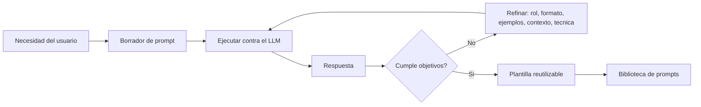

# Prompt engineering

## Introduccion

Escribir un prompt no es suficiente. Lo que realmente marca la diferencia entre un sistema de IA que responde de forma impredecible y uno que produce resultados consistentes y utiles es la calidad de las instrucciones que recibe. Prompt engineering es la disciplina que se ocupa exactamente de eso: diseñar, probar y afinar prompts para extraer lo mejor de un modelo de lenguaje.

Este capitulo explora que es prompt engineering, por que importa, cuales son las tecnicas mas efectivas y como aplicarlas en la practica.

---

## Definicion simple

Prompt engineering es el arte y la practica de escribir mejores instrucciones para que una IA responda mejor.

En pocas palabras: no solo importa hablarle a la IA, sino saber como pedirle las cosas.

---

## Explicacion tecnica

Prompt engineering es el proceso de diseñar, probar y refinar prompts para obtener salidas mas utiles, precisas, consistentes y seguras de un modelo.

No se trata solo de "redactar bonito". Tecnica y practicamente incluye decisiones como:

- definir claramente la tarea
- establecer formato de salida
- dar contexto relevante
- incluir ejemplos
- limitar ambiguedades
- dividir problemas complejos en pasos
- reducir respuestas inventadas o demasiado vagas

En sistemas reales, prompt engineering tambien puede involucrar prompts de sistema, plantillas, variables dinamicas, instrucciones por rol y estrategias de encadenamiento entre pasos.

### Tecnicas principales de prompt engineering

#### Zero-shot prompting

El modelo recibe la tarea directamente, sin ejemplos previos. Funciona bien para tareas simples o cuando el modelo tiene un conocimiento amplio del dominio.

```
Clasifica el siguiente comentario como "positivo", "negativo" o "neutro":
"El producto llego antes de lo esperado y funcionaba perfectamente."
```

#### Few-shot prompting

Se incluyen ejemplos de pares entrada-salida antes de la tarea real. Esto "muestra" al modelo el patron esperado y reduce la ambiguedad.

```
Clasifica el sentimiento del comentario.

Ejemplos:
Comentario: "Excelente atencion al cliente."
Sentimiento: positivo

Comentario: "Tarde tres dias en llegar y venia roto."
Sentimiento: negativo

Comentario: "El producto es lo que esperaba, nada mas."
Sentimiento: neutro

Ahora clasifica:
Comentario: "Me sorprendio la calidad del empaque."
Sentimiento:
```

#### Chain-of-thought (CoT) prompting

Se le pide al modelo que razone paso a paso antes de dar la respuesta final. Esto mejora significativamente el rendimiento en tareas que requieren razonamiento logico, matematico o de varios pasos.

```
Resuelve el siguiente problema y muestra tu razonamiento paso a paso antes de dar la respuesta final.

Un tren sale de la ciudad A a las 8:00 a 80 km/h. Otro tren sale de la ciudad B a las 9:00 a 100 km/h en direccion contraria. Las ciudades estan a 360 km de distancia. ¿A que hora se encuentran?
```

#### ReAct (Reasoning + Acting)

Un patron que combina razonamiento interno (Thought) con acciones ejecutables (Action) y observacion del resultado (Observation). Es especialmente util para agentes que usan herramientas.

```
Thought: necesito saber el precio actual del dolar para calcular la conversion.
Action: buscar("precio dolar hoy")
Observation: 1 USD = 985 CLP (16:30 UTC)
Thought: con ese dato puedo calcular la conversion solicitada.
Action: calcular(1200 * 985)
Observation: 1.182.000 CLP
Respuesta: 1.200 dolares equivalen a 1.182.000 pesos chilenos al tipo de cambio actual.
```

#### Instrucciones de sistema (system prompt engineering)

El prompt de sistema es la capa mas estrategica del diseño de prompts. Establece el comportamiento base del asistente para toda la sesion. Un buen system prompt incluye:

- identidad y rol del asistente
- tono y estilo de comunicacion
- restricciones de contenido
- formato de respuesta esperado
- como manejar casos donde no se tiene informacion

#### Self-consistency

Se genera la misma consulta multiples veces con temperatura alta y se toma la respuesta mas frecuente como la mas confiable. Util para tareas donde hay una respuesta correcta pero el modelo puede vagar.

#### Prompt chaining (encadenamiento)

Se divide una tarea compleja en prompts mas pequenos y manejables, donde la salida de uno alimenta la entrada del siguiente.

```
Paso 1: "Extrae los puntos clave de este articulo."
Paso 2: "Basandote en estos puntos clave, identifica las tres decisiones mas importantes."
Paso 3: "Para cada decision identificada, propone una accion concreta para un director de producto."
```

---

## Ejemplo practico

### Version poco trabajada

```
Analiza este reporte
```

### Version con prompt engineering

```
Analiza este reporte financiero como si fueras un analista junior. Resume los hallazgos en 5 puntos, identifica 2 riesgos principales y termina con una recomendacion ejecutiva de no mas de 80 palabras.
```

La segunda version reduce ambiguedad, fija formato y aclara la expectativa.

### Version con few-shot

```
Analiza reportes financieros y produce un resumen ejecutivo.

Ejemplo de analisis anterior:
Entrada: [reporte de Q2 con margenes comprimidos]
Salida: "Q2 muestra compresion de margenes del 3% frente al trimestre anterior, impulsada principalmente por aumento de costos operativos. Riesgos: (1) presion continua de proveedores, (2) posible reduccion de capex. Recomendacion: revisar contratos de suministro antes del cierre de Q3."

Ahora analiza:
[inserta el nuevo reporte aqui]
```

---

## Buenas practicas para el diseño de prompts

1. **Empieza por la claridad:** define exactamente que quieres y escribelo explicitamente. No des por sentado que el modelo infiere bien la intencion.

2. **Especifica el formato de salida:** si necesitas una lista, un JSON, una tabla o parrafos, indicalo. Esto reduce enormemente el trabajo de post-procesamiento.

3. **Usa ejemplos cuando la tarea es ambigua:** un ejemplo vale mas que una descripcion larga de lo que quieres.

4. **Divide tareas complejas:** en lugar de un prompt que pide diez cosas, usa prompts encadenados que ataquen el problema paso a paso.

5. **Itera sistematicamente:** cambia una sola variable a la vez. Si el prompt dice "actua como experto" y "usa tono informal", no cambies ambas cosas a la vez; no sabras que mejoro el resultado.

6. **Registra las versiones:** guarda los prompts que funcionan con sus resultados. Un prompt que sirve hoy es un activo valioso.

7. **Prueba con casos limite:** ¿que pasa si el usuario manda una entrada vacia? ¿o en otro idioma? ¿o con informacion contradictoria? Los prompts robustos manejan estos casos de forma predecible.

8. **Evita instrucciones negativas sin alternativa:** "No uses tecnicismos" es menos util que "Usa lenguaje que pueda entender alguien sin formacion tecnica."

---

## Analogia facil

Es como pedirle a un arquitecto que te dibuje una casa.

Si dices "hazme una casa", la respuesta puede ser cualquier cosa.

Si dices "quiero una casa de una planta, con 3 habitaciones, patio pequeno, estilo moderno y presupuesto limitado", el resultado se acerca mucho mas a lo que necesitas.

Y si le muestras fotos de casas similares a lo que tienes en mente (few-shot), el arquitecto entiende el estilo con mucha mas precision que con solo una descripcion verbal.

---

## Diagrama



---

## Relacion con los demas conceptos

- Se apoya directamente en [Prompt](01-prompt.md), porque trabaja sobre la calidad de la instruccion inicial.
- Depende de [Contexto](03-contexto.md), ya que un buen prompt suele decidir que informacion adicional incluir o excluir.
- Se relaciona con [Tokens](04-tokens.md) porque prompts demasiado largos o mal estructurados consumen mas espacio y pueden degradar resultados.
- Se conecta con [LLM](05-llm.md) porque las tecnicas de prompt engineering existen para guiar mejor el comportamiento del modelo.
- Se relaciona con [Skill](08-skill.md) y [MCP](09-mcp.md) cuando el prompt debe coordinar herramientas, acciones o llamadas externas.
- Se vincula con [Prompt dentro de MCP](10-prompt-en-mcp.md) porque, en sistemas compuestos, tambien importa como se formula la instruccion dentro de un flujo conectado.
- Alimenta la fase Q de [QRSPI](13-qrspi.md): clarificar bien una pregunta antes de actuar es, en esencia, aplicar prompt engineering al propio objetivo.
- Las [Evaluaciones](12-evaluaciones.md) son el mecanismo que determina si un prompt mejorado realmente produce mejores resultados de forma consistente.

---

## Idea clave

Prompt engineering no cambia el cerebro del modelo; cambia la forma en que le damos instrucciones para usar mejor lo que ya sabe hacer. Es la disciplina que convierte un modelo capaz pero impredecible en un componente confiable y util dentro de un sistema.

---

## Resumen del capitulo

Prompt engineering es la practica de diseñar instrucciones precisas, estructuradas y probadas para obtener resultados consistentes de modelos de lenguaje. Sus tecnicas —zero-shot, few-shot, chain-of-thought, ReAct, encadenamiento— cubren un espectro que va desde instrucciones simples hasta flujos de razonamiento complejos. Dominar estas tecnicas es una de las habilidades mas practicas y de mayor impacto para cualquier persona que construya o use sistemas basados en IA.