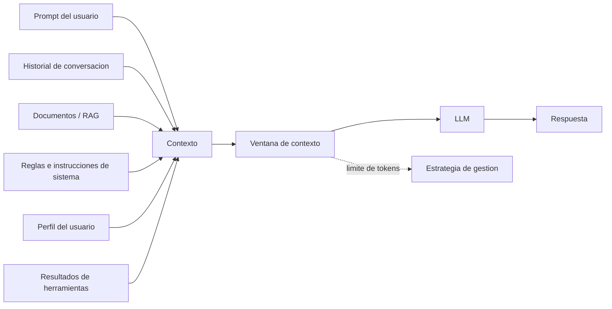

# Contexto

## Introduccion

El modelo de lenguaje no recuerda el pasado, no conoce tu base de datos y no sabe nada sobre el estado actual de tu aplicacion. Solo puede razonar sobre lo que recibe en el momento de la consulta. Por eso, la calidad de cualquier sistema de IA moderno depende no solo del modelo, sino de cuanta informacion relevante se le entrega y como se organiza esa informacion antes de pedirle que responda.

A esa informacion adicional que se entrega al modelo junto con la instruccion principal se le llama contexto. Entender que es el contexto, como funciona tecnicamente y como gestionarlo bien es fundamental para construir sistemas de IA que produzcan resultados utiles y precisos.

---

## Definicion simple

El contexto es la informacion adicional que ayuda a la IA a entender mejor una tarea antes de responder.

Es todo lo que acompaña a la pregunta para que la respuesta tenga sentido.

---

## Explicacion tecnica

En sistemas de IA, el contexto es el conjunto de datos que el modelo recibe junto con la instruccion principal. Puede incluir conversaciones previas, documentos, reglas, ejemplos, perfil del usuario, estado de una aplicacion o resultados traidos por herramientas.

Tecnicamente, el contexto forma parte de la entrada total que el modelo procesa. El modelo no tiene memoria humana persistente por defecto; necesita que la informacion relevante este presente en su ventana de contexto o le sea reinyectada por el sistema.

Por eso, en sistemas modernos, gran parte de la calidad depende no solo del modelo, sino de que contexto se selecciona, cuanto contexto se añade y como se organiza.

### La ventana de contexto

La ventana de contexto es el limite maximo de tokens que un modelo puede procesar en una sola llamada. Todo lo que se envie al modelo —instrucciones, historial de conversacion, documentos, resultados de herramientas, respuesta esperada— debe caber dentro de ese limite.

Los modelos modernos tienen ventanas de contexto que van desde 4.000 hasta 200.000 tokens o mas, dependiendo del modelo. Esto equivale, de manera aproximada, a entre 3.000 y 150.000 palabras.

El limite de la ventana de contexto importa por varias razones:

- determina cuanto historial de conversacion se puede incluir
- limita el tamaño de los documentos que el modelo puede "leer" de una sola vez
- afecta el costo: mas tokens equivalen a mayor costo en la mayoria de las APIs
- afecta el rendimiento: modelos con ventanas muy grandes pueden perder precision en la informacion que esta "en el medio" de entradas muy largas

### Tipos de contexto

**Contexto estatico:** informacion que no cambia durante la sesion. Incluye instrucciones del sistema, reglas del negocio, perfil del usuario, configuracion del asistente.

**Contexto dinamico:** informacion que varia con cada consulta o con el avance de la conversacion. Incluye historial de mensajes, resultados de herramientas, datos traidos por RAG, estado actual del sistema.

**Contexto externo:** informacion que no esta en el modelo ni en la conversacion, sino en sistemas externos. Se recupera en tiempo real y se inyecta en la entrada. Ejemplos: documentos de una base de conocimiento, registros de una base de datos, respuestas de APIs.

### Gestion del contexto

Como la ventana de contexto tiene limites, los sistemas reales necesitan estrategias para decidir que incluir:

**Seleccion por relevancia (RAG):** en lugar de incluir todos los documentos disponibles, se usan embeddings para recuperar solo los fragmentos mas relevantes para la consulta actual. Esto maximiza la utilidad del espacio disponible.

**Compresion del historial:** cuando la conversacion crece, se puede resumir el historial antiguo para liberar espacio sin perder el hilo de la interaccion.

**Truncamiento:** en casos simples, se descarta el historial mas antiguo cuando se alcanza el limite. Es la estrategia mas simple pero puede causar perdida de informacion critica.

**Ventana deslizante:** se mantienen siempre los N mensajes mas recientes y se descarta lo anterior. Util para conversaciones largas donde el contexto reciente es mas relevante.

---

## Ejemplo practico

### Pregunta sin contexto

```
Resume este documento
```

### Pregunta con contexto

```
Resume este documento para un director de operaciones. Enfocate en costos, plazos y riesgos. Ignora el detalle legal.

[Documento: informe de auditoria interna Q3 2024...]
```

En el segundo caso, la IA sabe para quien resume, que priorizar y que dejar fuera.

### Ejemplo de contexto dinamico inyectado por RAG

Un usuario pregunta: "¿Cual es la politica de devoluciones para productos electronicos?"

Sin RAG, el modelo responderia con informacion generica o podria inventar detalles. Con RAG, el sistema:

1. Convierte la pregunta en un vector
2. Busca en la base de documentos los fragmentos mas parecidos
3. Recupera el parrafo exacto de la politica de devoluciones
4. Lo inyecta como contexto en la llamada al modelo

El modelo entonces responde basandose en el documento real, no en supuestos.

---

## Analogia facil

El contexto se parece a los antecedentes que das a un medico.

Decir "me siento mal" sirve poco.

Decir "me siento mal, tengo fiebre desde ayer, alergia a penicilina y me duele el pecho" cambia por completo la calidad de la evaluacion.

Un medico brillante con informacion incompleta puede llegar a conclusiones incorrectas. Un medico promedio con informacion completa puede dar un diagnostico mucho mas util. Con los modelos de lenguaje pasa exactamente lo mismo.

---

## Diagrama



---

## Relacion con los demas conceptos

- Complementa al [Prompt](01-prompt.md) porque una buena instruccion suele necesitar informacion de apoyo.
- Es una materia prima central del [Prompt engineering](02-prompt-engineering.md), que decide que contexto incluir.
- Se convierte en [Tokens](04-tokens.md) junto con el resto de la entrada, por lo que ocupa parte del espacio disponible.
- Alimenta al [LLM](05-llm.md), que solo puede razonar sobre lo que recibe.
- Puede venir de sistemas basados en [Embeddings](06-embeddings.md), por ejemplo al recuperar documentos semanticamente parecidos (RAG).
- Puede combinarse con [Skill](08-skill.md) y [MCP](09-mcp.md) cuando herramientas externas aportan datos adicionales.
- Influye directamente en el [Prompt dentro de MCP](10-prompt-en-mcp.md), porque las herramientas y el modelo suelen intercambiar contexto para resolver tareas.
- Un [Agente](11-agente.md) activo gestiona el contexto activamente: decide que informacion buscar, recuperar o descartar en cada paso.
- Las [Evaluaciones](12-evaluaciones.md) miden si el contexto entregado es suficiente y si el modelo lo usa correctamente.

---

## Idea clave

Un buen modelo con mal contexto suele fallar. Un buen contexto puede mejorar mucho el resultado sin cambiar el modelo. La gestion del contexto —que incluir, que excluir, como organizarlo— es uno de los factores mas determinantes en la calidad de un sistema de IA en produccion.

---

## Resumen del capitulo

El contexto es la informacion que el modelo recibe junto con la instruccion. Tiene un limite fisico (la ventana de contexto) y requiere estrategias activas de gestion cuando la informacion disponible supera ese limite. Los sistemas modernos usan tecnicas como RAG, compresion del historial y ventanas deslizantes para asegurarse de que el modelo siempre tenga la informacion mas relevante a mano al momento de responder.