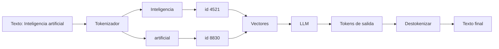

# Tokens

## Introduccion

Cuando una persona lee un texto, procesa palabras, frases y oraciones completas. Un modelo de lenguaje funciona de manera diferente: no trabaja sobre texto como tal, sino sobre unidades mas pequenas y numericas llamadas tokens. Entender que son los tokens, como se crean y por que importan es esencial para comprender el funcionamiento real de cualquier sistema basado en LLMs: sus costos, sus limites y su comportamiento.

---

## Definicion simple

Los tokens son las piezas pequeñas en las que un modelo divide el texto para poder procesarlo.

No siempre equivalen a palabras completas: pueden ser palabras, partes de palabras, signos o fragmentos frecuentes.

---

## Explicacion tecnica

Los modelos de lenguaje no trabajan directamente con texto humano como si leyeran una pagina. Primero convierten el texto en tokens mediante un proceso llamado tokenizacion. Cada token se representa como un identificador numerico que luego el modelo transforma en vectores matematicos para procesarlo.

### Que es la tokenizacion

La tokenizacion es el proceso de dividir texto en unidades manejables (tokens) que el modelo puede procesar. Los algoritmos de tokenizacion modernos —como Byte Pair Encoding (BPE), WordPiece o SentencePiece— aprenden a dividir el texto de una manera que equilibra dos objetivos:

- mantener las unidades significativas del lenguaje (palabras comunes en un solo token)
- representar cualquier texto posible con un vocabulario finito (usando sub-palabras para palabras raras)

Por eso, palabras comunes en ingles como "the" o "and" suelen ser un solo token, mientras que palabras tecnicas, nombres propios o palabras en idiomas con menos datos de entrenamiento pueden dividirse en multiples tokens.

### Cuantos tokens equivale a una palabra o caracter

Una regla aproximada para el ingles es que 1 token ≈ 4 caracteres ≈ 0.75 palabras. Para el español y otros idiomas romanicos, el ratio suele ser ligeramente mayor (mas tokens por palabra) porque los algoritmos de tokenizacion se entrenaron predominantemente con texto en ingles.

Ejemplos de tokenizacion:

| Texto | Tokens aproximados |
|---|---|
| "Hello, world!" | 4 |
| "Inteligencia artificial" | 3-4 |
| "supercalifragilisticoexpialidoso" | 8-12 |
| Un parrafo de 100 palabras | ~130-150 |
| Una pagina de 500 palabras | ~650-750 |

### Por que importa el recuento de tokens

Los tokens importan por varias razones criticas en sistemas reales:

**Costo:** la mayoria de las APIs de modelos de lenguaje cobran por tokens procesados. Un prompt de 10.000 tokens mas una respuesta de 2.000 tokens resulta en 12.000 tokens facturados. Escalar esto a millones de llamadas hace que la optimizacion de tokens tenga un impacto economico directo.

**Limites de la ventana de contexto:** como se explica en el capitulo de Contexto, la ventana de contexto tiene un limite en tokens. Todo el input (prompt del sistema + historial + documentos + pregunta del usuario) mas la respuesta generada deben caber dentro de ese limite.

**Velocidad:** mas tokens significa mas computo y mayor latencia. En aplicaciones interactivas donde la experiencia del usuario depende de respuestas rapidas, esto importa.

**Calidad:** hay evidencia de que los modelos pierden algo de precision con entradas muy largas, especialmente con informacion que queda "enterrada" en el medio de ventanas de contexto grandes.

### Tokens de entrada vs tokens de salida

Las APIs de LLMs distinguen entre:

- **Tokens de entrada (input tokens):** todo lo que va al modelo (sistema + conversacion + documentos).
- **Tokens de salida (output tokens):** lo que el modelo genera como respuesta.

Generalmente, los tokens de salida son mas caros que los de entrada. Esto incentiva respuestas concisas y formatos que no generen texto innecesario.

---

## Ejemplo practico

La frase:

```
"Inteligencia artificial moderna"
```

podria dividirse en unidades como:

- "Inteligencia" → token 1
- " artificial" → token 2
- " moderna" → token 3

Pero una palabra poco comun como "supercalifragilistico" se dividiria en muchos mas tokens:

- "super" → token 1
- "cal" → token 2
- "ifrag" → token 3
- "ilist" → token 4
- "ico" → token 5

Lo importante es que el modelo procesa estas piezas numericas, no el texto bruto tal como lo ve una persona.

### Impacto del idioma en los tokens

Un mismo mensaje en diferentes idiomas puede ocupar diferente cantidad de tokens:

```
"Hello, how are you?" → ~5 tokens
"Hola, ¿como estas?" → ~6-7 tokens
"Γεια σου, πώς είσαι;" → ~10-14 tokens (griego)
```

Esto es relevante para sistemas multilingues: el mismo contenido en algunos idiomas puede costar mas tokens (y por ende mas dinero) que en ingles.

---

## Herramientas para contar tokens

Antes de enviar un prompt largo a un modelo, es posible contar sus tokens con librerias como:

- `tiktoken` (OpenAI): permite contar tokens para modelos GPT antes de enviarlos
- `transformers` (Hugging Face): incluye tokenizadores para la mayoria de los modelos open source

Esto permite validar que una entrada cabe en la ventana de contexto y estimar el costo antes de ejecutar.

---

## Analogia facil

Piensa en fichas de construccion.

Una persona ve una casa completa, pero el sistema trabaja con ladrillos. Los tokens son esos ladrillos con los que el modelo arma y entiende el texto.

Algunas palabras son un ladrillo entero; otras —las mas largas o raras— se dividen en varios ladrillos pequeños. El modelo nunca ve "la casa": solo ve la secuencia de ladrillos y aprende a predecir cual viene a continuacion.

---

## Diagrama



---

## Relacion con los demas conceptos

- El [Prompt](01-prompt.md) termina convertido en tokens antes de llegar al modelo.
- El [Prompt engineering](02-prompt-engineering.md) suele buscar claridad sin desperdiciar tokens.
- El [Contexto](03-contexto.md) tambien ocupa tokens, por lo que incluir demasiado puede dejar menos espacio para la respuesta.
- El [LLM](05-llm.md) opera sobre secuencias de tokens, no sobre palabras en sentido humano.
- Los [Embeddings](06-embeddings.md) tambien parten de texto convertido en representaciones numericas, aunque con un objetivo distinto al de la tokenizacion para generacion.
- En flujos con [MCP](09-mcp.md), las instrucciones y datos compartidos entre componentes tambien acaban entrando al modelo como tokens.
- Las [Evaluaciones](12-evaluaciones.md) monitorean el consumo de tokens para controlar costos y latencia.

---

## Idea clave

Entender los tokens ayuda a entender el costo, los limites de contexto y el comportamiento real de un sistema de lenguaje. No son un detalle tecnico menor: son la unidad basica de todo lo que el modelo recibe y produce.

---

## Resumen del capitulo

Los tokens son la representacion interna del texto en los modelos de lenguaje. El proceso de dividir texto en tokens (tokenizacion) determina cuanto espacio ocupa una entrada, cuanto cuesta procesarla y que tan bien el modelo puede trabajar con palabras de distintos idiomas o con vocabulario especializado. Conocer la tokenizacion es fundamental para diseñar sistemas eficientes, controlar costos y entender los limites reales de los modelos que se usan.