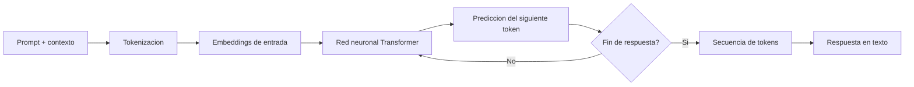

# LLM

## Introduccion

En el centro de los sistemas modernos de inteligencia artificial esta el modelo de lenguaje de gran tamaño, comunmente conocido como LLM (por sus siglas en ingles: Large Language Model). Es el componente que recibe texto, lo procesa y genera una respuesta. Sin un LLM, no hay generacion de lenguaje, no hay razonamiento sobre texto, no hay asistente de IA.

Pero el LLM por si solo no hace nada util. Lo que determina la calidad de un sistema es como se le dan instrucciones, que contexto se le entrega, con que herramientas trabaja y como se mide si sus respuestas son buenas. Este capitulo explica como funciona el LLM internamente, cuales son sus capacidades y limitaciones, y por que es el motor —pero no el unico componente— de cualquier sistema de IA moderno.

---

## Definicion simple

LLM significa Large Language Model, o modelo de lenguaje de gran tamaño.

Es un sistema de IA entrenado con enormes cantidades de texto para entender patrones del lenguaje y generar respuestas.

---

## Explicacion tecnica

Un LLM es un modelo estadistico y neuronal que aprende relaciones entre tokens a gran escala. Durante su entrenamiento, ajusta miles de millones de parametros para predecir que token tiene mas probabilidad de venir despues de otros.

Aunque esa idea suene simple, al escalar datos, computo y parametros, el modelo desarrolla capacidades muy utiles: resumir, traducir, responder preguntas, clasificar, extraer informacion, generar codigo y seguir instrucciones.

En produccion, un LLM no suele trabajar solo. Normalmente forma parte de un sistema mayor que le da prompts, contexto, herramientas, reglas y mecanismos externos de recuperacion de informacion.

### Arquitectura: el Transformer

La arquitectura que hace posibles los LLMs modernos se llama Transformer. Fue introducida en 2017 en el articulo "Attention is All You Need" y desde entonces domina el campo del procesamiento de lenguaje natural.

El componente central del Transformer es el mecanismo de **atencion** (attention). La atencion permite al modelo, mientras procesa un token, "mirar" hacia todos los demas tokens de la entrada y ponderar cuales son mas relevantes para entender el significado del token actual. Esto es lo que le da al modelo la capacidad de capturar dependencias a larga distancia en el texto.

Un Transformer tiene dos partes principales:

- **Encoder:** procesa la entrada y crea representaciones contextuales de cada token. Util para tareas de clasificacion o comprension.
- **Decoder:** genera tokens de salida uno a uno, usando la atencion sobre lo ya generado y sobre el encoder. Util para generacion de texto.

Los LLMs modernos para chat y generacion (como GPT, Claude o Llama) son principalmente decoders: generan texto token por token, cada uno condicionado por todos los anteriores.

### El proceso de entrenamiento

Un LLM se entrena en tres etapas principales:

**1. Preentrenamiento:** el modelo aprende a predecir el siguiente token en textos de internet, libros, codigo y otras fuentes. Este proceso con cientos de miles de millones de tokens permite que el modelo desarrolle conocimiento amplio del lenguaje, del mundo y de muchas tareas.

**2. Fine-tuning supervisado (SFT):** el modelo base se ajusta con ejemplos de instrucciones y respuestas ideales, escritos por humanos. Esto lo convierte en un modelo que "sigue instrucciones" en lugar de solo completar texto.

**3. RLHF (Reinforcement Learning from Human Feedback):** se usa una funcion de recompensa aprendida de preferencias humanas para alinear el modelo a comportamientos utiles, seguros y honestos.

### Capacidades de los LLMs modernos

- Comprension y generacion de texto en multiples idiomas
- Resumen, extraccion de informacion, clasificacion
- Traduccion
- Generacion de codigo en decenas de lenguajes de programacion
- Razonamiento logico y matematico (con limitaciones)
- Seguimiento de instrucciones complejas
- Conversacion natural con memoria de turno

### Limitaciones importantes

**Alucinaciones:** el modelo puede "inventar" datos, citas, nombres o hechos que suenan plausibles pero son falsos. Esto ocurre porque el modelo optimiza por probabilidad de tokens, no por verdad factual.

**Limite de conocimiento:** el modelo tiene un "corte de entrenamiento" (knowledge cutoff): no conoce eventos ocurridos despues de esa fecha a menos que se le proporcionen como contexto.

**Sin memoria persistente:** por defecto, cada llamada al modelo es independiente. No recuerda conversaciones anteriores a menos que el sistema las reinyecte explicitamente.

**Sensibilidad al prompt:** pequeños cambios en la formulacion del prompt pueden producir respuestas muy diferentes.

**Razonamiento matematico:** aunque ha mejorado mucho, el razonamiento matematico preciso sigue siendo una debilidad relativa. Los modelos modernos con capacidad de "llamar a herramientas" (como una calculadora o interprete Python) resuelven esto delegando el calculo.

---

## Ejemplo practico

Supongamos que un usuario pregunta:

```
Explica la fotosintesis para un niño de 10 años.
```

El LLM recibe esa instruccion, la convierte internamente en representaciones numericas, estima que tipos de respuesta encajan mejor con ese pedido (vocabulario sencillo, analogias, explicacion basica del proceso) y genera una secuencia de tokens que luego vemos como texto legible.

El modelo no "busca la respuesta en un libro": genera estadisticamente el texto mas probable dado lo que aprendio durante el entrenamiento y lo que recibio como entrada.

### Ejemplo de alucinacion

Si se le pregunta a un LLM sin contexto adicional:

```
¿Cual fue el resultado del partido entre Argentina y Francia en la Copa America 2024?
```

El modelo puede responder con un marcador especifico que suena veridico pero que podria ser incorrecto. Para evitar esto, la solucion es proveer el dato como contexto o usar un sistema con acceso a busqueda en tiempo real.

---

## Analogia facil

Un LLM se parece a un cocinero muy entrenado que ha visto miles de recetas.

No memoriza todo como una enciclopedia perfecta, pero aprende patrones: que ingredientes combinan, que pasos suelen seguirse y que tipo de plato encaja con una peticion concreta.

Si le pides "algo con pollo y limon", puede improvisar una receta que probablemente funcione. Pero si le pides el resultado exacto de una receta especifica que nunca vio, podria inventar detalles. Por eso, en sistemas criticos, el cocinero siempre trabaja con la receta a la vista (contexto) y no de memoria.

---

## Diagrama



---

## Relacion con los demas conceptos

- Recibe un [Prompt](01-prompt.md) como instruccion principal.
- Se beneficia del [Prompt engineering](02-prompt-engineering.md), que mejora la forma en que se le pide una tarea.
- Solo puede usar bien el [Contexto](03-contexto.md) que le entrega el sistema.
- Procesa la entrada y genera salida en forma de [Tokens](04-tokens.md).
- Puede trabajar junto con [Embeddings](06-embeddings.md) para encontrar informacion parecida o relevante antes de generar la respuesta.
- Puede haberse especializado con [Fine-tuning](07-fine-tuning.md) para rendir mejor en tareas concretas.
- Puede activar o coordinar un [Skill](08-skill.md) para usar capacidades adicionales.
- Puede integrarse con herramientas mediante [MCP](09-mcp.md).
- Puede participar en un flujo donde exista un [Prompt dentro de MCP](10-prompt-en-mcp.md), no solo un prompt aislado escrito por el usuario.
- Puede ser el motor de razonamiento de un [Agente](11-agente.md) que lo usa para interpretar, decidir y ejecutar.
- Su calidad se mide y se vigila con [Evaluaciones](12-evaluaciones.md), que detectan regresiones y comparan modelos.

---

## Idea clave

El LLM es el motor central del lenguaje, pero la calidad final del sistema depende tambien de como se le da contexto, instrucciones y acceso a herramientas. Un LLM excelente con malas instrucciones y poco contexto produce resultados pobres. Un LLM moderado con buen diseño del sistema puede producir resultados excelentes.

---

## Resumen del capitulo

Un LLM es un modelo neuronal basado en la arquitectura Transformer que aprende a predecir texto a partir de grandes cantidades de datos. Sus capacidades son amplias —comprension, generacion, razonamiento, codigo— pero tiene limitaciones reales: puede alucinar, no conoce eventos recientes sin contexto y no tiene memoria persistente. Entender el LLM como un componente dentro de un sistema mas grande —y no como una soluccion magica y autonoma— es la clave para usarlo de forma efectiva.