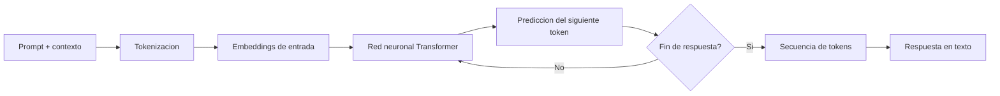

# LLM

## Definicion simple

LLM significa Large Language Model, o modelo de lenguaje de gran tamaño.

Es un sistema de IA entrenado con enormes cantidades de texto para entender patrones del lenguaje y generar respuestas.

## Explicacion tecnica

Un LLM es un modelo estadistico y neuronal que aprende relaciones entre tokens a gran escala. Durante su entrenamiento, ajusta miles de millones de parametros para predecir que token tiene mas probabilidad de venir despues de otros.

Aunque esa idea suene simple, al escalar datos, computo y parametros, el modelo desarrolla capacidades muy utiles: resumir, traducir, responder preguntas, clasificar, extraer informacion, generar codigo y seguir instrucciones.

En produccion, un LLM no suele trabajar solo. Normalmente forma parte de un sistema mayor que le da prompts, contexto, herramientas, reglas y mecanismos externos de recuperacion de informacion.

## Ejemplo practico

Supongamos que un usuario pregunta:

"Explica la fotosintesis para un niño de 10 años."

El LLM recibe esa instruccion, la convierte internamente en representaciones numericas, estima que tipos de respuesta encajan mejor con ese pedido y genera una secuencia de tokens que luego vemos como texto legible.

## Analogia facil

Un LLM se parece a un cocinero muy entrenado que ha visto miles de recetas.

No memoriza todo como una enciclopedia perfecta, pero aprende patrones: que ingredientes combinan, que pasos suelen seguirse y que tipo de plato encaja con una peticion concreta.

## Diagrama

## Relacion con los demas conceptos

- Recibe un [Prompt](01-prompt.md) como instruccion principal.
- Se beneficia del [Prompt engineering](02-prompt-engineering.md), que mejora la forma en que se le pide una tarea.
- Solo puede usar bien el [Contexto](03-contexto.md) que le entrega el sistema.
- Procesa la entrada y genera salida en forma de [Tokens](04-tokens.md).
- Puede trabajar junto con [Embeddings](06-embeddings.md) para encontrar informacion parecida o relevante.
- Puede haberse especializado con [Fine-tuning](07-fine-tuning.md) para rendir mejor en tareas concretas.
- Puede activar o coordinar un [Skill](08-skill.md) para usar capacidades adicionales.
- Puede integrarse con herramientas mediante [MCP](09-mcp.md).
- Puede participar en un flujo donde exista un [Prompt dentro de MCP](10-prompt-en-mcp.md), no solo un prompt aislado escrito por el usuario.
- Su calidad se mide y se vigila con [Evaluaciones](12-evaluaciones.md), que detectan regresiones y comparan modelos.

## Idea clave

El LLM es el motor central del lenguaje, pero la calidad final del sistema depende tambien de como se le da contexto, instrucciones y acceso a herramientas.