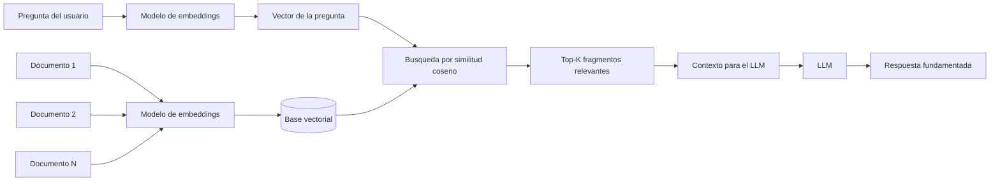

# Embeddings

## Introduccion

El lenguaje humano esta lleno de sinonimos, parafrasis y conceptos relacionados que ninguna busqueda por palabras clave puede capturar completamente. Si un usuario pregunta "como reduzco la latencia de mi API" y la documentacion habla de "mejora del tiempo de respuesta del servidor", una busqueda exacta no encontrara la respuesta correcta. Los embeddings resuelven este problema convirtiendo texto en representaciones matematicas donde el significado se puede medir y comparar.

Este capitulo explica que son los embeddings, como se generan, como se usan para recuperar informacion relevante (RAG) y por que son un componente fundamental de los sistemas de IA modernos.

---

## Definicion simple

Los embeddings son representaciones numericas de texto, imagenes u otros datos que capturan parte de su significado.

En simple: convierten contenido en coordenadas matematicas para que una maquina pueda comparar que tan parecidas son dos cosas.

---

## Explicacion tecnica

Un embedding es un vector, es decir, una lista de numeros que ubica un elemento dentro de un espacio semantico de alta dimension. En ese espacio, elementos con significado parecido suelen quedar cerca entre si, y elementos muy distintos suelen quedar mas lejos.

Esto permite operaciones utiles como:

- busqueda semantica
- agrupacion de documentos similares
- recomendacion de contenido
- recuperacion de contexto para un LLM
- deteccion aproximada de similitud entre frases

Los embeddings no son respuestas en lenguaje natural. Son una forma compacta de representar significado para que un sistema pueda medir cercania conceptual.

### Como se generan los embeddings

Un modelo de embeddings recibe texto como entrada y produce un vector de numeros reales como salida. El vector tiene una dimension fija (por ejemplo, 1536 numeros para los modelos de OpenAI, o 768 para muchos modelos de Sentence Transformers).

El modelo aprende a generar estos vectores durante su entrenamiento, de forma que textos con significado similar producen vectores proximos en el espacio.

Los modelos de embeddings mas usados son modelos especializados en representacion semantica (no en generacion de texto), como:

- **text-embedding-3-small** y **text-embedding-3-large** (OpenAI)
- **text-embedding-ada-002** (OpenAI, generacion anterior)
- **all-MiniLM-L6-v2** y otros modelos de Sentence Transformers (open source)
- **Cohere Embed** (Cohere)
- **Gemini Embeddings** (Google)

### Como se mide la similitud entre vectores

La similitud entre dos vectores se mide con metricas matematicas. La mas comun es la **similitud coseno** (cosine similarity), que mide el angulo entre dos vectores independientemente de su magnitud:

- similitud coseno de 1.0 = vectores identicos (misma direccion)
- similitud coseno de 0.0 = vectores sin relacion (angulo de 90 grados)
- similitud coseno de -1.0 = vectores opuestos

En la practica, una similitud por encima de 0.85-0.90 suele indicar textos muy relacionados semanticamente.

Otras metricas incluyen distancia euclidiana y producto punto, pero cosine similarity es la mas robusta para texto.

### Bases de datos vectoriales

Para usar embeddings a escala, se necesitan bases de datos especializadas en almacenar y buscar vectores eficientemente. Estas bases de datos pueden encontrar los K vectores mas cercanos a una consulta (busqueda K-NN) sobre millones de documentos en milisegundos.

Las mas comunes son:

- **Pinecone** (servicio gestionado)
- **Weaviate** (open source, gestionado)
- **Qdrant** (open source, gestionado)
- **Chroma** (open source, ligero, bueno para prototipos)
- **pgvector** (extension de PostgreSQL, buena para quienes ya usan Postgres)
- **FAISS** (libreria de Meta, eficiente, requiere mas configuracion)

### El patron RAG (Retrieval-Augmented Generation)

RAG es la aplicacion mas importante de los embeddings en sistemas de IA modernos. El patron funciona asi:

1. **Indexacion:** los documentos se dividen en fragmentos (chunks), se convierten en embeddings y se almacenan en una base vectorial.
2. **Consulta:** cuando el usuario hace una pregunta, se convierte a embedding con el mismo modelo.
3. **Recuperacion:** se buscan los K fragmentos mas cercanos al embedding de la pregunta.
4. **Generacion:** los fragmentos recuperados se insertan como contexto en el prompt y el LLM genera la respuesta basandose en ellos.

RAG resuelve dos limitaciones criticas de los LLMs:
- **Conocimiento actualizado:** puede recuperar informacion mas reciente que el corte de entrenamiento del modelo.
- **Reduccion de alucinaciones:** al proporcionar los documentos reales, el modelo tiene menos necesidad de "inventar" informacion.

### Chunking: como dividir documentos para embeddings

La calidad de un sistema RAG depende mucho de como se dividen los documentos. Estrategias comunes:

- **Chunk fijo:** dividir en fragmentos de N caracteres o palabras. Simple pero puede cortar ideas a la mitad.
- **Chunk por oracion o parrafo:** mantiene unidades semanticas. Mejor calidad pero tamaños variables.
- **Chunk con solapamiento:** incluir los ultimos X tokens del chunk anterior en el inicio del siguiente. Preserva el contexto en los bordes.
- **Chunk jerarquico:** mantener chunks pequeños para recuperacion precisa pero incluir el documento padre completo cuando se necesita mas contexto.

---

## Ejemplo practico

Imagina una base de conocimiento con miles de documentos de soporte tecnico. Un usuario pregunta:

```
¿Como reduzco el tiempo de carga de mi aplicacion?
```

Aunque ningun documento use exactamente esa frase, un sistema con embeddings puede encontrar textos sobre "mejora de rendimiento", "optimizacion de respuesta" o "latencia", porque busca por similitud de significado y no solo por coincidencia exacta de palabras.

### Paso a paso del proceso RAG

1. El sistema convierte la pregunta en un vector: `[0.12, -0.34, 0.89, ...]`
2. Busca en la base vectorial los 5 fragmentos con mayor similitud coseno
3. Recupera, por ejemplo:
   - Fragmento de "Guia de optimizacion de APIs": menciona caching y compresion gzip
   - Fragmento de "Mejores practicas de frontend": menciona lazy loading e imagenes comprimidas
   - Fragmento de "Monitoreo de rendimiento": menciona identificar cuellos de botella con profilers
4. Inserta esos 3 fragmentos como contexto en el prompt del LLM
5. El LLM genera una respuesta basada en los documentos reales de la empresa

---

## Analogia facil

Piensa en un mapa de ciudades.

Dos ciudades cercanas en el mapa suelen tener relacion geografica. En embeddings, dos textos cercanos en el espacio vectorial suelen tener relacion de significado.

Cuando buscas "mejora de rendimiento", el sistema entiende que "optimizacion de latencia" y "reduccion de tiempo de respuesta" estan "cerca en el mapa semantico" y los recupera aunque las palabras exactas sean distintas.

---

## Diagrama



---

## Relacion con los demas conceptos

- Se conecta con el [LLM](05-llm.md) porque muchas aplicaciones usan embeddings para traer contexto util antes de consultar al modelo.
- Mejora el [Contexto](03-contexto.md) al permitir recuperar documentos semanticamente relevantes en lugar de enviar documentos completos.
- Se relaciona con [Tokens](04-tokens.md) porque el texto primero debe convertirse a representaciones numericas, aunque embeddings y tokenizacion para generacion cumplen funciones distintas.
- Puede complementar al [Prompt engineering](02-prompt-engineering.md), ya que un buen sistema no solo formula bien la pregunta, sino que tambien adjunta el contexto correcto recuperado por RAG.
- Puede integrarse con [MCP](09-mcp.md) si una herramienta externa ofrece busqueda vectorial o acceso a conocimiento recuperado.
- Puede alimentar un [Prompt dentro de MCP](10-prompt-en-mcp.md) al aportar informacion relevante que luego se inserta en la instruccion final.
- Un [Agente](11-agente.md) puede invocar busqueda por embeddings como una de sus acciones para reunir informacion antes de actuar.
- Las [Evaluaciones](12-evaluaciones.md) pueden usar similitud por embeddings para medir que tan semanticamente parecida es la respuesta generada a la respuesta esperada.

---

## Idea clave

Los embeddings no "piensan" ni "responden". Sirven para encontrar y organizar significado de manera matematica. Son el puente entre la busqueda exacta (que solo encuentra coincidencias literales) y la comprension semantica que permite a un sistema recuperar la informacion correcta aunque las palabras exactas sean distintas.

---

## Resumen del capitulo

Los embeddings son vectores numericos que representan el significado del texto en un espacio matematico. Se usan principalmente para busqueda semantica y para el patron RAG (Retrieval-Augmented Generation), que permite a los LLMs responder con informacion actualizada y precisa sin necesidad de reentrenamiento. La calidad de un sistema RAG depende de la calidad del modelo de embeddings, de la estrategia de chunking y de la base de datos vectorial utilizada.