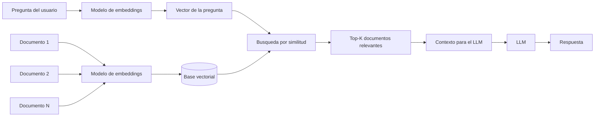

# Embeddings

## Definicion simple

Los embeddings son representaciones numericas de texto, imagenes u otros datos que capturan parte de su significado.

En simple: convierten contenido en coordenadas matematicas para que una maquina pueda comparar que tan parecidas son dos cosas.

## Explicacion tecnica

Un embedding es un vector, es decir, una lista de numeros que ubica un elemento dentro de un espacio semantico. En ese espacio, elementos con significado parecido suelen quedar cerca entre si, y elementos muy distintos suelen quedar mas lejos.

Esto permite operaciones utiles como:

- busqueda semantica
- agrupacion de documentos similares
- recomendacion de contenido
- recuperacion de contexto para un LLM
- deteccion aproximada de similitud entre frases

Los embeddings no son respuestas en lenguaje natural. Son una forma compacta de representar significado para que un sistema pueda medir cercania conceptual.

## Ejemplo practico

Imagina una base de conocimiento con miles de documentos. Un usuario pregunta:

"Como reduzco el tiempo de carga de mi aplicacion?"

Aunque ningun documento use exactamente esa frase, un sistema con embeddings puede encontrar textos sobre "mejora de rendimiento", "optimizacion de respuesta" o "latencia", porque busca por similitud de significado y no solo por coincidencia exacta de palabras.

## Analogia facil

Piensa en un mapa de ciudades.

Dos ciudades cercanas en el mapa suelen tener relacion geografica. En embeddings, dos textos cercanos en el espacio vectorial suelen tener relacion de significado.

## Diagrama

## Relacion con los demas conceptos

- Se conecta con el [LLM](05-llm.md) porque muchas aplicaciones usan embeddings para traer contexto util antes de consultar al modelo.
- Mejora el [Contexto](03-contexto.md) al permitir recuperar documentos semanticamente relevantes.
- Se relaciona con [Tokens](04-tokens.md) porque el texto primero debe convertirse a representaciones numericas, aunque embeddings y tokenizacion cumplen funciones distintas.
- Puede complementar al [Prompt engineering](02-prompt-engineering.md), ya que un buen sistema no solo formula bien la pregunta, sino que tambien adjunta el contexto correcto.
- Puede integrarse con [MCP](09-mcp.md) si una herramienta externa ofrece busqueda vectorial o acceso a conocimiento recuperado.
- Puede alimentar un [Prompt dentro de MCP](10-prompt-en-mcp.md) al aportar informacion relevante que luego se inserta en la instruccion final.

## Idea clave

Los embeddings no "piensan" ni "responden". Sirven para encontrar y organizar significado de manera matematica.