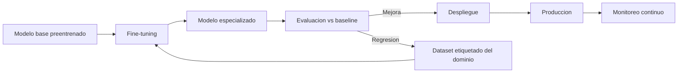

# Fine-tuning

## Introduccion

Los modelos de lenguaje de gran tamaño son poderosos generalistas. Pueden escribir codigo, resumir textos, responder preguntas y mucho mas. Pero a veces ese conocimiento general no es suficiente: una empresa necesita que el modelo siempre use un tono especifico, que entienda terminologia propia de su industria, que siga un formato muy preciso, o que rinda mucho mejor en una tarea concreta que ocurre miles de veces por dia.

Fine-tuning es la tecnica que permite tomar un modelo generalista y adaptarlo a esas necesidades especificas. Este capitulo explica como funciona, cuando tiene sentido usarlo, cuales son sus variantes modernas y en que se diferencia de otras estrategias como el prompt engineering o RAG.

---

## Definicion simple

Fine-tuning es volver a entrenar parcialmente un modelo ya existente para que se adapte mejor a una tarea o dominio concreto.

Es como tomar un modelo generalista y darle una especializacion.

---

## Explicacion tecnica

Un modelo base aprende patrones generales durante un entrenamiento muy grande. El fine-tuning añade una fase posterior de entrenamiento con datos mas especificos para ajustar sus parametros a una necesidad concreta.

Por ejemplo, puede usarse para:

- adoptar un estilo de respuesta determinado
- mejorar rendimiento en un sector, como legal o medico
- seguir formatos muy estrictos
- clasificar tipos de documentos
- responder mejor sobre una tarea repetitiva del negocio

La idea central es que el modelo no solo reciba mejores instrucciones, sino que cambie internamente parte de su comportamiento estadistico a partir de ejemplos adicionales.

### Fine-tuning supervisado (SFT)

La forma mas directa es el fine-tuning supervisado: se proporciona al modelo un conjunto de pares (instruccion → respuesta ideal) y se ajustan los pesos del modelo para que aprenda a producir esas respuestas ante esas instrucciones.

Formato tipico de los datos de entrenamiento:

```json
[
  {
    "prompt": "Clasifica este ticket de soporte: 'No puedo acceder a mi cuenta'",
    "completion": "Categoria: Acceso y autenticacion"
  },
  {
    "prompt": "Clasifica este ticket de soporte: 'La factura del mes pasado tiene un error'",
    "completion": "Categoria: Facturacion"
  }
]
```

### LoRA (Low-Rank Adaptation)

El fine-tuning tradicional modifica todos los parametros del modelo, lo que es computacionalmente caro para modelos de miles de millones de parametros. LoRA es una tecnica de fine-tuning eficiente que congela la mayoria de los parametros del modelo y solo entrena matrices pequenas de adaptacion que se insertan en las capas del modelo.

Las ventajas de LoRA son:
- Requiere mucho menos memoria y computo
- Produce adaptadores ligeros que pueden cambiarse facilmente
- Puede combinar multiples adaptadores para distintas tareas
- Es practicamente el estandar para fine-tuning de modelos grandes en hardware limitado

### RLHF (Reinforcement Learning from Human Feedback)

RLHF no es exactamente fine-tuning en el sentido tradicional, pero es una forma de ajuste que se usa para alinear modelos a preferencias humanas. El proceso es:

1. Se recopilan comparaciones de respuestas: el humano elige cual de dos respuestas es mejor
2. Se entrena un modelo de recompensa que aprende a predecir esas preferencias
3. Se usa esa funcion de recompensa con algoritmos de refuerzo para ajustar el LLM

RLHF es la tecnica detras de los modelos de chat modernos alineados (como ChatGPT o Claude): permite que el modelo aprenda a ser util, inofensivo y honesto no solo por instrucciones, sino por retroalimentacion directa de evaluadores humanos.

### Cuando tiene sentido hacer fine-tuning

Fine-tuning es valioso cuando:

- La tarea requiere un estilo de respuesta muy especifico y consistente que es dificil de capturar con prompts
- Se tienen miles de ejemplos etiquetados de alta calidad
- La tarea es repetitiva a gran escala y la diferencia de rendimiento justifica el costo de entrenamiento
- Se necesita reducir la longitud de los prompts (el modelo aprende el comportamiento, sin necesidad de explicarlo cada vez)
- El vocabulario o la terminologia del dominio es muy especifica y el modelo base no la maneja bien

Fine-tuning probablemente no vale la pena cuando:
- No se tienen suficientes datos de calidad (menos de cientos de ejemplos suele ser insuficiente)
- El problema puede resolverse con un buen prompt o con RAG
- Los requisitos cambian frecuentemente (fine-tuning es costoso y no se rehace facilmente)
- El costo de entrenamiento y mantenimiento excede el beneficio obtenido

### Fine-tuning vs RAG vs Prompt engineering

| Estrategia | Cuando usar | Ventajas | Desventajas |
|---|---|---|---|
| Prompt engineering | Primero siempre | Sin costo adicional, rapido de iterar | Limites del modelo, puede ser verboso |
| RAG | Cuando el problema es de conocimiento | Informacion actualizable, sin reentrenamiento | Requiere infraestructura de busqueda |
| Fine-tuning | Cuando se necesita cambiar el comportamiento del modelo | Mejor rendimiento en tareas especificas, prompts mas cortos | Costo de entrenamiento, datos necesarios, mas rigido |

La recomendacion general es: primero probar con prompt engineering, luego considerar RAG si el problema es de conocimiento, y solo entonces evaluar fine-tuning si los dos anteriores no son suficientes.

---

## Ejemplo practico

Una empresa de soporte tecnico tiene miles de tickets etiquetados por categoria. En vez de depender solo de prompts, entrena un modelo con esos casos para que identifique con mas precision si un ticket corresponde a facturacion, acceso, infraestructura o integraciones.

Eso es un caso tipico de fine-tuning: adaptar el modelo a datos propios y a una tarea concreta.

### Ejemplo de cuando fine-tuning supera al prompting

Supongamos que se necesita que el modelo siempre responda en un formato JSON muy especifico para integrarse con un sistema legacy:

```json
{
  "categoria": "acceso",
  "prioridad": "alta",
  "equipo_asignado": "seguridad",
  "resumen": "...",
  "siguiente_paso": "..."
}
```

Con un prompt muy detallado, el modelo puede producir ese formato el 85% del tiempo. Con fine-tuning sobre 2.000 ejemplos correctos, puede llegar al 99%+ de consistencia. Para un sistema en produccion con miles de tickets diarios, esa diferencia es critica.

---

## Analogia facil

Imagina un medico general que luego hace una residencia en cardiologia.

Sigue siendo medico, pero ahora esta mas afinado para un tipo particular de problema. No perdio su capacidad general, pero para diagnosticar problemas cardiacos, su precision, vocabulario y criterio son mucho mejores que los de un medico recien graduado.

El "medico general" es el modelo base preentrenado. La "residencia" es el fine-tuning sobre datos del dominio. Y el modelo resultante sigue pudiendo atender otros problemas generales, pero brilla especialmente en el dominio para el que fue especializado.

---

## Diagrama



---

## Relacion con los demas conceptos

- Se diferencia de [Prompt engineering](02-prompt-engineering.md): uno mejora la instruccion; el otro modifica el modelo.
- Se aplica sobre un [LLM](05-llm.md) o un modelo base parecido para volverlo mas especializado.
- Puede reducir la dependencia de prompts muy detallados, aunque no elimina la necesidad de un buen [Prompt](01-prompt.md).
- Puede trabajar mejor si el sistema sigue usando buen [Contexto](03-contexto.md), porque un modelo especializado tampoco adivina informacion ausente.
- Puede combinarse con [Embeddings](06-embeddings.md) y RAG: fine-tuning para el estilo y comportamiento, RAG para el conocimiento actualizable.
- Puede formar parte de una arquitectura con [Skill](08-skill.md) y [MCP](09-mcp.md), pero no los sustituye: solo especializa el modelo central.
- Su impacto debe medirse con [Evaluaciones](12-evaluaciones.md), comparando el modelo afinado con el modelo base sobre un golden dataset.

---

## Idea clave

Fine-tuning cambia al modelo. Prompt engineering cambia la forma de hablarle. Son cosas relacionadas, pero no equivalentes. Antes de recurrir al fine-tuning, siempre vale la pena agotar las opciones de prompt engineering y RAG, que son mas rapidas, mas baratas y mas faciles de iterar.

---

## Resumen del capitulo

Fine-tuning es la tecnica de adaptar un modelo base a un dominio o tarea especifica mediante entrenamiento adicional con datos etiquetados. Sus variantes modernas —especialmente LoRA— permiten hacer esta especializacion de forma eficiente incluso en hardware limitado. La decision de hacer fine-tuning debe tomarse cuidadosamente, comparandola con alternativas como prompting y RAG, y siempre validando el resultado con evaluaciones sistematicas.