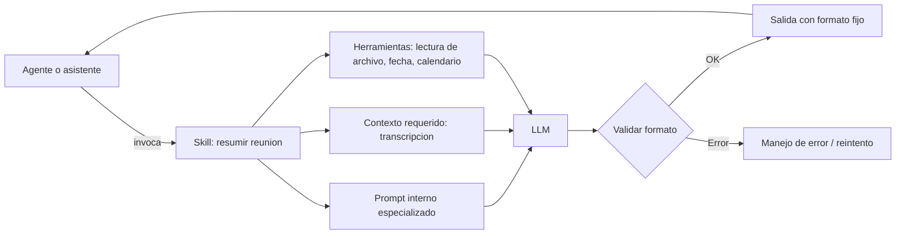

# Skill

## Introduccion

Un asistente de IA generico puede responder preguntas generales. Pero los sistemas realmente utiles en entornos empresariales necesitan mas que eso: necesitan capacidades empaquetadas, bien definidas y reutilizables que puedan activarse en el momento correcto. Eso es exactamente lo que un skill proporciona.

Este capitulo explica que es un skill en el contexto de sistemas de IA, como se diseña, como se activa y por que es un componente clave para construir asistentes y agentes que hagan trabajo real de forma consistente.

---

## Definicion simple

En sistemas de IA, un skill es una capacidad empaquetada para hacer una tarea concreta.

No es una "habilidad humana" abstracta, sino un componente reutilizable que le enseña al sistema como resolver cierto tipo de trabajo.

---

## Explicacion tecnica

Un skill suele combinar instrucciones, reglas, contexto esperado y, a veces, acceso a herramientas o pasos de ejecucion. Su objetivo es encapsular una funcion concreta para que un asistente o agente no tenga que improvisarla desde cero cada vez.

Dependiendo de la plataforma, un skill puede incluir:

- prompts especializados
- formato de entrada y salida
- criterios de decision
- llamadas a herramientas
- pasos secuenciales de trabajo
- restricciones de seguridad o validacion

En otras palabras, un skill convierte una capacidad en una pieza reutilizable del sistema.

### Anatomia de un skill

Un skill bien diseñado tiene al menos estos componentes:

**Nombre y descripcion:** identifican el skill para el agente o sistema que lo va a invocar. La descripcion debe ser suficientemente clara para que un agente pueda decidir cuando usar este skill y cuando no.

**Parametros de entrada:** los datos que el skill necesita para ejecutarse. Pueden ser texto libre, estructurado (JSON) o referencias a recursos externos.

**Prompt interno:** la instruccion que guia al LLM dentro del skill. Es un prompt especializado, no el prompt del usuario.

**Herramientas o llamadas externas:** si el skill necesita leer archivos, consultar una API, buscar en una base de datos o ejecutar codigo, esas dependencias deben estar declaradas.

**Formato de salida:** la estructura que el skill produce. Puede ser texto libre, JSON, una lista, un objeto de datos, etc.

**Validaciones y manejo de errores:** que debe hacer el skill si los datos de entrada estan incompletos, si una herramienta falla o si el resultado no cumple los criterios esperados.

### Tipos de skills

**Skills simples:** ejecutan una sola operacion bien definida. Ejemplo: "reformatear un bloque de codigo a un estilo especifico", "traducir un texto a un idioma dado", "extraer entidades de un parrafo".

**Skills compuestos:** ejecutan una secuencia de pasos internos para producir un resultado mas elaborado. Ejemplo: "analizar un ticket de soporte, clasificarlo, asignarle prioridad y redactar una respuesta preliminar".

**Skills con herramientas:** dependen de herramientas externas para completar su funcion. Ejemplo: "buscar informacion en la base de conocimiento, recuperar los 3 documentos mas relevantes y generar un resumen que los cite".

**Skills agenticos:** pueden tomar decisiones internas, iterar sobre resultados intermedios o ramificarse segun condiciones. Son el escalon mas complejo y se acercan a micro-agentes especializados.

### Diseño de un buen skill

Un skill bien diseñado deberia:

1. **Hacer una sola cosa bien.** Un skill que intenta resolver veinte problemas distintos suele resolver todos a medias.
2. **Tener una interfaz clara.** Los parametros de entrada y el formato de salida deben estar bien documentados.
3. **Ser testeable independientemente.** Debe poder probarse con casos de entrada conocidos y resultados esperados.
4. **Ser robusto ante entradas imperfectas.** En la practica, los datos de entrada rara vez son perfectos. El skill debe manejar casos borde.
5. **Ser auditable.** Debe quedar registro de que datos recibio, que herramientas invoco y que produjo.

---

## Ejemplo practico

Un asistente empresarial puede tener un skill llamado "resumir reunion".

Ese skill podria:

- recibir una transcripcion
- extraer acuerdos
- listar tareas pendientes
- devolver un resumen en formato fijo

El usuario no necesita diseñar todo desde cero cada vez; el sistema reutiliza esa capacidad ya preparada.

### Ejemplo de skill con herramientas

Skill: **"analizar_ticket_soporte"**

Parametros de entrada:
- `ticket_id`: identificador del ticket
- `prioridad`: alta | media | baja

Pasos internos:
1. Invocar herramienta `leer_ticket(ticket_id)` → obtiene el texto del ticket
2. Invocar herramienta `buscar_historial_usuario(ticket.usuario_id)` → obtiene tickets previos
3. Ejecutar LLM con prompt especializado para analizar el problema y el historial
4. Generar respuesta en JSON con: categoria, urgencia, respuesta_sugerida, escalacion_necesaria

Salida:
```json
{
  "categoria": "acceso",
  "urgencia": "alta",
  "respuesta_sugerida": "Hola [nombre], entendemos que no puedes acceder...",
  "escalacion_necesaria": false
}
```

Este skill encapsula todo ese flujo para que el agente solo tenga que invocarlo con el ticket_id y el sistema haga el resto.

---

## Analogia facil

Piensa en un libro de recetas.

Un skill es como una receta: describe paso a paso como preparar un plato concreto. Las herramientas (tools) son los ingredientes y utensilios que la receta necesita para llevarse a cabo. Sin los ingredientes adecuados la receta no se puede ejecutar, y sin la receta los ingredientes por si solos no producen el plato.

Un chef (el agente) tiene acceso a muchas recetas (skills) y decide cual usar segun lo que el cliente pide. No improvisa cada plato desde cero: usa el conocimiento codificado en las recetas.

---

## Diagrama



---

## Relacion con los demas conceptos

- Puede usar un [Prompt](01-prompt.md) interno para orientar la tarea que resuelve.
- Suele apoyarse en [Prompt engineering](02-prompt-engineering.md), porque un skill bien diseñado contiene instrucciones bien afinadas.
- Puede agregar [Contexto](03-contexto.md) especifico antes de pedir una respuesta al modelo.
- Normalmente delega el razonamiento linguistico a un [LLM](05-llm.md).
- Puede usar [Embeddings](06-embeddings.md) para buscar informacion relacionada antes de ejecutar su tarea principal.
- Puede ejecutarse sobre un modelo ajustado con [Fine-tuning](07-fine-tuning.md), aunque eso no es obligatorio.
- Suele ser invocado por un [Agente](11-agente.md), que decide cuando usar esa capacidad dentro de un flujo mayor.
- Puede conectarse con herramientas externas mediante [MCP](09-mcp.md).
- En muchos casos incluye o consume un [Prompt dentro de MCP](10-prompt-en-mcp.md) cuando trabaja sobre una infraestructura compartida de prompts y herramientas.
- Puede ser el nivel de ejecucion de una fase en ciclos como [RPI](12-rpi.md) o [QRSPI](13-qrspi.md).
- Debe ser cubierto por [Evaluaciones](12-evaluaciones.md) independientes: probar el skill en aislamiento antes de integrarlo en un agente.

---

## Idea clave

Un skill convierte una tarea recurrente en una capacidad reusable, en lugar de depender siempre de instrucciones improvisadas. Cuantos mas skills bien diseñados tiene un agente, mas trabajo complejo puede delegar y mas consistente y confiable se vuelve el sistema.

---

## Resumen del capitulo

Un skill es una unidad de capacidad reutilizable dentro de un sistema de IA. Encapsula instrucciones, herramientas, formatos de entrada/salida y logica de validacion para que una tarea recurrente pueda ejecutarse de forma consistente sin tener que diseñarla desde cero cada vez. Diseñar buenos skills —claros, testeables, robustos— es clave para construir agentes confiables y sistemas de IA que escalen.