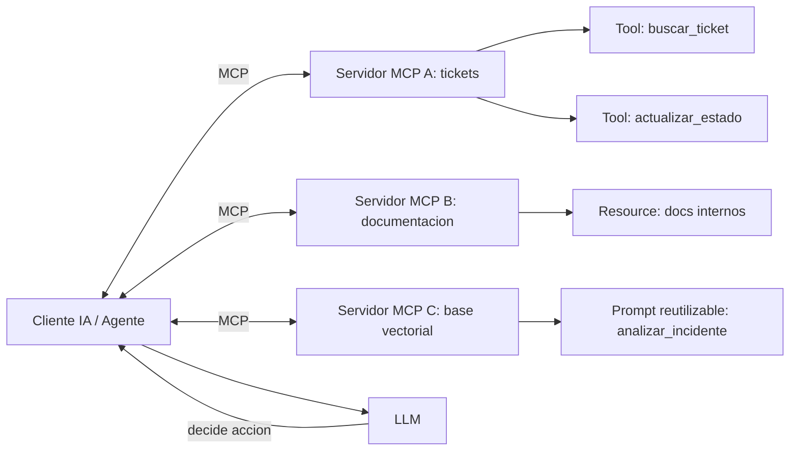

# MCP

## Introduccion

A medida que los sistemas de IA se vuelven mas capaces, necesitan acceder a mas herramientas, datos y servicios externos. Un asistente moderno puede necesitar leer archivos, consultar bases de datos, llamar APIs, ejecutar codigo o buscar documentacion. Sin un estandar comun, cada integracion requiere codigo personalizado, lo que hace que los sistemas sean fragiles, costosos de mantener y dificiles de escalar.

El Model Context Protocol (MCP) es la respuesta a ese problema: un protocolo abierto que define como los modelos de IA pueden comunicarse con herramientas y fuentes de datos externas de forma estandarizada. Este capitulo explica como funciona MCP, cuales son sus componentes principales y por que es un avance importante para construir sistemas de IA modulares y conectados.

---

## Definicion simple

MCP significa Model Context Protocol.

Es una forma estandar de conectar modelos de IA con herramientas, datos y funciones externas sin tener que crear integraciones distintas para cada caso.

---

## Explicacion tecnica

MCP es un protocolo que define como un cliente de IA y un servidor pueden intercambiar contexto, herramientas y otros recursos de manera estructurada.

La idea principal es separar el modelo de las fuentes externas de informacion y accion. En lugar de programar una conexion distinta para cada base de datos, API o sistema, MCP ofrece una interfaz comun para exponer capacidades como:

- herramientas que el modelo puede invocar
- recursos que el sistema puede leer
- prompts reutilizables
- datos estructurados necesarios para la tarea

Esto hace que los sistemas sean mas modulares. Un cliente compatible con MCP puede conectarse a distintos servidores MCP y descubrir que capacidades tiene disponibles.

### Arquitectura cliente-servidor de MCP

MCP sigue un modelo cliente-servidor:

**Cliente MCP:** el componente del lado del modelo de IA. Puede ser un agente, un asistente o cualquier sistema que quiera usar capacidades externas. El cliente descubre los servidores disponibles, solicita sus capacidades y realiza llamadas a herramientas o recursos.

**Servidor MCP:** el componente que expone capacidades. Puede ser un servicio que da acceso a una base de datos, a archivos del sistema, a una API externa o a funciones de computo. Un servidor MCP es como un plugin: define que puede hacer y como usarlo.

**Protocolo de comunicacion:** define el formato de mensajes entre cliente y servidor. Usa JSON-RPC 2.0 sobre distintos transportes (stdio para procesos locales, HTTP/SSE para servicios remotos).

### Los tres tipos de capacidades en MCP

**Herramientas (Tools):** funciones que el modelo puede invocar para realizar acciones o obtener informacion. Las herramientas tienen un nombre, una descripcion y un esquema de parametros. El modelo decide cuando y como usarlas.

Ejemplos de herramientas:
- `buscar_ticket(id)` → retorna los detalles de un ticket
- `leer_archivo(ruta)` → retorna el contenido de un archivo
- `ejecutar_consulta_sql(query)` → ejecuta una consulta y retorna los resultados
- `crear_issue_github(titulo, descripcion)` → crea un issue en un repositorio

**Recursos (Resources):** datos o documentos que el cliente puede leer. Son como archivos de solo lectura: el cliente los recupera pero no los modifica a traves de MCP.

Ejemplos de recursos:
- documentacion interna de la empresa
- esquema de una base de datos
- configuracion del sistema
- plantillas de documentos

**Prompts reutilizables (Prompts):** instrucciones preformateadas que el servidor puede proporcionar para tareas comunes. Permiten que equipos de prompters expertos publiquen prompts de calidad que los clientes pueden usar directamente.

### Descubrimiento de capacidades

Una ventaja clave de MCP es que los clientes pueden descubrir automaticamente las capacidades disponibles. Al conectarse a un servidor, el cliente puede preguntar: "¿que herramientas tienes?", "¿que recursos puedo leer?", "¿que prompts ofreces?". El servidor responde con una lista estructurada, y el cliente puede usar esas capacidades dinamicamente.

Esto es fundamentalmente diferente a las integraciones hardcodeadas: un cliente MCP puede conectarse a un servidor nuevo y empezar a usar sus capacidades sin que ningun desarrollador tenga que escribir codigo especifico para esa integracion.

### Seguridad en MCP

MCP incluye consideraciones de seguridad importantes:

- Los servidores deben validar las entradas antes de ejecutar acciones
- Los clientes deben verificar que los servidores son de confianza antes de conectarse
- Las herramientas destructivas (como borrar archivos o ejecutar comandos) deben requerir confirmacion explicita
- El protocolo incluye mecanismos de aislamiento para limitar el alcance de lo que un servidor puede hacer

---

## Ejemplo practico

Imagina un asistente que necesita consultar tickets de soporte y tambien revisar documentacion interna.

En vez de construir integraciones separadas y cerradas dentro del asistente, se puede conectar a:

- un servidor MCP que expone una herramienta para buscar tickets
- otro servidor MCP que expone recursos de documentacion

El modelo sigue siendo el mismo, pero ahora puede apoyarse en informacion externa mediante una interfaz comun.

### Ejemplo de llamada a herramienta via MCP

El agente recibe: "¿Por que falla el login del usuario ID 12345?"

El agente invoca la herramienta `buscar_ticket` via MCP:
```json
{
  "method": "tools/call",
  "params": {
    "name": "buscar_ticket",
    "arguments": {
      "usuario_id": "12345",
      "categoria": "acceso"
    }
  }
}
```

El servidor MCP responde con los datos del ticket y el agente puede entonces razonar sobre ellos para dar una respuesta util al usuario.

---

## Analogia facil

MCP se parece a un enchufe estandar.

Si todos los aparatos usan conectores distintos, integrarlos es costoso y fragil. Si comparten un estandar (como el enchufe USB-C o el europeo de dos patas), cualquier aparato compatible puede conectarse a cualquier fuente compatible.

Con MCP, cualquier cliente de IA compatible puede conectarse a cualquier servidor MCP sin necesidad de integraciones personalizadas. El modelo es el aparato; las herramientas y datos son las fuentes de energia; MCP es el estandar del enchufe.

---

## Diagrama



---

## Relacion con los demas conceptos

- Extiende lo que puede hacer un [LLM](05-llm.md), porque le da acceso estructurado a herramientas y datos externos.
- Mejora el [Contexto](03-contexto.md) al permitir traer informacion desde otros sistemas en tiempo real.
- Suele ser usado por un [Agente](11-agente.md), que necesita consultar recursos o ejecutar herramientas sin integraciones ad hoc.
- Puede alojar o exponer [Prompt dentro de MCP](10-prompt-en-mcp.md) para tareas reutilizables.
- Se relaciona con [Skill](08-skill.md) porque un skill puede usar MCP para ejecutar parte de su trabajo.
- Se combina con [Prompt engineering](02-prompt-engineering.md), ya que no basta con tener herramientas: tambien hay que guiar bien su uso en el prompt.
- Puede complementar sistemas con [Embeddings](06-embeddings.md) cuando el acceso a busqueda vectorial se publica como capacidad externa a traves de un servidor MCP.

---

## Idea clave

MCP no reemplaza al modelo. Le da una forma ordenada y estandarizada de conectarse con el resto del mundo. La modularidad que aporta hace que los sistemas sean mas faciles de mantener, extender y reusar: agregar una nueva herramienta es tan simple como desplegar un nuevo servidor MCP.

---

## Resumen del capitulo

MCP es un protocolo abierto que estandariza como los modelos de IA se conectan con herramientas, datos y servicios externos. Con su modelo cliente-servidor y sus tres tipos de capacidades (herramientas, recursos y prompts), MCP permite construir sistemas modulares donde el modelo puede descubrir y usar capacidades dinamicamente sin necesidad de integraciones hardcodeadas. Es la infraestructura de conectividad de los sistemas de IA modernos.