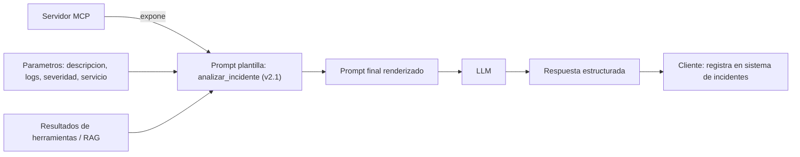

# Prompt dentro de MCP

## Introduccion

En los capitulos anteriores vimos que un prompt es la instruccion que un usuario le da a un modelo, y que MCP es el protocolo que conecta modelos con herramientas y datos externos. Cuando estos dos conceptos se combinan, surge algo nuevo: prompts que no los escribe el usuario directamente, sino que son componentes estructurados del sistema, versionados, parametrizados y reutilizables, que viajan a traves de la infraestructura MCP.

Este capitulo explica que es un prompt dentro de MCP, como se diferencia de un prompt convencional, cuando usarlos y como diseñarlos bien.

---

## Definicion simple

Un prompt dentro de MCP es una instruccion reutilizable que forma parte de una arquitectura conectada por el Model Context Protocol.

En vez de ser solo un texto escrito manualmente por el usuario, puede venir preparado por una herramienta o servidor y usarse dentro de un flujo mas grande.

---

## Explicacion tecnica

Dentro del ecosistema MCP, un servidor puede exponer prompts reutilizables o ayudar a construir prompts a partir de datos, parametros y contexto externo. Eso permite que los clientes de IA consuman instrucciones estructuradas de manera consistente.

Desde una mirada tecnica, esto significa que el prompt deja de ser solo una cadena improvisada y pasa a ser parte de una interfaz compartida. Puede incluir:

- variables de entrada
- contexto recuperado por herramientas
- formato esperado de salida
- reglas del dominio
- pasos sugeridos para resolver una tarea

Eso mejora reutilizacion, control y consistencia dentro de sistemas con multiples componentes.

### Por que los prompts como componentes del sistema

En sistemas de IA simples, el prompt lo escribe el usuario y punto. En sistemas de produccion mas complejos, el prompt es mucho mas:

- Es codigo: debe estar versionado, testeado y revisado como cualquier otro componente
- Es una interfaz: define que inputs acepta y que outputs produce
- Es una dependencia: cambiarlo puede afectar el comportamiento de todo el sistema

Cuando los prompts viven dentro de MCP, se benefician de todos esos atributos de forma natural: el servidor los versiona, los expone a traves de una interfaz estandar y los actualiza de forma independiente del codigo del cliente.

### Estructura de un prompt MCP

Un prompt expuesto a traves de MCP tiene tipicamente:

- **Nombre:** identificador unico (`analizar_incidente`, `clasificar_ticket`)
- **Descripcion:** explica para que sirve el prompt, cuando usarlo y que produce
- **Parametros:** lista de variables que el cliente debe proporcionar para renderizar el prompt
- **Plantilla:** el texto del prompt con placeholders para los parametros
- **Metadata:** version, autor, fecha de ultima actualizacion, casos de uso recomendados

### Prompts con parametros

Un prompt parametrizado es una plantilla con "huecos" que se rellenan con datos concretos en tiempo de ejecucion:

```
Analiza el siguiente incidente de produccion:

Servicio afectado: {{servicio}}
Severidad: {{severidad}}
Descripcion del problema: {{descripcion}}
Logs recientes:
{{logs}}

Produce:
1. Causa raiz probable
2. Impacto estimado en usuarios
3. Acciones inmediatas recomendadas
4. Acciones preventivas a largo plazo
```

El cliente llena `{{servicio}}`, `{{severidad}}`, `{{descripcion}}` y `{{logs}}` con los datos reales del incidente antes de enviarlo al LLM.

### Versionado y mantenimiento

Los prompts como componentes del sistema deben estar versionados. Un cambio en el prompt puede afectar la calidad de las respuestas, la estructura del output y la compatibilidad con sistemas que procesan ese output.

Practicas recomendadas:

- versionar prompts igual que el codigo: `v1.0`, `v1.1`, `v2.0`
- documentar que cambio en cada version y por que
- ejecutar evals automaticas antes de promover una nueva version
- mantener versiones anteriores disponibles mientras haya clientes que las usen

---

## Ejemplo practico

Supongamos que un servidor MCP ofrece un prompt llamado "analizar_incidente".

Ese prompt podria recibir como parametros:

- descripcion del incidente
- logs recientes
- severidad
- servicio afectado

El cliente usa ese prompt ya preparado y el modelo recibe una instruccion mucho mas rica y consistente que un mensaje improvisado cada vez.

### Sin prompt MCP

Cada vez que ocurre un incidente, el ingeniero de guardia escribe manualmente:
```
"Hubo un error en el servicio de pagos, mira estos logs y dime que esta mal"
```

La calidad del analisis depende de cuanto detalle incluya el ingeniero en el momento, que puede variar mucho segun el nivel de estres y la experiencia de quien escribe.

### Con prompt MCP

El sistema automaticamente completa la plantilla con los datos del incidente:
```
Analiza el siguiente incidente de produccion:

Servicio afectado: pagos-api
Severidad: CRITICA
Descripcion del problema: La tasa de error del endpoint /checkout supera el 40% desde las 14:32 UTC
Logs recientes:
[ERROR] 14:32:01 PaymentProcessor: Timeout connecting to payment-gateway after 5000ms
[ERROR] 14:32:01 PaymentProcessor: Timeout connecting to payment-gateway after 5000ms
[ERROR] 14:32:03 CircuitBreaker: OPEN state for payment-gateway

Produce:
1. Causa raiz probable
2. Impacto estimado en usuarios
3. Acciones inmediatas recomendadas
4. Acciones preventivas a largo plazo
```

El analisis resultante es mucho mas estructurado, completo y accionable.

---

## Analogia facil

Es como una plantilla profesional en una empresa.

En lugar de redactar desde cero cada informe de incidente, usas un formato aprobado con campos claros. Eso reduce errores y hace que todos trabajen con la misma base, independientemente de quien este de guardia esa noche.

Los prompts dentro de MCP son esas plantillas para instrucciones a modelos de IA: estandarizan como se le pide al modelo que resuelva un tipo de tarea, asegurando consistencia y calidad independientemente de quien o que sistema invoca la consulta.

---

## Diagrama



---

## Relacion con los demas conceptos

- Parte del concepto general de [Prompt](01-prompt.md), pero en un entorno mas estructurado.
- Suele ser resultado de [Prompt engineering](02-prompt-engineering.md), porque alguien tuvo que diseñarlo bien para que sea reutilizable y efectivo.
- Integra [Contexto](03-contexto.md) procedente de herramientas, recursos o sistemas externos.
- Termina siendo procesado por un [LLM](05-llm.md), igual que cualquier otra instruccion.
- Puede incorporar informacion recuperada mediante [Embeddings](06-embeddings.md), por ejemplo documentos semanticamente relevantes.
- Puede formar parte de un [Skill](08-skill.md) que automatiza una tarea recurrente.
- Puede ser usado por un [Agente](11-agente.md) como parte de una secuencia de trabajo con herramientas y decisiones intermedias.
- Existe precisamente dentro de una arquitectura [MCP](09-mcp.md), que permite compartir prompts, recursos y herramientas de forma estandar.
- Debe ser evaluado y versionado como cualquier otro componente, usando [Evaluaciones](12-evaluaciones.md) para validar que las nuevas versiones no introducen regresiones.

---

## Idea clave

Un prompt dentro de MCP es un prompt convertido en componente de sistema: mas reusable, mas controlado y mejor conectado con herramientas y contexto externo. Es la diferencia entre instrucciones improvisadas y una interfaz de prompts gobernada, versionada y testeable.

---

## Resumen del capitulo

Los prompts dentro de MCP elevan el concepto de prompt de "texto que escribe el usuario" a "componente gobernado del sistema". Al exponerlos a traves del protocolo MCP, se pueden versionar, parametrizar, compartir entre equipos y actualizar de forma independiente. Esto es especialmente valioso en sistemas de produccion donde la consistencia y la calidad de las instrucciones son tan criticas como la calidad del codigo.