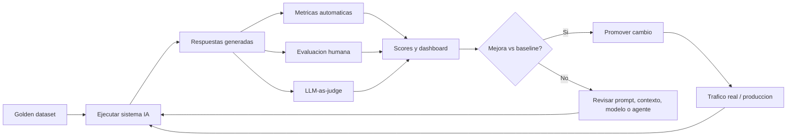

# Evaluaciones (LLM Evals)

## Introduccion

En el desarrollo de software tradicional, los tests automatizados son la forma de garantizar que los cambios en el codigo no rompan funcionalidad existente. En sistemas de IA, el equivalente son las evaluaciones (evals): conjuntos de pruebas estructuradas que miden si el sistema produce respuestas de calidad, si mejora con los cambios y si no regresa en dimensiones que ya funcionaban bien.

Sin evaluaciones, "mejorar" un sistema de IA es una opinion subjetiva. Con evaluaciones sistematicas, es una decision basada en datos. Este capitulo explica que son las evals, como se diseñan, cuales son sus tipos y como integrarlas en el ciclo de desarrollo.

---

## Definicion simple

Las evaluaciones, o "evals", son pruebas sistematicas que miden que tan bien responde un sistema de IA.

En simple: son la forma de saber si el modelo, el prompt, el contexto o el agente realmente estan haciendo bien su trabajo, y no solo "parece" que funcionan.

---

## Explicacion tecnica

Un eval define un conjunto de entradas, salidas esperadas (o criterios) y metricas para medir el comportamiento de un LLM o de un sistema basado en LLM. A diferencia del software tradicional, donde una prueba unitaria suele dar verdadero o falso, las salidas de un LLM son textos abiertos, asi que los evals combinan distintos enfoques:

- **Evaluacion automatica (cuantitativa):** compara la salida con una referencia mediante metricas como exact match, BLEU, ROUGE, METEOR, F1, similitud por embeddings o validaciones de formato (JSON Schema, expresiones regulares).
- **Evaluacion humana (cualitativa):** personas expertas puntuan la respuesta segun rubricas (utilidad, correccion, claridad, tono, seguridad).
- **LLM-as-judge:** se usa un LLM, normalmente mas potente, como juez que aplica una rubrica para puntuar respuestas. Es mas barato y escalable que la evaluacion humana, pero introduce sus propios sesgos y conviene calibrarlo contra evaluaciones humanas.
- **Evaluacion offline vs online:**
  - *Offline* sobre un dataset fijo (golden set), util para iterar antes de soltar cambios a produccion.
  - *Online* sobre trafico real, usando A/B testing, feedback de usuario, ratings, tasa de exito de la tarea o señales implicitas (clics, retencion).

Un sistema serio de evals suele incluir tambien:

- un **golden dataset** versionado con casos representativos, casos limite y regresiones conocidas
- **evaluadores** automatizados que producen un score por dimension (correcion, relevancia, factualidad, toxicidad, latencia, costo)
- un **dashboard** con tendencias y alertas para detectar regresiones
- evaluaciones de **seguridad y red-teaming** para prompts adversariales

## Dimensiones tipicas que se miden

- **Correccion / accuracy:** ¿la respuesta es correcta?
- **Relevancia:** ¿esta enfocada en lo que el usuario pidio?
- **Factualidad / grounding:** ¿se apoya en el contexto recuperado y evita inventar?
- **Fluidez y formato:** ¿es legible y respeta el formato pedido (JSON, lista, longitud)?
- **Utilidad:** ¿le sirve al usuario para resolver su tarea?
- **Seguridad:** ¿evita contenido toxico, sesgado o no permitido?
- **Robustez:** ¿se mantiene estable ante variaciones del prompt?
- **Latencia y costo:** ¿la respuesta llega a tiempo y dentro del presupuesto de tokens?

## Ejemplo practico

Imagina un asistente que responde preguntas sobre la documentacion interna de una empresa.

1. Se construye un **golden dataset** con 200 preguntas reales y la respuesta esperada (o los documentos que deberian citarse).
2. Para cada cambio en el prompt, en el modelo o en el sistema de recuperacion (RAG), se ejecutan los 200 casos.
3. Por cada respuesta se calcula:
   - similitud semantica con la respuesta esperada (embeddings)
   - si las citas usadas estan entre los documentos correctos
   - una puntuacion de "utilidad" hecha por un LLM-as-judge segun una rubrica
4. Si alguna metrica empeora respecto a la version anterior, el cambio no se promueve a produccion.
5. En produccion, se mide la tasa de "thumbs up/down" y la proporcion de conversaciones reabiertas, como evals online.

## Metodologia recomendada

1. **Definir la tarea y el exito.** Antes de medir, hay que decidir que significa "buena respuesta" en este caso.
2. **Construir un golden dataset** pequeño pero representativo y mantenerlo vivo.
3. **Elegir metricas** combinadas: automaticas + humanas o LLM-as-judge.
4. **Automatizar la corrida** de evals en cada cambio (CI para prompts, modelos o RAG).
5. **Analizar fallos**, no solo promedios: revisar los peores casos y agregarlos al dataset.
6. **Cerrar el ciclo con datos de produccion**, incorporando casos reales (anonimizados) al golden set.

## Retos comunes

- Las metricas automaticas no siempre capturan calidad real.
- Los jueces (humanos o LLM) tienen sesgos: posicion, longitud, estilo.
- Optimizar para una metrica puede degradar otras dimensiones (gaming).
- Datasets desactualizados dejan pasar regresiones nuevas.
- Evaluar agentes y flujos multi-paso es mas complejo que evaluar respuestas unicas: hay que medir tambien la trayectoria de pasos y herramientas.

## Analogia facil

Las evals son como las pruebas de calidad en una cocina industrial.

No basta con que el chef diga "esto sabe bien". Hay catadores, recetas estandar, controles de temperatura, tiempos y muestras de comparacion. Si un dia el plato se aleja del estandar, las pruebas lo detectan antes de que llegue al cliente.

## Diagrama

## Relacion con los demas conceptos

- Miden la calidad de las respuestas generadas por un [LLM](05-llm.md).
- Permiten comparar variantes de [Prompt](01-prompt.md) y validar tecnicas de [Prompt engineering](02-prompt-engineering.md).
- Verifican si el [Contexto](03-contexto.md) entregado es suficiente y si el modelo lo usa correctamente.
- Ayudan a controlar el consumo y limites de [Tokens](04-tokens.md), incluyendo costo y latencia.
- Son indispensables para validar el efecto de un [Fine-tuning](07-fine-tuning.md) y evitar regresiones.
- Pueden apoyarse en [Embeddings](06-embeddings.md) para medir similitud semantica entre la respuesta esperada y la generada.
- Aplican tambien a [Skill](08-skill.md), [MCP](09-mcp.md) y [Prompt dentro de MCP](10-prompt-en-mcp.md), porque cada componente añadido puede afectar el resultado final.
- Son criticas para un [Agente](11-agente.md), donde no solo se evalua la respuesta final, sino tambien la secuencia de pasos y el uso de herramientas.

## Idea clave

Sin evaluaciones, "mejorar" un sistema de IA es una opinion. Con evaluaciones, es una decision medible y repetible.

## Evals en el ciclo de CI/CD

Asi como el codigo tiene pipelines de CI/CD que ejecutan tests en cada pull request, los sistemas de IA deben tener pipelines equivalentes que ejecuten evals automaticamente ante cualquier cambio en el prompt, el modelo, el sistema de recuperacion o la configuracion del agente.

Un pipeline tipico de CI para sistemas de IA:

1. El desarrollador modifica un prompt, un parametro del sistema o actualiza el modelo
2. El pipeline ejecuta automaticamente el golden dataset contra la nueva version
3. Se calculan los scores y se comparan con el baseline de la version anterior
4. Si cualquier metrica cae por debajo del umbral definido, el pipeline falla y el cambio no puede mergearse
5. Si todas las metricas superan el umbral (o mejoran), el cambio puede avanzar

Herramientas populares para implementar esto:

- **Promptfoo:** framework open source para testing de prompts y LLMs
- **Braintrust:** plataforma para evals y monitoreo de LLMs
- **LangSmith:** plataforma de LangChain para tracing y evaluacion
- **RAGAS:** libreria especifica para evaluar sistemas RAG
- **DeepEval:** framework de testing para LLMs estilo pytest

## Resumen del capitulo

Las evaluaciones son el mecanismo de control de calidad de los sistemas de IA. Sin ellas, los cambios en prompts, modelos o configuracion son apuestas. Con un sistema de evals bien diseñado —golden dataset representativo, metricas combinadas, evaluacion continua en CI/CD— los cambios se pueden tomar con confianza y las regresiones se detectan antes de llegar a produccion.

## Referencias

- "LLM Evals" - System Design Newsletter: https://newsletter.systemdesign.one/p/llm-evals
