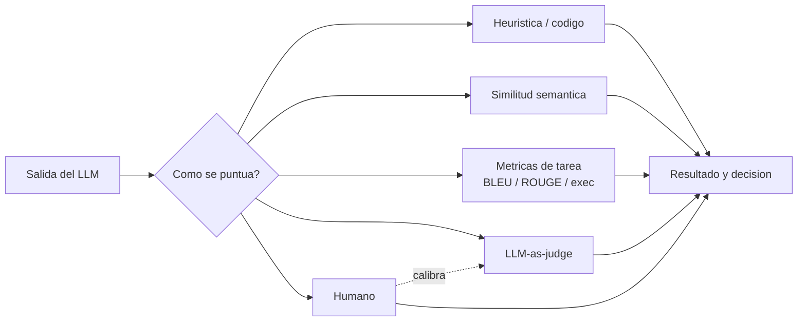
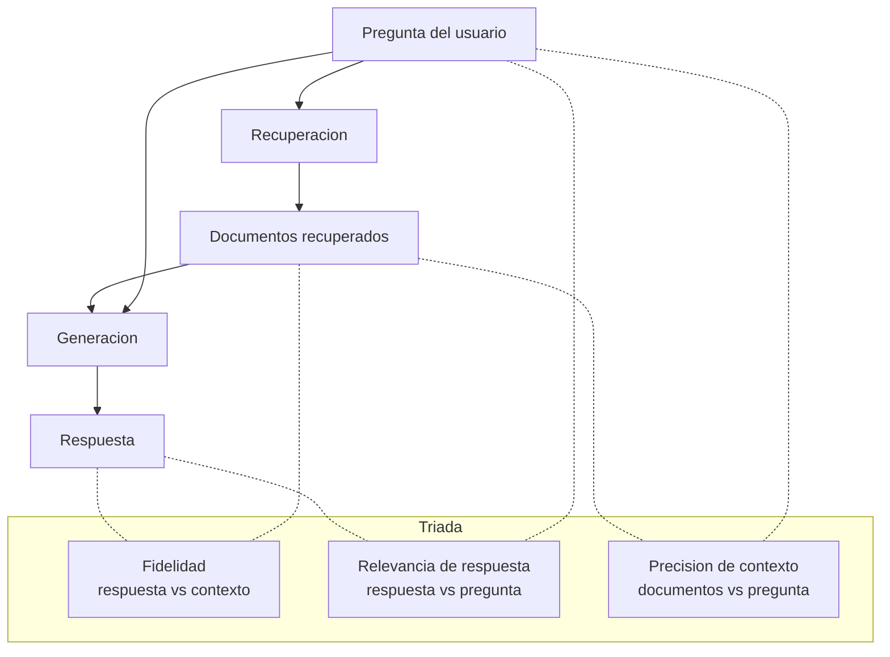
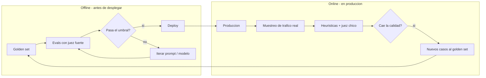

# Evaluacion (Evals)

## Definicion simple

Evaluar (o "hacer evals") es medir, de forma sistematica y repetible, que tan bien se comporta un sistema de IA frente a casos representativos.

En simple: es la disciplina que permite decir con datos si una version de un prompt, un modelo o un agente es mejor o peor que otra, en lugar de confiar solo en la intuicion ("a mi me funciono").

## Por que es necesaria una disciplina propia

Las pruebas tradicionales de software no alcanzan para sistemas basados en LLMs. Hay tres problemas que rompen los habitos clasicos de testing:

- **No determinismo:** el mismo prompt puede producir respuestas distintas en cada ejecucion. Una prueba que pasa una vez no garantiza que vuelva a pasar.
- **Correctitud difusa:** muchas tareas no tienen una unica respuesta correcta. Un resumen "empatico" o una explicacion "clara" admiten varias salidas validas y varias malas, y la frontera es un juicio.
- **Regresiones silenciosas:** ajustar un prompt puede mejorar unos casos y empeorar otros sin que nadie lo note. Sin un proceso de evaluacion, cada cambio es una apuesta a ciegas.

Por eso se necesita una capa formal de medicion, no solo pruebas unitarias clasicas.

## Conceptos basicos

### Criterios

Los criterios son las dimensiones de calidad que importan para el caso de uso concreto. No los define el modelo ni el framework: los define el equipo de producto. Para un bot de soporte pueden ser "resuelve la consulta", "tono empatico", "no escala innecesariamente". Para un generador de codigo pueden ser "compila", "respeta convenciones", "resuelve el problema".

### Dimensiones de calidad

Vocabulario estandar para hablar de calidad de salidas de LLM:

- **Relevancia:** responde lo que se pregunto.
- **Coherencia:** no se contradice, no salta de tema.
- **Exactitud factual:** lo que afirma es verdadero.
- **Utilidad:** ayuda al usuario a avanzar, no solo es "tecnicamente correcto".
- **Seguridad:** evita contenido dañino, sesgado o inapropiado.

### Rubrica

Una rubrica convierte criterios vagos en preguntas concretas y puntuables. En lugar de "es util?", pregunta "responde directamente?", "evita rodeos innecesarios?", "es comprensible para un usuario no tecnico?". Es el equivalente a un checklist de code review aplicado a salidas de LLM y es lo que hace que la evaluacion sea reproducible.

### Casos de prueba

Cada caso de prueba es un par entrada/salida. La entrada es un prompt representativo del trafico real; la salida puede ser una respuesta de referencia ("asi se ve algo bueno") o la respuesta del sistema que estamos puntuando. Pocos casos son anecdota; cientos empiezan a dar señal.

### Golden set

Es el conjunto curado de casos de prueba contra el que se mide todo. Conviene construirlo a partir de trafico real anonimizado, no solo de ejemplos imaginados por el equipo, porque los usuarios reales fallan de formas que uno no anticipa. El golden set es la "verdad de referencia" del sistema: se versiona y se actualiza cuando aparecen nuevos modos de fallo.

### Umbral de pass/fail

Las rubricas suelen dar puntajes (1 a 5, 0 a 10, porcentaje). El umbral es la linea que convierte ese puntaje en decision. Es una decision de producto: muy bajo y se publica calidad mala; muy alto y nunca se publica nada.

### Cobertura de evaluacion

Mide que tan bien el golden set refleja el trafico real. Casi todos los equipos sobreestiman su cobertura: el set se arma con casos felices y obvios, mientras produccion trae frases raras y usos inesperados. Se mejora muestreando produccion regularmente y agregando los casos donde el sistema fallo.

### Temperatura, top-p y reproducibilidad

La **temperatura** controla cuanto azar hay en la generacion: cerca de 0 el modelo es casi deterministico, mas alta es mas creativa. **Top-p** (nucleus sampling) limita el muestreo a los tokens con probabilidad acumulada hasta cierto umbral. Para evaluar conviene fijar `temperature = 0` y reducir el ruido. Si la aplicacion en produccion usa temperatura mas alta, hay que asumir mayor varianza.

### Rigor estadistico

Aun con temperatura 0, una sola corrida no alcanza: el golden set tambien tiene varianza. Hay que correr varias muestras, reportar media y desviacion, y comparar versiones para distinguir una mejora real de un ruido afortunado. Pasar de 4.1 a 4.3 puede ser señal o puede ser azar.

## Metodos de scoring

### Evaluacion humana

Es el patron oro y la referencia ultima. Lenta, cara y a veces inconsistente, pero la mas cercana a la verdad. No escala para correr en cada cambio: se usa para construir y validar el golden set, calibrar evaluadores automaticos y depurar fallos no claros.

### Heuristica / basada en codigo

Comprobaciones simples por codigo: la respuesta es JSON valido, esta dentro del limite de caracteres, contiene los campos requeridos, evita frases prohibidas, cumple un regex. Es rapida y barata, pero solo detecta problemas estructurales: no mide si la respuesta es buena, util o veraz. Funciona como primera linea de defensa.

### Similitud semantica

Cuando hay una respuesta de referencia, se mide cuanto se parecen en significado (no en palabras exactas) la salida del modelo y esa referencia. Para esto se convierten ambos textos en vectores ([Embeddings](06-embeddings.md)) y se compara su similitud (tipicamente coseno). Captura que "el endpoint devuelve 404" y "el endpoint responde con not found" son equivalentes. Limitacion: no detecta una respuesta fluida pero falsa si esta cerca semanticamente de la correcta.

### Metricas especificas de tarea

- **BLEU:** pensada para traduccion automatica, mide solapamiento de n-gramas con una referencia.
- **ROUGE:** pensada para resumenes, mide cuanta de la referencia aparece en la salida (recall).
- **Evaluacion por ejecucion:** para generacion de codigo, lo que importa es si el codigo corre y pasa los tests. Es una de las pocas metricas verdaderamente objetivas en LLMs.

Todas comparten el mismo limite: miden similitud superficial con una referencia, no calidad real.

### LLM-as-judge

Se usa un modelo mas capaz (por ejemplo, un GPT o Claude grande) como juez. Se le da la entrada original, la salida a evaluar y la rubrica, y devuelve un puntaje con justificacion. Es lo que hace que evaluar a escala sea viable: aplica la rubrica sobre miles de casos sin miles de horas humanas. Tiene sus sesgos y errores, asi que es una aproximacion al juicio humano, no un reemplazo.

### Pointwise vs pairwise

- **Pointwise:** "puntua esta salida del 1 al 5". Simple y barato.
- **Pairwise:** "cual de estas dos salidas es mejor?". Mas confiable, porque comparar es mas facil que puntuar en abstracto, pero cuesta el doble.

Patron habitual de la industria:

- **Online (en produccion):** heuristicas y jueces chicos, baratos, corriendo en continuo.
- **Offline (antes de desplegar):** el mejor juez disponible, pointwise y pairwise, como compuerta antes del release.

### Calibracion del juez

Antes de confiar en un juez automatico hay que medir cuanto coincide con humanos en una muestra: si la concordancia es alta, sirve como proxy; si es baja, esta midiendo otra cosa. La calibracion se repite cada vez que cambia el modelo juez o el prompt de la rubrica.

## Evaluacion de sistemas RAG

Muchos sistemas reales no son "prompt entra, respuesta sale": primero recuperan documentos relevantes y luego generan la respuesta apoyandose en ellos (Retrieval-Augmented Generation). Esto reduce alucinaciones, pero introduce nuevos modos de fallo que la evaluacion estandar no detecta.

### El triangulo del RAG

- **Fidelidad (faithfulness):** la respuesta esta realmente sustentada en los documentos recuperados, o el modelo "alucino con pasos extra"?
- **Relevancia de la respuesta:** responde lo que el usuario pregunto, mas alla de estar bien sustentada?
- **Precision del contexto:** los documentos recuperados eran realmente relevantes para la pregunta?

### Patrones tipicos de fallo en RAG

1. **Recuperacion trae chunks irrelevantes:** falla la precision de contexto. El modelo alucina o dice "no se". Se ataca mejorando embeddings, chunking o re-ranking.
2. **Recuperacion correcta pero el modelo la ignora:** falla la fidelidad. Suele ser problema de prompt: hay que forzar que la respuesta se apoye en el contexto provisto.
3. **Respuesta sustentada pero inutil:** falla la relevancia de la respuesta. Suele indicar que la base de conocimiento no contiene la informacion necesaria; el arreglo es mejorar los datos, no el prompt.

## Evaluacion offline vs online

- **Offline:** se corre antes de desplegar, sobre el golden set, con el mejor juez disponible. Funciona como un CI para LLMs: si la calidad baja respecto a la version actual, no se publica.
- **Online:** se muestrea trafico real en produccion y se puntua con metodos baratos (heuristicas, jueces chicos). Sirve para detectar fallos que el golden set no cubria. Los casos nuevos descubiertos aqui alimentan el golden set.

Ambos son complementarios: offline atrapa lo conocido, online descubre lo inesperado.

## Versionado de prompts y regresion

El prompt es codigo y debe tratarse como tal: version control, historial, diffs. Cada cambio se corre contra la suite de evals para detectar regresiones. Si la version anterior puntuaba 4.2 y la nueva 3.8, se atrapo una regresion antes de que llegue al usuario. Sin esta disciplina, cada cambio es "ship and pray".

## Benchmarks publicos

Sirven para comparar modelos entre si, no para validar tu caso de uso:

- **MMLU:** conocimiento general en muchas materias.
- **HellaSwag:** sentido comun en completar escenarios.
- **HumanEval:** generacion de codigo, medido con `pass@k`.

Tambien hay leaderboards (Hugging Face Open LLM Leaderboard, Chatbot Arena). Son utiles para preseleccionar modelos, pero la decision final debe basarse en evals propios sobre el golden set propio.

### Contaminacion de datasets

Aparece cuando los datos de evaluacion ya estuvieron en el entrenamiento del modelo: el puntaje refleja memorizacion, no capacidad. Por eso los benchmarks publicos pierden valor con el tiempo y por eso conviene no depender solo de ejemplos publicos: armar evals con consultas reales del dominio.

## Anti-patrones comunes

- **Evaluacion "por feeling":** "lo probe un par de veces y se ve bien". Da falsa confianza, no escala, no detecta regresiones.
- **Trampa de la muestra unica:** correr el set una sola vez y reportar el numero. Por no determinismo, un buen prompt puede verse mal y uno malo bien. Hay que correr varias veces y mirar varianza.
- **Ley de Goodhart:** "cuando una metrica se vuelve objetivo, deja de ser una buena metrica". Optimizar agresivamente por una metrica corrompe lo que querias medir (premiar confianza produce alucinaciones confiadas; premiar largo produce respuestas largas y vacias).
- **Mismatch eval-produccion:** el golden set refleja lo que el equipo imagino, no lo que los usuarios realmente piden. La cobertura baja vuelve los evals optimistas: pasan las pruebas y fallan los usuarios.

## Ejemplo practico

Un equipo cambia el prompt del bot de soporte para que sea "mas empatico". Sin evals, prueba tres mensajes a mano, le parece mejor y publica.

Con evals, el flujo es distinto:

1. Tienen un golden set de 300 conversaciones reales anonimizadas, con la respuesta ideal asociada.
2. Tienen una rubrica con cuatro criterios: resuelve el problema, tono empatico, no escala innecesariamente, menor a 200 palabras.
3. Corren la version actual y la nueva con `temperature = 0`, cinco veces cada una, y puntuan con un LLM juez calibrado contra humanos.
4. La version nueva sube empatia (4.6 vs 4.1) pero baja resolucion (3.4 vs 4.0). El score promedio queda igual, pero el cambio empeora lo que mas importa.
5. No se publica. Se ajusta el prompt para mantener empatia sin perder resolucion y se vuelve a evaluar.

El cambio no se decidio "por feeling", se decidio con evidencia.

## Analogia facil

Evaluar un LLM se parece a probar una receta nueva en un restaurante.

No alcanza con que al chef le guste su propio plato (eso es "vibe"). Tampoco con que un comensal lo pruebe una vez. Hace falta una rubrica (sabor, presentacion, temperatura, tiempo de preparacion), un panel de catadores (humano + automatico), un menu de prueba representativo (golden set) y repetir varias veces para descartar suerte. Solo entonces tiene sentido cambiar la carta.

## Relacion con los demas conceptos

- Lo que se evalua siempre arranca con un [Prompt](01-prompt.md), y la calidad de las respuestas depende mucho del [Prompt engineering](02-prompt-engineering.md).
- La fidelidad y la relevancia dependen del [Contexto](03-contexto.md) que recibe el modelo, especialmente en sistemas RAG.
- Los puntajes y la varianza terminan dependiendo de como el [LLM](05-llm.md) tokeniza y genera, lo que se conecta con [Tokens](04-tokens.md).
- La similitud semantica y la busqueda de casos parecidos en el golden set se apoyan en [Embeddings](06-embeddings.md).
- Cuando un modelo se especializa con [Fine-tuning](07-fine-tuning.md), las evals sirven para verificar que efectivamente mejoro en su tarea sin romper otras.
- Una rutina de evaluacion puede empaquetarse como un [Skill](08-skill.md) reutilizable, o exponerse como herramientas via [MCP](09-mcp.md).
- Las plantillas de rubricas y de prompts de juez son ejemplos tipicos de un [Prompt dentro de MCP](10-prompt-en-mcp.md).
- Un [Agente](11-agente.md) de calidad puede orquestar el ciclo completo de evals: muestrear, puntuar, comparar versiones y abrir issues cuando hay regresion.
- Encaja naturalmente en [RPI (Research, Plan, Implement)](12-rpi.md): research analiza fallos, plan propone cambios, implement los aplica y los evals validan que el cambio no introdujo regresion.

## Idea clave

Sin evaluacion, mejorar un sistema de LLM es adivinar. Con evaluacion, mejora una disciplina: criterios claros, rubrica explicita, golden set representativo, varias corridas, separacion offline/online y trato del prompt como codigo versionado. La evaluacion es lo que convierte "parece que funciona" en "sabemos que funciona, y sabemos cuando deja de hacerlo".
