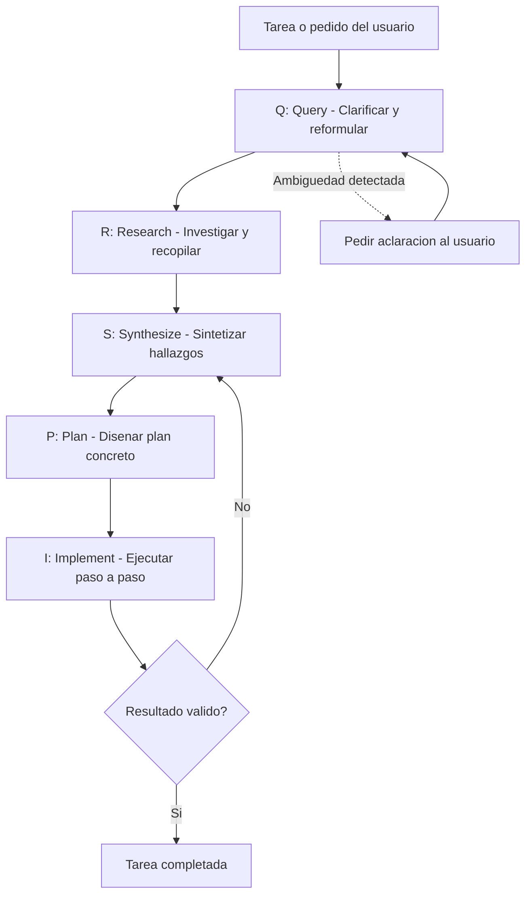

# QRSPI

## Introduccion

Cuando un sistema de IA enfrenta tareas complejas, no basta con darle una instruccion y esperar que todo salga bien. Los mejores resultados aparecen cuando el trabajo se estructura en fases claras: primero entender el problema a fondo, luego buscar informacion relevante, despues sintetizar lo que se sabe, planificar los pasos concretos y recien entonces ejecutar.

Ese es el principio detras de QRSPI: un patron de trabajo en cinco fases que extiende y refina la idea del ciclo RPI (Research, Plan, Implement), incorporando una fase inicial de clarificacion de la pregunta y una fase intermedia de sintesis antes de planificar.

---

## Definicion simple

QRSPI es un patron de trabajo en cinco fases para resolver tareas complejas con sistemas de IA:

- **Q - Query:** aclarar y reformular la pregunta antes de empezar
- **R - Research:** investigar y reunir la informacion necesaria
- **S - Synthesize:** sintetizar lo aprendido en una vision coherente
- **P - Plan:** disenar un plan concreto y verificable
- **I - Implement:** ejecutar el plan paso a paso

En simple: QRSPI impide que un agente o asistente se lance a actuar sin entender bien el problema. Primero pregunta, despues aprende, luego integra lo aprendido, despues planifica y por ultimo hace.

---

## Explicacion tecnica

QRSPI es un patron de orquestacion que descompone cualquier tarea en cinco fases bien definidas. Es especialmente util para agentes de IA que trabajan sobre problemas ambiguos, proyectos de software, investigacion o toma de decisiones con multiples variables.

### Q — Query (Clarificacion de la pregunta)

La primera fase consiste en analizar la solicitud original y determinar si esta suficientemente clara. Antes de buscar informacion o actuar, el sistema revisa:

- ¿La pregunta es especifica o ambigua?
- ¿Hay suposiciones implicitas que deben verificarse?
- ¿El objetivo final esta claramente definido?
- ¿Existen multiples interpretaciones validas del pedido?

Si la pregunta es ambigua, el sistema puede reformularla, dividirla en sub-preguntas o pedir aclaracion al usuario antes de continuar. Esta fase evita el error clasico de "resolver perfectamente el problema equivocado".

En sistemas automatizados, esta fase puede implementarse como una verificacion interna donde el agente genera una interpretacion explicita del pedido y, de ser posible, la confirma antes de avanzar.

### R — Research (Investigacion)

Con la pregunta clarificada, el sistema recopila la informacion necesaria para responderla. Esto puede incluir:

- leer archivos relevantes del proyecto
- consultar documentacion interna o externa
- explorar bases de conocimiento
- recuperar documentos mediante busqueda semantica (RAG)
- ejecutar herramientas de diagnostico
- revisar historial de cambios o logs

El objetivo de la fase de research no es actuar todavia, sino acumular contexto suficiente para que las decisiones posteriores esten bien fundamentadas. Es la diferencia entre operar con informacion completa y operar con suposiciones.

### S — Synthesize (Sintesis)

Esta es la fase que diferencia a QRSPI de RPI. Una vez reunida la informacion, el sistema la sintetiza en una vision coherente antes de planificar. Sintetizar significa:

- identificar los datos mas relevantes entre todo lo investigado
- detectar contradicciones o lagunas de informacion
- establecer relaciones entre distintas piezas del conocimiento
- formular hipotesis o conclusiones intermedias
- descartar informacion ruido que no aporta al objetivo

La sintesis convierte el volumen de informacion recogida en un marco interpretativo util. Sin este paso, la fase de planificacion puede resultar en planes demasiado amplios, mal priorizados o basados en premisas incorrectas.

En la practica, esta fase puede materializarse como un breve resumen de hallazgos, una lista de premisas confirmadas o una descripcion del estado del sistema antes de cualquier cambio.

### P — Plan (Planificacion)

Con la informacion sintetizada, el sistema diseña un plan explicito de accion. Un buen plan en este contexto:

- es una lista de pasos corta, concreta y verificable
- especifica que archivo, funcion, componente o recurso se modifica en cada paso
- tiene un orden logico que minimiza dependencias cruzadas
- incluye criterios de exito para cada paso
- puede revisarse o interrumpirse antes de ejecutarse

La planificacion explicita tiene una ventaja importante: permite que un humano, otro componente del sistema o una fase de evaluacion automatica revise el plan antes de que se ejecute cualquier cambio real. En sistemas criticos, esto puede ser obligatorio.

### I — Implement (Implementacion)

La ultima fase es la ejecucion del plan. Aqui el sistema aplica los cambios, genera el contenido, ejecuta los comandos o produce las salidas que el plan especificaba. Las reglas de una buena implementacion dentro de QRSPI son:

- seguir el plan en lugar de improvisar
- validar cada paso antes de avanzar al siguiente
- registrar lo que se hizo (para auditoria y trazabilidad)
- detectar y reportar desviaciones respecto al plan
- si surge informacion nueva que invalida el plan, volver a la fase S o P antes de continuar

---

## Diferencias entre RPI y QRSPI

| Aspecto | RPI | QRSPI |
|---|---|---|
| Fases | 3 (Research, Plan, Implement) | 5 (Query, Research, Synthesize, Plan, Implement) |
| Clarificacion inicial | No explicita | Si, fase Query |
| Sintesis de hallazgos | Implicita en Research | Fase dedicada (Synthesize) |
| Adecuado para | Tareas relativamente claras | Tareas ambiguas o de alta complejidad |
| Costo de tokens | Menor | Mayor (mas pasos de razonamiento) |

RPI es una buena opcion para tareas donde el objetivo es claro desde el inicio y el espacio del problema esta bien delimitado. QRSPI agrega valor cuando el pedido es ambiguo, cuando la informacion recopilada puede ser voluminosa o contradictoria, o cuando las consecuencias de actuar sobre premisas incorrectas son altas.

---

## Ejemplo practico

Supongamos que un usuario dice:

"Mejora el rendimiento de la aplicacion."

### Aplicando QRSPI

**Q — Query:** el pedido es vago. El agente reformula: ¿"rendimiento" significa tiempo de respuesta del backend, velocidad de carga del frontend, costo de infra, consumo de memoria, o todo lo anterior? ¿Hay metricas actuales disponibles? ¿Hay un objetivo cuantificable (por ejemplo, pasar de 3s a 1s en la API de busqueda)?

Si el usuario no esta disponible para responder, el agente puede asumir la interpretacion mas razonable y documentarla explicitamente.

**R — Research:** el agente revisa los logs de la aplicacion, busca endpoints lentos, analiza el codigo de los tres endpoints con mayor latencia, lee la configuracion de la base de datos y revisa las consultas mas frecuentes.

**S — Synthesize:** de todo lo investigado, el agente sintetiza: "el cuello de botella principal esta en la consulta de la pagina de inicio, que hace tres JOINs innecesarios y no usa indices. Los otros dos endpoints son lentos pero menos criticos. Agregar un indice compuesto en la tabla `productos` reduciria la latencia estimada en un 70%."

**P — Plan:** el agente propone: "(1) Agregar indice compuesto en tabla `productos` sobre columnas `categoria` y `activo`. (2) Refactorizar la consulta de inicio para eliminar el JOIN con `historial`. (3) Agregar un test de rendimiento con un dataset de 10.000 filas para verificar la mejora. (4) Documentar el cambio en el registro de decisiones de arquitectura."

**I — Implement:** el agente ejecuta los cambios del plan en el orden especificado, valida que los tests pasan y que la latencia efectivamente mejoro, y reporta el resultado.

---

## Cuando usar QRSPI

QRSPI es especialmente util cuando:

- la tarea recibida es ambigua o tiene multiples interpretaciones validas
- el espacio del problema es amplio (muchos archivos, muchos sistemas, muchas variables)
- actuar sobre premisas incorrectas tendria un costo alto (cambios destructivos, decisiones de negocio, critico para produccion)
- la informacion recopilada en la fase de research es voluminosa y puede resultar confusa sin una fase de sintesis
- el sistema debe explicar su razonamiento antes de actuar (trazabilidad, auditoria, trabajo en equipo)

QRSPI puede ser excesivo para tareas pequeñas y bien definidas, donde RPI o incluso un prompt directo son suficientes.

---

## Analogia facil

QRSPI se parece al proceso de trabajo de un buen consultor.

Cuando un consultor llega a una empresa, no empieza a implementar soluciones el primer dia. Primero pregunta que problema quieren resolver (Q), despues entrevista al equipo, revisa datos y procesos (R), luego integra todo en un diagnostico coherente (S), diseña un plan de accion (P) y recien entonces empieza a implementar cambios (I).

La diferencia entre un consultor que falla y uno que tiene exito muchas veces esta en esa fase inicial de aclaracion: asegurarse de que estan resolviendo el problema real y no el sintoma visible.

---

## Diagrama

---

## Relacion con los demas conceptos

- El ciclo comienza con un [Prompt](01-prompt.md) como entrada. La fase Q de QRSPI es, en esencia, un paso de meta-analisis sobre ese prompt: ¿esta bien formulado? ¿Es suficientemente claro?
- Se apoya profundamente en [Prompt engineering](02-prompt-engineering.md): cada fase puede beneficiarse de instrucciones bien estructuradas, y la fase Q en particular aplica principios de clarificacion y reformulacion que son centrales en prompt engineering.
- La fase R construye [Contexto](03-contexto.md): investigar es reunir la informacion que el modelo necesita para razonar bien.
- Todo el ciclo opera sobre [Tokens](04-tokens.md): cada fase consume tokens de entrada y genera tokens de razonamiento y accion. QRSPI tiene un costo de tokens mayor que RPI precisamente porque agrega dos fases de reflexion.
- El motor de razonamiento en todas las fases es un [LLM](05-llm.md), que interpreta, sintetiza, planifica y genera acciones.
- Durante la fase R, puede usarse [Embeddings](06-embeddings.md) para recuperar documentos o fragmentos relevantes por similitud semantica.
- Puede operar sobre un modelo ajustado mediante [Fine-tuning](07-fine-tuning.md) si el dominio del problema lo justifica.
- QRSPI puede empaquetarse como un [Skill](08-skill.md) reutilizable: un agente que sabe "resolver tareas complejas siguiendo QRSPI" puede invocar ese skill ante cualquier pedido suficientemente complejo.
- Las herramientas que el agente usa durante las fases R e I pueden conectarse via [MCP](09-mcp.md), y las plantillas de instruccion para cada fase pueden ser [Prompts dentro de MCP](10-prompt-en-mcp.md).
- Tipicamente es ejecutado por un [Agente](11-agente.md), que coordina las cinco fases y decide cuando avanzar, cuando volver atras y cuando escalar al usuario.
- Se extiende directamente desde [RPI](12-rpi.md), agregando las fases Q y S para cubrir casos de mayor ambiguedad y complejidad.
- Sus resultados deben medirse con [Evaluaciones](12-evaluaciones.md): no solo el resultado final, sino la calidad de la reformulacion (Q), la relevancia de lo investigado (R), la precision de la sintesis (S), la viabilidad del plan (P) y la correccion de la implementacion (I).

---

## Idea clave

QRSPI es RPI con dos mejoras criticas: una fase inicial que asegura que el problema esta bien entendido antes de actuar, y una fase de sintesis que convierte informacion dispersa en un marco de decision coherente. Aplicado a un agente de IA, reduce errores por mala comprension del problema y mejora la calidad de los planes antes de que se ejecute cualquier cambio real.

---

## Resumen del capitulo

Los sistemas de IA mas efectivos no improvisan. Estructuran su trabajo en fases claras que separan el entendimiento del problema, la recopilacion de informacion, la integracion de conocimiento, la planificacion y la ejecucion. QRSPI es la formalizacion de ese principio en cinco pasos que cualquier agente, equipo de desarrollo o sistema automatizado puede adoptar para reducir errores, mejorar la trazabilidad y producir resultados mas confiables en tareas complejas.
