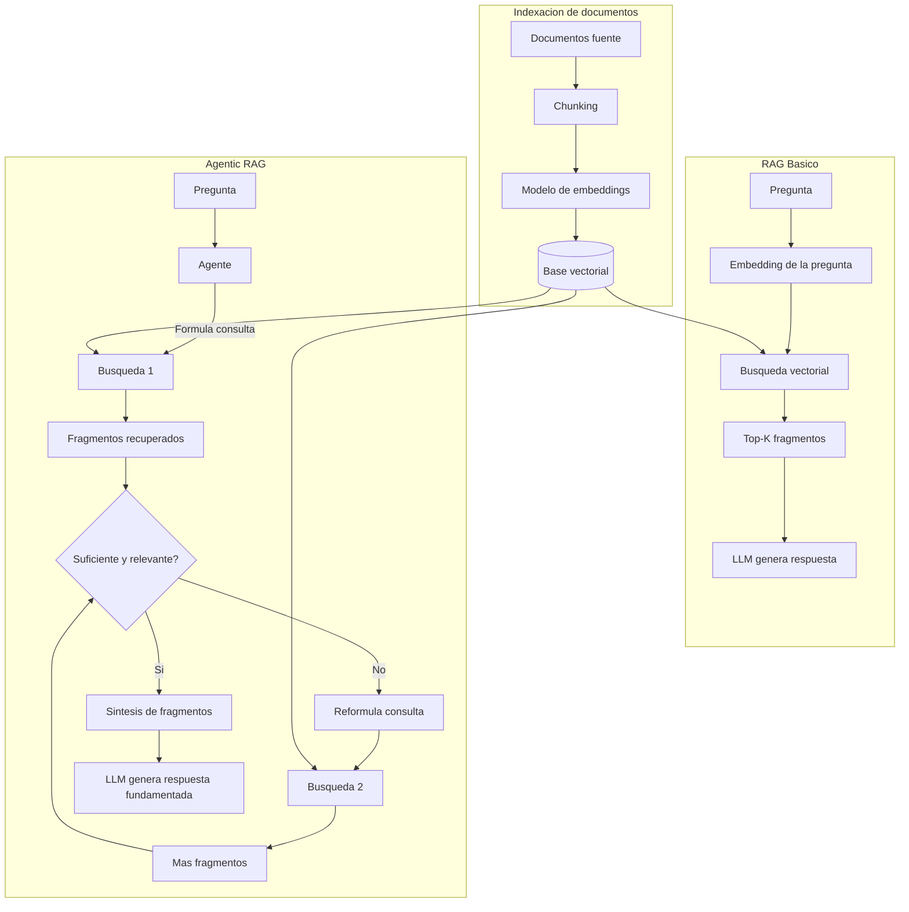

# RAG y Agentic RAG

## Introduccion

Los modelos de lenguaje aprenden de los datos con los que fueron entrenados, pero ese conocimiento tiene una fecha de corte y no incluye informacion especifica de cada empresa, proyecto o dominio. Un LLM no sabe nada de los documentos internos de tu empresa, de los incidentes de la semana pasada ni del estado actual de un sistema en produccion.

RAG (Retrieval-Augmented Generation) resuelve este problema de forma elegante: en lugar de reentrenar el modelo, le entregamos la informacion relevante justo antes de que responda. Agentic RAG lleva este principio mas lejos: convierte la recuperacion de informacion en un proceso dinamico y coordinado por un agente, capaz de decidir cuantas busquedas hacer, como combinar sus resultados y cuando la informacion recuperada es suficientemente buena.

Este capitulo explica el patron RAG desde sus fundamentos hasta sus variantes mas avanzadas, y profundiza en como los agentes transforman la recuperacion en un proceso de razonamiento iterativo.

---

## Definicion simple

**RAG** es un patron que conecta un LLM con una base de conocimiento externa. Antes de responder, el sistema recupera fragmentos de documentos relevantes y los entrega al modelo como contexto adicional.

**Agentic RAG** es una evolucion del patron RAG donde un agente coordina activamente el proceso de recuperacion: puede lanzar multiples busquedas, evaluar la calidad de lo que recupero, reformular sus consultas y decidir cuando tiene suficiente informacion para responder con confianza.

En simple: RAG conecta al modelo con documentos. Agentic RAG le da al modelo la capacidad de buscar de forma inteligente, no solo de recibir lo que alguien ya decidio buscar por el.

---

## Explicacion tecnica

### El patron RAG: arquitectura base

RAG combina dos fases bien diferenciadas: una de **recuperacion** (retrieval) y una de **generacion** (generation). El proceso completo tiene cuatro pasos:

1. **Indexacion:** los documentos fuente se dividen en fragmentos (chunks), cada fragmento se convierte en un vector mediante un modelo de embeddings y ese vector se almacena en una base de datos vectorial junto con el texto original.

2. **Consulta:** cuando el usuario hace una pregunta, el sistema la convierte en un vector con el mismo modelo de embeddings.

3. **Recuperacion:** la base vectorial busca los K fragmentos cuyos vectores son mas similares al vector de la pregunta (busqueda por similitud coseno u otra metrica).

4. **Generacion:** los fragmentos recuperados se insertan en el prompt como contexto y el LLM genera una respuesta basada en esa informacion.

Este patron resuelve dos limitaciones fundamentales de los LLMs:

- **Conocimiento desactualizado:** RAG puede recuperar informacion mas reciente que el corte de entrenamiento del modelo sin necesidad de re-entrenarlo.
- **Alucinaciones por falta de datos:** al entregar los documentos reales como contexto, el modelo tiene mucho menos margen para inventar informacion.

### Tipos de RAG

#### RAG naive (basico)

La implementacion mas simple: se indexan los documentos una vez, se hace una sola busqueda semantica por pregunta y los top-K fragmentos se insertan directamente en el prompt. Es facil de implementar y funciona bien en dominios acotados, pero tiene limitaciones claras cuando las preguntas son complejas, ambiguas o requieren combinar informacion de multiples fuentes.

Problemas frecuentes del RAG naive:

- la pregunta original no siempre es el mejor vector de busqueda
- los fragmentos recuperados pueden ser relevantes pero repetitivos o contradictorios
- el modelo no tiene forma de saber si lo que se recupero es suficiente o confiable
- preguntas que requieren razonamiento en multiples pasos no pueden responderse con una sola busqueda

#### RAG avanzado (Advanced RAG)

Incorpora tecnicas en tres momentos del pipeline para mejorar la calidad de lo que se recupera y de como se usa.

**Tecnicas de pre-recuperacion** (mejoran la consulta antes de buscar):

- **Reformulacion de query:** en lugar de buscar con la pregunta tal como la escribio el usuario, el sistema genera una version reformulada o expandida que capture mejor la intencion. Puede usarse el propio LLM para esto.
- **HyDE (Hypothetical Document Embeddings):** en lugar de vectorizar la pregunta, el LLM genera un fragmento de documento hipotetico que responderia la pregunta, y ese fragmento se usa como vector de busqueda. Suele encontrar resultados mas relevantes porque el vector de busqueda tiene la forma de una respuesta, no de una pregunta.
- **Descomposicion de query:** preguntas complejas se dividen en sub-preguntas mas simples, cada una con su propia busqueda. Los resultados se combinan al final.
- **Step-back prompting:** antes de buscar la respuesta especifica, se busca informacion de nivel superior (el concepto general detras de la pregunta), lo que entrega contexto mas rico.

**Tecnicas de recuperacion:**

- **Busqueda densa (dense retrieval):** usa vectores de embeddings para buscar por similitud semantica. Captura relaciones de significado aunque las palabras exactas sean diferentes.
- **Busqueda dispersa (sparse retrieval):** algoritmos como BM25 o TF-IDF buscan coincidencias de terminos exactos. Excelente para nombres propios, codigos y acronimos que los embeddings pueden perder.
- **Busqueda hibrida:** combina busqueda densa y dispersa con un mecanismo de fusion (como Reciprocal Rank Fusion). Es la estrategia mas robusta en la mayoria de los casos reales porque captura tanto significado semantico como coincidencias exactas.
- **Recuperacion jerarquica:** indexa los documentos en dos niveles: chunks pequeños para recuperacion precisa y sus documentos padre completos para contexto. Primero recupera el chunk preciso, luego entrega el documento mas amplio al LLM.

**Tecnicas de post-recuperacion** (mejoran lo recuperado antes de entregarlo al LLM):

- **Reranking:** un modelo especializado (cross-encoder) re-evalua la relevancia de los fragmentos recuperados respecto a la pregunta original. Los embeddings miden similitud entre vectores independientes; el reranker los evalua juntos y produce rankings mas precisos.
- **Filtrado de redundancia:** si varios fragmentos dicen lo mismo, se elimina la repeticion para no desperdiciar tokens de contexto.
- **Compresion de contexto:** en lugar de insertar fragmentos completos, se extrae solo la parte relevante de cada fragmento. Reduce el ruido y el costo de tokens.
- **Verificacion de relevancia:** un paso que filtra fragmentos que no son realmente utiles para la pregunta, aunque hayan pasado la busqueda inicial.

#### RAG modular (Modular RAG)

Una arquitectura flexible donde cada componente del pipeline puede reemplazarse o reordenarse de forma independiente: diferentes modelos de embeddings, diferentes bases vectoriales, diferentes estrategias de chunking, diferentes tecnicas de recuperacion y post-procesamiento. Permite evolucionar el sistema pieza por pieza sin redisenar todo.

### Agentic RAG

En el RAG tradicional, el proceso de recuperacion es estatico: una pregunta dispara una busqueda, los resultados se insertan y el LLM responde. El sistema no puede decidir si la informacion recuperada es suficiente, ni buscar mas si no lo es.

**Agentic RAG** introduce un agente como orquestador del proceso de recuperacion. El agente puede:

- decidir si necesita recuperar informacion o si puede responder con lo que ya tiene
- formular multiples consultas de busqueda distintas para cubrir distintos angulos de la pregunta
- evaluar la calidad y relevancia de los fragmentos recuperados
- decidir si necesita buscar mas antes de responder
- combinar informacion de multiples busquedas en una respuesta coherente
- reconocer cuando la informacion disponible es insuficiente o contradictoria e informarlo

El resultado es un sistema capaz de manejar preguntas complejas que requieren razonamiento en multiples pasos, informacion de multiples fuentes o verificacion de lo recuperado.

#### Self-RAG

Self-RAG es un patron donde el mismo LLM controla si necesita recuperar informacion y evalua la calidad de lo que recupero. El modelo genera tokens especiales de reflexion que indican:

- **[Retrieve]:** si necesita buscar informacion externa antes de continuar
- **[IsRel]:** si el fragmento recuperado es relevante para la pregunta
- **[IsSup]:** si la respuesta generada esta soportada por los fragmentos recuperados
- **[IsUseful]:** si la respuesta final es util para el usuario

Esto convierte al modelo en un agente parcial de su propio proceso de recuperacion: decide activamente cuando buscar y verifica que lo que genero este fundamentado en lo que encontro.

#### Corrective RAG (CRAG)

CRAG agrega un mecanismo de evaluacion de la calidad de los documentos recuperados. Antes de usar los fragmentos, un evaluador (que puede ser otro LLM o un modelo especializado) los clasifica en:

- **relevantes:** se usan directamente
- **irrelevantes:** se descartan o se buscan alternativas
- **ambiguos:** se complementan con busqueda en internet u otras fuentes

Si los documentos recuperados son de baja calidad, el sistema activa una estrategia de correccion: puede reformular la consulta, buscar en fuentes adicionales o combinar la base de conocimiento interna con resultados de busqueda web.

#### Multi-hop RAG

Para preguntas que requieren combinar informacion de multiples documentos o razonar en varios pasos, el agente encadena recuperaciones sucesivas. Cada busqueda usa como entrada el resultado de la busqueda anterior.

Ejemplo: "¿Que impacto tuvo el cambio de arquitectura del servicio de pagos en la tasa de errores del modulo de facturacion?"

Paso 1: busca documentos sobre el cambio de arquitectura del servicio de pagos.
Paso 2: extrae que componentes fueron modificados.
Paso 3: busca documentos sobre la tasa de errores del modulo de facturacion relacionados con esos componentes.
Paso 4: sintetiza la relacion entre ambos.

Ninguno de esos pasos puede completarse sin el anterior.

### Desafios de los sistemas RAG

**Calidad del chunking:** fragmentos demasiado cortos pierden contexto; demasiado largos introducen ruido. La estrategia optima depende del tipo de documento y de la pregunta tipica del sistema.

**El problema de la aguja en el pajar:** cuando hay muchos fragmentos relevantes y el contexto esta cerca del limite de tokens, el modelo puede "olvidar" informacion que esta al medio de ese contexto. Los estudios muestran que los LLMs recuerdan mejor lo que esta al principio y al final del contexto.

**Recuperacion sin respuesta:** a veces la respuesta no esta en los documentos disponibles. Un buen sistema RAG debe saber cuando decir "no encontre informacion suficiente" en lugar de inventar.

**Costos de indexacion y actualizacion:** mantener el indice actualizado cuando los documentos cambian frecuentemente requiere pipelines de actualizacion incremental.

**Seguridad y acceso:** diferentes usuarios pueden tener acceso a diferentes documentos. El sistema RAG debe respetar los permisos de acceso al recuperar informacion.

---

## Ejemplo practico

Una empresa tiene miles de documentos internos: politicas, guias tecnicas, actas de reuniones y documentacion de sistemas. Los empleados necesitan respuestas rapidas y precisas sobre este contenido.

**Sin RAG:** el asistente solo conoce informacion general del mundo hasta su fecha de entrenamiento. No sabe nada de los documentos de la empresa y puede inventar respuestas.

**Con RAG basico:** el asistente puede responder sobre el contenido de los documentos indexados. Un empleado pregunta "¿cual es la politica de vacaciones?" y el sistema recupera el fragmento correcto de la politica de RRHH y lo usa para responder.

**Con Agentic RAG:** un empleado pregunta "¿que decisiones sobre el roadmap del producto tomamos en el ultimo trimestre y como se comparan con lo que habiamos planificado a principio de año?"

El agente:
1. Formula tres consultas de busqueda separadas: una para actas recientes del ultimo trimestre, otra para el plan de roadmap de inicio de año, y una tercera para decisiones estrategicas de producto.
2. Recupera fragmentos de multiples actas de reuniones y del documento de planificacion anual.
3. Evalua si los fragmentos cubren el periodo solicitado o si necesita buscar mas.
4. Si los fragmentos son insuficientes, reformula la consulta con terminos alternativos.
5. Una vez que tiene suficiente informacion, sintetiza las decisiones tomadas, las compara con el plan original e identifica diferencias.

La respuesta final integra informacion de multiples documentos de distintas fechas, algo que RAG naive no puede hacer de forma confiable.

### Ejemplo de pipeline tecnico con Agentic RAG

```
Pregunta del usuario:
"¿Por que el servicio de notificaciones tiene mayor latencia esta semana?"

Agente - Paso 1: Recuperar metricas recientes
  Consulta: "latencia servicio notificaciones semana actual"
  Resultado: fragmentos de dashboards con incremento del 40% en P95

Agente - Paso 2: Recuperar historial de cambios
  Consulta: "deploy cambios servicio notificaciones ultimos 7 dias"
  Resultado: fragmento de log de deploy del martes, nuevo timeout de base de datos

Agente - Paso 3: Recuperar contexto del cambio detectado
  Consulta: "configuracion timeout base de datos notificaciones"
  Resultado: fragmento de documentacion tecnica explicando el parametro modificado

Agente - Evaluacion: los tres fragmentos son coherentes y suficientes.

LLM genera respuesta:
"El incremento de latencia esta relacionado con el cambio de configuracion del timeout
de base de datos aplicado el martes. El nuevo valor de 5 segundos (antes 1 segundo)
permite que las consultas lentas completen en lugar de fallar, lo que explica el aumento
en el P95 pero la reduccion en tasa de errores. Ver fragmento [2] para los detalles del
deploy y fragmento [3] para la documentacion del parametro."
```

---

## Analogia facil

Imagina un investigador que responde preguntas para una empresa.

**RAG naive** es como darle al investigador un asistente que va a buscar exactamente una vez a los archivos: saca los tres documentos mas parecidos a la pregunta y se los entrega. El investigador responde con eso, sin importar si los documentos son suficientes.

**RAG avanzado** es como darle al asistente instrucciones mas detalladas: si la primera busqueda no fue muy buena, reformula la consulta; descarta los documentos que no son relevantes; asegurate de que lo que traes no sea todo lo mismo.

**Agentic RAG** es como que el propio investigador decida como buscar. El no espera que alguien le traiga documentos: razona que necesita buscar, formula sus propias preguntas de busqueda, evalua lo que encuentra, pide buscar mas si hace falta, y solo responde cuando esta convencido de que tiene suficiente informacion fundamentada. Es un investigador activo, no un consumidor pasivo de lo que le traen.

---

## Diagrama



---

## Relacion con los demas conceptos

- Depende de los [Embeddings](06-embeddings.md) para convertir tanto los documentos como las preguntas en vectores que permiten la busqueda por similitud semantica.
- El contexto recuperado se inyecta como parte del [Contexto](03-contexto.md) que recibe el LLM antes de generar su respuesta.
- Todo el contenido recuperado e inyectado consume [Tokens](04-tokens.md), lo que hace critico gestionar bien el tamaño de los fragmentos y cuantos se incluyen.
- El [LLM](05-llm.md) es el motor de generacion que produce la respuesta final a partir del contexto recuperado; en Agentic RAG tambien es el motor de razonamiento que decide como buscar.
- El [Prompt engineering](02-prompt-engineering.md) determina como se formula la instruccion al LLM incluyendo los fragmentos recuperados, y como se le indica que base su respuesta en esos documentos.
- En Agentic RAG, el componente central es un [Agente](11-agente.md) que coordina el proceso de recuperacion, decide cuando buscar y evalua la calidad de los resultados.
- Las herramientas de busqueda vectorial pueden exponerse como capacidades a traves de [MCP](09-mcp.md) o [Skill](08-skill.md), permitiendo que el agente las invoque de forma estandarizada.
- El [Fine-tuning](07-fine-tuning.md) y RAG son estrategias complementarias: fine-tuning adapta el comportamiento del modelo; RAG le entrega conocimiento externo en tiempo de inferencia.
- Las [Evaluaciones](12-evaluaciones.md) son fundamentales para medir la calidad de un sistema RAG: precision de recuperacion (se recuperaron los documentos correctos), fidelidad de la respuesta (la respuesta esta soportada por los documentos) y utilidad para el usuario.
- Patrones como [RPI](12-rpi.md) y [QRSPI](13-qrspi.md) pueden usar Agentic RAG en sus fases de investigacion para recopilar informacion relevante de forma sistematica antes de planificar e implementar.

---

## Idea clave

RAG no es una solucion para que el LLM "sepa mas cosas": es una forma de darle acceso a informacion especifica en el momento en que la necesita. Agentic RAG va un paso mas alla: le da al sistema la capacidad de razonar sobre como buscar esa informacion, no solo de recibirla. La diferencia entre un sistema RAG mediocre y uno excelente no esta en el modelo sino en la calidad del pipeline de recuperacion: como se dividen los documentos, que tecnicas de busqueda se usan y cuanto razonamiento se aplica sobre los resultados antes de pasarlos al modelo.

---

## Resumen del capitulo

RAG (Retrieval-Augmented Generation) es el patron que permite a un LLM responder con informacion externa actualizada sin necesidad de reentrenamiento. El pipeline base indexa documentos como vectores, recupera los fragmentos mas relevantes ante cada consulta y los entrega como contexto al modelo. RAG avanzado mejora cada fase con tecnicas como reformulacion de consultas, busqueda hibrida, reranking y compresion de contexto. Agentic RAG eleva el patron a un proceso dinamico: un agente razona sobre como y cuanto buscar, encadena multiples recuperaciones para preguntas complejas, evalua la calidad de lo que recupero y decide cuando tiene suficiente informacion para responder con fundamento. La calidad de cualquier sistema RAG depende tanto de la arquitectura de recuperacion como de la inteligencia que se aplica para orquestarla.
