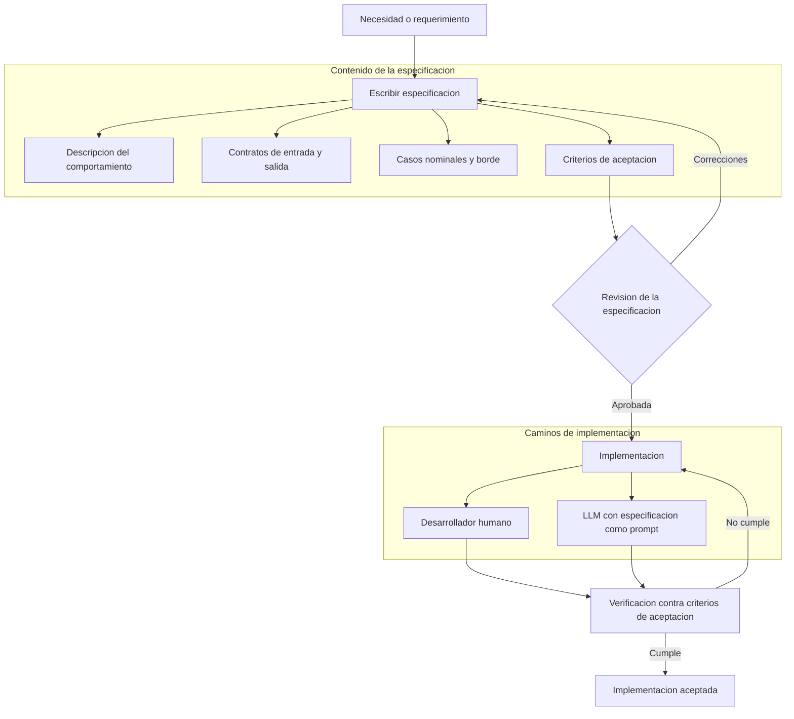

# Spec Driven Development

## Introduccion

El desarrollo de software ha evolucionado junto con las herramientas disponibles. Durante decadas, los equipos escribieron codigo y luego lo documentaron, o definieron requerimientos vagos y esperaron que los desarrolladores los interpretaran correctamente. Esos enfoques producian inconsistencias, retrabajo y sistemas dificiles de mantener.

Spec Driven Development (SDD) propone invertir ese orden: primero se define con precision que debe hacer el sistema, y luego se construye. Con la llegada de los sistemas de IA capaces de generar codigo, ese orden se vuelve especialmente relevante: un LLM que recibe una especificacion bien redactada puede producir implementaciones correctas, verificables y alineadas con lo que el equipo realmente necesita.

---

## Definicion simple

**Spec Driven Development** es una metodologia de desarrollo en la que la especificacion detallada del comportamiento esperado precede y guia toda implementacion. La especificacion no es un documento informal de requerimientos: es una descripcion precisa, estructurada y verificable de lo que el sistema debe hacer, como debe comportarse en casos normales y en casos borde, y cuales son sus contratos de entrada y salida.

En simple: primero se define exactamente que debe hacer el sistema y como debe probarse, y recien entonces se escribe el codigo que lo hace.

---

## Explicacion tecnica

SDD parte de una premisa central: el costo de un error descubierto durante la implementacion es mucho mayor que el costo de detectarlo durante la especificacion. Una especificacion precisa actua como contrato entre quien define el comportamiento esperado y quien lo implementa, ya sea un desarrollador humano o un sistema de IA generativa.

### Componentes de una especificacion

Una especificacion en SDD tipicamente incluye:

- **Descripcion del comportamiento:** que hace el componente, funcion, servicio o sistema en lenguaje preciso.
- **Contratos de entrada y salida:** tipos, formatos y restricciones de los datos que entran y los que salen.
- **Casos de uso nominales:** los escenarios esperados donde el sistema funciona correctamente.
- **Casos borde y errores:** que pasa cuando los datos estan incompletos, son invalidos o el sistema falla.
- **Criterios de aceptacion:** condiciones verificables que determinan si la implementacion cumple la especificacion.

### SDD con sistemas de IA

Cuando se integran LLMs al proceso de desarrollo, la especificacion cumple un rol doble:

1. **Como prompt estructurado:** la especificacion se convierte en la instruccion que guia al LLM para generar codigo. Cuanto mas precisa es la especificacion, mas predictible y correcta es la salida del modelo.
2. **Como criterio de evaluacion:** la especificacion define los tests y criterios contra los que se evalua el codigo generado. Permite detectar automaticamente si la implementacion se desvio de lo esperado.

Este enfoque conecta directamente con el patron RPI: la especificacion es el resultado de la fase de Research y el insumo principal de la fase de Plan. El modelo implementa sobre la base de una especificacion ya revisada y aprobada, no a partir de una descripcion ambigua.

### Tipos de especificaciones

**Especificaciones funcionales:** describen el comportamiento observable del sistema desde el punto de vista del usuario o del sistema que lo invoca. Se centran en entradas, salidas y efectos secundarios.

**Especificaciones de interfaz:** definen los contratos de una API, servicio o componente: endpoints, parametros, tipos de datos, codigos de respuesta, esquemas. En sistemas que usan OpenAPI, GraphQL schemas o Protocol Buffers, la especificacion de interfaz es formal y ejecutable.

**Especificaciones de comportamiento (BDD):** escritas en lenguaje casi natural usando formatos como Gherkin (Given / When / Then), describen el comportamiento del sistema desde la perspectiva del negocio. Pueden ejecutarse directamente como tests con frameworks como Cucumber o Behave.

**Especificaciones de tests (TDD como caso especial):** en Test Driven Development, los tests son la especificacion. SDD puede verse como una generalizacion de TDD donde la especificacion puede tomar formas mas ricas que solo tests unitarios.

### Ciclo de SDD

```
Definir especificacion
       |
       v
Revisar y validar especificacion (antes de escribir codigo)
       |
       v
Implementar segun especificacion (manual o con asistencia de IA)
       |
       v
Verificar que la implementacion cumple la especificacion
       |
       v
Iterar si hay desviaciones
```

La clave esta en que la revision ocurre sobre la especificacion, no sobre el codigo. Es mucho mas barato cambiar un documento que reescribir codigo ya integrado.

### Beneficios en equipos con IA generativa

- **Reduccion de ambiguedad:** el LLM trabaja mejor con especificaciones precisas que con descripciones vagas. Una especificacion bien redactada reduce las iteraciones necesarias para obtener un resultado correcto.
- **Trazabilidad:** cada pieza de codigo puede rastrearse hasta la especificacion que la origino. Si la especificacion cambia, es claro que codigo debe revisarse.
- **Verificacion automatizada:** los criterios de aceptacion de la especificacion se traducen directamente en tests. El sistema puede verificar automaticamente si el codigo generado los cumple.
- **Colaboracion asincrona:** distintos miembros del equipo pueden trabajar sobre la misma especificacion sin coordinacion en tiempo real, porque el contrato esta definido por escrito.

---

## Ejemplo practico

Un equipo desarrolla un servicio de autenticacion para una aplicacion web. En lugar de empezar a codificar, el equipo escribe primero la especificacion del endpoint de login:

**Especificacion: POST /auth/login**

```
Descripcion:
  Autentica a un usuario con email y password. Devuelve un token JWT si las
  credenciales son validas.

Entrada:
  - email: string, formato email valido, requerido
  - password: string, minimo 8 caracteres, requerido

Salida exitosa (200):
  - token: string JWT con expiracion de 1 hora
  - userId: string identificador del usuario autenticado

Errores:
  - 400: email o password ausentes o con formato invalido
  - 401: credenciales incorrectas (email no existe o password incorrecto)
  - 429: mas de 5 intentos fallidos en los ultimos 10 minutos desde la misma IP
  - 500: error interno del servidor

Casos borde:
  - El email existe pero tiene diferente capitalizacion (ej: "User@example.com" vs "user@example.com"): debe tratarse como el mismo usuario
  - El password tiene espacios al inicio o al final: no deben ignorarse, deben tratarse como parte del password

Criterios de aceptacion:
  - Un usuario existente con credenciales correctas recibe un token valido
  - Un usuario inexistente recibe 401
  - Un password incorrecto recibe 401 (sin indicar cual de los dos campos fallo)
  - Mas de 5 intentos fallidos activa el rate limit y devuelve 429
  - El token generado puede verificarse con la clave publica del servicio
```

Con esta especificacion, el equipo puede:

1. **Pedirle a un LLM que genere la implementacion** con un prompt que incluya la especificacion completa. El modelo tiene toda la informacion necesaria para generar codigo correcto en el primer intento o con pocas iteraciones.

2. **Generar los tests automaticamente** a partir de los criterios de aceptacion y los casos borde listados.

3. **Revisar la especificacion en equipo** antes de escribir una sola linea de codigo, detectando ambiguedades (como la capitalizacion del email) antes de que se conviertan en bugs.

4. **Verificar que la implementacion cumple la especificacion** ejecutando los tests generados.

---

## Analogia facil

Imagina que vas a construir una casa. Hay dos formas de empezar:

La primera es contratar a los obreros el lunes y decirles "quiero una casa grande con varias habitaciones". Los obreros empiezan a construir segun su mejor interpretacion. A la semana, cuando ves que pusieron tres habitaciones cuando necesitabas cinco, tenes que demoler y reconstruir.

La segunda es contratar primero a un arquitecto que dibuje los planos completos: cuantas habitaciones, de que tamano, donde van las puertas, que carga soporta cada pared, que materiales se usan. Los obreros no empiezan hasta que vos revisas y apruebas los planos. Cuando empiezan, saben exactamente que construir.

SDD es la segunda forma aplicada al software. Los planos son la especificacion. Los obreros pueden ser desarrolladores humanos o un sistema de IA generativa. Lo importante es que el contrato esta definido antes de que empiece la construccion.

Un LLM sin especificacion es como un obrero talentoso al que le decis "construi algo util": puede sorprenderte, pero probablemente no construya lo que realmente necesitabas. Un LLM con una especificacion precisa es como ese mismo obrero con los planos en la mano: sabe exactamente que hacer.

---

## Diagrama



---

## Relacion con los demas conceptos

- La especificacion en SDD se traduce directamente en un [Prompt](01-prompt.md) estructurado cuando se usa un LLM para generar la implementacion. La calidad del prompt determina la calidad de la salida.
- El [Prompt engineering](02-prompt-engineering.md) es la tecnica que permite convertir una especificacion en un prompt efectivo: agregar el rol correcto, el formato de salida esperado y los ejemplos necesarios para guiar al modelo.
- El [Contexto](03-contexto.md) del sistema incluye la especificacion completa cuando se le pide a un LLM que implemente. Cuanto mas precisa y completa es la especificacion, mejor el modelo puede completar la tarea dentro del limite de tokens.
- Los [Tokens](04-tokens.md) disponibles en el contexto limitan cuanta especificacion puede incluirse en un solo prompt. Especificaciones muy largas pueden requerir tecnicas de chunking o resumido antes de enviarse al modelo.
- El [LLM](05-llm.md) es el componente que procesa la especificacion y genera la implementacion. Modelos con ventanas de contexto grandes pueden procesar especificaciones mas detalladas en una sola llamada.
- El [Fine-tuning](07-fine-tuning.md) puede aplicarse para entrenar modelos especializados en seguir especificaciones en un formato o dominio particular, mejorando la precision de la implementacion generada.
- SDD puede implementarse como un [Skill](08-skill.md) reutilizable: un componente que recibe una especificacion como input y devuelve codigo, tests o documentacion como output.
- A traves de [MCP](09-mcp.md), un skill de SDD puede acceder a herramientas externas durante la implementacion: ejecutar tests, consultar repositorios de codigo, verificar dependencias o publicar resultados en sistemas de seguimiento.
- Un [Agente](11-agente.md) puede automatizar el ciclo completo de SDD: recibir una necesidad, generar la especificacion, revisarla, generar la implementacion, ejecutar los tests y reportar si se cumplen los criterios de aceptacion, todo sin intervencion humana en cada paso.
- Las [Evaluaciones (LLM Evals)](12-evaluaciones.md) miden si el LLM que implementa segun especificaciones lo hace correctamente. Los criterios de aceptacion de la especificacion son directamente los casos de prueba de las evals.
- SDD es compatible con [RPI](12-rpi.md): la fase de Research produce el entendimiento necesario para escribir la especificacion; la especificacion es el output de la fase de Plan; la implementacion guiada por la especificacion es la fase de Implement.
- [QRSPI](13-qrspi.md) extiende ese patron: la fase de Query aclara que tipo de especificacion se necesita; Research reune el contexto tecnico; Synthesize consolida ese contexto en una especificacion coherente; Plan define como implementarla; Implement la ejecuta.
- En sistemas [RAG](14-rag.md), la especificacion puede incluir instrucciones sobre que documentos recuperar y como usarlos. Agentic RAG puede usarse para que el agente decida dinamicamente que fragmentos de la especificacion necesitan informacion externa adicional.
- Los [Guardrails](15-guardrails.md) pueden verificar que el codigo generado por el LLM cumple la especificacion antes de ser entregado: un guardrail de salida puede ejecutar los tests definidos en los criterios de aceptacion y bloquear entregas que no pasen.

---

## Idea clave

SDD no es una metodologia nueva inventada para la era de la IA: es un principio de ingenieria clasico (definir antes de construir) aplicado con las herramientas actuales. Lo que cambia con los LLMs es que la especificacion ya no es solo un documento para que los humanos lean: es el insumo principal que el sistema de IA necesita para generar implementaciones correctas. Una especificacion vaga produce codigo que puede funcionar o no. Una especificacion precisa produce codigo verificable, trazable y alineado con lo que el sistema realmente necesita hacer.

---

## Resumen del capitulo

Spec Driven Development es una metodologia en la que la especificacion detallada del comportamiento esperado precede y guia toda implementacion. Una especificacion en SDD incluye descripcion del comportamiento, contratos de entrada y salida, casos nominales y borde, y criterios de aceptacion verificables. En sistemas que integran LLMs, la especificacion cumple un doble rol: es el prompt estructurado que guia la generacion de codigo y es el criterio contra el que se verifica si esa generacion es correcta. SDD conecta directamente con patrones como RPI y QRSPI, y se beneficia de herramientas como agentes, skills, evals y guardrails para automatizar el ciclo completo desde la especificacion hasta la verificacion.
