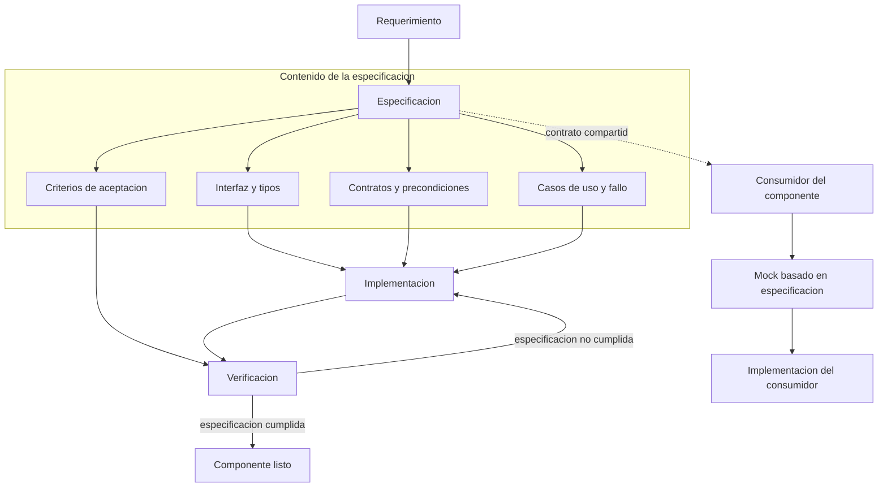

# Spec Driven Development

## Introduccion

Cuando un desarrollador o un agente de IA comienza a escribir codigo sin una especificacion clara, el resultado suele ser impredecible: el codigo puede funcionar pero no resolver el problema correcto, puede resolver el problema correcto pero con una interfaz que nadie espera, o puede completar la tarea de una forma que es imposible de verificar o mantener.

Spec Driven Development (SDD) es una disciplina de trabajo que invierte el orden habitual: primero se define con precision que debe hacer el sistema, cual es su interfaz, que contratos debe cumplir y cuales son sus casos de exito y fallo. Solo entonces se escribe el codigo. La especificacion no es documentacion posterior a la implementacion; es el artefacto que guia, restringe y valida la implementacion desde el principio.

En el contexto de sistemas de IA y agentes, SDD toma especial relevancia: un agente que trabaja desde una especificacion formal puede verificar su propio trabajo, detectar cuando se desvio del contrato y producir resultados predecibles incluso en sistemas complejos.

---

## Definicion simple

**Spec Driven Development** es una practica de desarrollo en la que una especificacion formal y verificable del comportamiento esperado se escribe antes que el codigo. La especificacion define la interfaz, los contratos, los casos de uso y los criterios de aceptacion del sistema. El codigo se evalua siempre contra esa especificacion.

En simple: primero defines exactamente que debe hacer el sistema y como debe comportarse. Despues lo construyes. La especificacion es el criterio de verdad, no el codigo.

---

## Explicacion tecnica

### Que es una especificacion

Una especificacion en el contexto de SDD es un documento o artefacto que describe de forma precisa y verificable el comportamiento esperado de un componente. Una buena especificacion incluye:

- **Interfaz:** que entradas acepta, que salidas produce, que tipos de datos maneja
- **Contratos:** precondiciones (lo que debe ser verdad antes de invocar el componente), postcondiciones (lo que debe ser verdad despues) e invariantes (lo que siempre debe mantenerse)
- **Casos de uso:** los escenarios normales que el componente debe manejar correctamente
- **Casos de fallo:** los escenarios de error y como debe comportarse el sistema ante ellos
- **Criterios de aceptacion:** las condiciones verificables que determinan si la implementacion cumple la especificacion

Las especificaciones pueden tomar distintas formas:

- **Esquemas de datos** (JSON Schema, OpenAPI, Pydantic models): describen la estructura y tipos de las entradas y salidas
- **Contratos de codigo** (Design by Contract, types, assertions): condiciones verificables en tiempo de ejecucion o compilacion
- **Especificaciones de comportamiento** (Gherkin, BDD): describen el comportamiento en lenguaje natural estructurado con escenarios Given-When-Then
- **Tests de contrato** (contract tests): verificaciones ejecutables del comportamiento esperado frente a casos concretos

### El ciclo Spec-First

El ciclo de trabajo de SDD tiene tres fases diferenciadas:

1. **Especificar:** antes de escribir codigo, se redacta la especificacion del componente. Se define la interfaz, los contratos y los criterios de aceptacion. Esta fase puede producir un documento, un esquema, un conjunto de tests de contrato o cualquier combinacion de ellos.

2. **Implementar:** con la especificacion como referencia, se escribe el codigo. La implementacion no necesita saber como se usara el componente; solo necesita cumplir la especificacion. Esto permite que distintos miembros del equipo (o distintos agentes) trabajen en paralelo: unos implementan el componente, otros implementan los consumidores, todos guiados por la misma especificacion compartida.

3. **Verificar:** se ejecutan los tests de contrato o las validaciones formales contra la implementacion para confirmar que cumple la especificacion. Si la implementacion pasa la verificacion, el componente puede integrarse. Si no, se corrige la implementacion, no la especificacion.

### SDD y agentes de IA

El auge de los agentes de IA que escriben codigo convierte a SDD en una practica especialmente valiosa. Cuando un agente genera una implementacion, la pregunta clave es: ?como se verifica que el resultado es correcto?

Sin una especificacion previa, la verificacion depende de la interpretacion del agente sobre lo que se le pidio, lo cual es subjetiva e inconsistente. Con una especificacion formal:

- El agente tiene un criterio de verdad objetivo contra el cual evaluar su propio trabajo
- La verificacion es automatizable: se ejecutan los tests de contrato y el resultado es binario
- El agente puede iterar sobre la implementacion hasta que la especificacion pase, sin necesidad de intervencion humana en cada ciclo
- El humano puede revisar la especificacion (que es mas corta y mas facil de leer que el codigo) en lugar de revisar la implementacion completa

Este patron es especialmente poderoso en combinacion con patrones como RPI o QRSPI: la fase de investigacion incluye entender el dominio, la fase de planificacion produce la especificacion, y la fase de implementacion genera y verifica el codigo contra esa especificacion.

### Especificaciones como contrato entre equipos

En sistemas con multiples componentes o multiples equipos, las especificaciones actuan como contratos que desacoplan el desarrollo:

- El equipo A define la especificacion de la API que el equipo B necesita
- El equipo B implementa el consumidor contra la especificacion, sin esperar a que el equipo A termine
- El equipo A implementa el proveedor contra la misma especificacion
- Cuando ambos integran, el contrato compartido garantiza la compatibilidad

Este principio, conocido como **contract-first development**, es la base de practicas como API-first design y consumer-driven contract testing.

### Diferencias con Test Driven Development (TDD)

SDD y TDD comparten el principio de definir el comportamiento esperado antes de implementar, pero operan en niveles diferentes:

| Aspecto | TDD | SDD |
|---|---|---|
| Artefacto principal | Tests unitarios | Especificacion formal (esquema, contrato, BDD) |
| Nivel de abstraccion | Implementacion concreta | Interfaz y comportamiento observable |
| Uso en equipos | Individual o de un componente | Entre equipos o entre agentes |
| Verificacion | Tests pasan/fallan | Contrato cumplido/no cumplido |
| Relacion con el codigo | Guia la implementacion interna | Define la interfaz externa |

Ambas practicas son complementarias: SDD define que debe hacer el sistema desde afuera, TDD guia como se construye por dentro.

---

## Ejemplo practico

Un equipo de desarrollo esta construyendo un servicio de resumen de documentos con IA. El servicio recibe un documento de texto y devuelve un resumen estructurado.

**Sin SDD:** el desarrollador implementa el servicio segun su interpretacion. El consumidor del servicio implementa su integracion segun su interpretacion. Cuando integran, descubren que el desarrollador devuelve el resumen como texto plano y el consumidor esperaba un JSON con campos especificos. La integracion falla y ambos equipos necesitan coordinarse para resolver el desacuerdo.

**Con SDD:**

Antes de escribir codigo, el equipo define la especificacion del servicio:

```yaml
# Especificacion del servicio de resumen
endpoint: POST /summarize

input:
  document:
    type: string
    minLength: 100
    maxLength: 50000
  language:
    type: string
    enum: [es, en]
    default: es

output:
  summary:
    type: string
    maxLength: 500
  key_points:
    type: array
    items:
      type: string
    minItems: 1
    maxItems: 5
  confidence:
    type: number
    minimum: 0
    maximum: 1

errors:
  - code: DOCUMENT_TOO_SHORT
    condition: document.length < 100
  - code: UNSUPPORTED_LANGUAGE
    condition: language not in [es, en]
```

Con esta especificacion, el equipo implementador escribe el servicio sabiendo exactamente que tiene que devolver. El equipo consumidor puede empezar a implementar la integracion contra un mock que cumpla la especificacion. Un agente de IA puede generar la implementacion del servicio y verificar automaticamente que el output cumple el esquema antes de considerarlo terminado. Cuando los dos equipos integran, el contrato compartido garantiza la compatibilidad.

---

## Analogia facil

Imagina que encargas una cocina a medida a un carpintero. Tienes dos formas de hacerlo:

**Sin especificacion:** le dices "quiero una cocina bonita y funcional" y esperas. El carpintero interpreta lo que cree que quieres. Cuando llega, los muebles no encajan con el espacio, las puertas abren hacia el lado equivocado y el estilo no es el que imaginabas. Arreglar eso cuesta mas que haberlo definido antes.

**Con especificacion:** antes de que el carpintero empiece, ambos acuerdan un plano detallado: dimensiones exactas de cada mueble, materiales, tipo de bisagras, donde van los cajones, cuanto espacio queda entre el mesador y el techo. Ese plano es la especificacion. El carpintero construye contra el plano. Tu puedes revisar el plano sin necesidad de entender carpinteria. Cuando el mueble llega, encaja.

En desarrollo de software, la especificacion es el plano. El codigo es la cocina construida. Y cuando hay un agente de IA construyendo la cocina, el plano es lo que le permite saber si lo que construyo esta bien o no, sin que un humano tenga que revisar cada tornillo.

---

## Diagrama



---

## Relacion con los demas conceptos

- Cuando un [Agente](11-agente.md) recibe una tarea de desarrollo, la especificacion actua como criterio de verdad para evaluar el resultado. Sin ella, el agente no tiene forma de verificar si su implementacion es correcta mas alla de que "parece funcionar".
- Se combina naturalmente con [RPI](12-rpi.md): la fase de Research entiende el dominio y el contexto, la fase de Plan produce la especificacion, y la fase de Implement genera el codigo verificado contra esa especificacion.
- En [QRSPI](13-qrspi.md), la especificacion puede surgir en la fase de Synthesize (al integrar lo investigado en una vision coherente del comportamiento esperado) y madurar en la fase de Plan antes de pasar a Implement.
- Las [Evaluaciones](12-evaluaciones.md) pueden disenarse a partir de la especificacion: los criterios de aceptacion de la spec se convierten en los evals que miden si el sistema cumple su contrato.
- Un [Skill](08-skill.md) puede definirse mediante una especificacion que describa sus entradas, salidas y contratos antes de implementar su logica interna. Esto hace al skill reemplazable: cualquier implementacion que cumpla la especificacion puede usarse.
- En sistemas [MCP](09-mcp.md), las herramientas (tools) expuestas por un servidor MCP son por definicion especificaciones: describen que hace la herramienta, que parametros acepta y que devuelve. El modelo decide si usar una herramienta basandose en esa especificacion, no en su implementacion.
- El [Prompt engineering](02-prompt-engineering.md) puede usarse para generar especificaciones desde requerimientos en lenguaje natural, convirtiendo descripciones informales en contratos formales y verificables.
- Los [Guardrails](15-guardrails.md) pueden derivarse de la especificacion: si la spec define que tipos de entrada son validos, esos mismos criterios pueden implementarse como guardrails de entrada que rechazan lo que no cumple el contrato.
- Con [RAG](14-rag.md), la especificacion puede recuperarse desde una base de conocimiento antes de que un agente empiece a implementar, asegurando que el agente trabaje desde el contrato mas reciente y no desde una version desactualizada.

---

## Idea clave

Una especificacion no es burocracia: es la diferencia entre construir lo correcto y construir algo que funciona pero no resuelve el problema. En sistemas con agentes de IA generando codigo, la especificacion es el unico mecanismo que permite verificar automaticamente que el resultado es correcto sin intervencion humana en cada paso. El valor de SDD no esta en el documento en si, sino en el contrato compartido que permite que multiples actores —humanos, equipos y agentes— trabajen hacia el mismo objetivo sin necesidad de coordinacion constante.

---

## Resumen del capitulo

Spec Driven Development es una practica de desarrollo en la que la especificacion formal del comportamiento esperado se escribe antes que el codigo. Una especificacion incluye la interfaz, los contratos, los casos de uso y los criterios de aceptacion del componente. El ciclo SDD tiene tres fases: especificar, implementar y verificar. En el contexto de agentes de IA, SDD aporta un criterio de verdad objetivo que permite al agente verificar su propio trabajo de forma automatica e iterar hasta cumplir el contrato. En equipos con multiples componentes, las especificaciones actuan como contratos compartidos que desacoplan el desarrollo y garantizan la compatibilidad. SDD es complementario a TDD: donde TDD guia la implementacion interna, SDD define la interfaz y el comportamiento externo. La combinacion de ambos, junto con patrones como RPI y QRSPI, produce sistemas de desarrollo asistido por IA que son verificables, predecibles y mantenibles.
