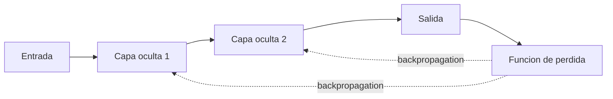

# Redes neuronales

## Introduccion

Antes de hablar de modelos de lenguaje, embeddings o transformers, conviene entender la pieza basica sobre la que se construye casi toda la inteligencia artificial moderna: la red neuronal. Aunque el nombre suena biologico, una red neuronal es en esencia una funcion matematica con muchos parametros ajustables que aprende a transformar entradas en salidas a partir de ejemplos.

Este capitulo explica que es una red neuronal, como aprende, por que apilar capas la hace tan poderosa y por que es la base sobre la que se apoyan los LLMs, los modelos de embeddings y los modelos de difusion.

---

## Definicion simple

Una red neuronal es un sistema de pequenas unidades conectadas en capas que transforma datos de entrada en datos de salida. Aprende ajustando esas conexiones a partir de muchos ejemplos.

En simple: es una funcion matematica que se va corrigiendo sola hasta dar respuestas razonables.

---

## Explicacion tecnica

Una red neuronal esta formada por neuronas artificiales organizadas en capas:

- una capa de entrada que recibe los datos
- una o mas capas ocultas que aplican transformaciones
- una capa de salida que produce el resultado

Cada neurona calcula una suma ponderada de las entradas que recibe, le suma un sesgo y aplica una funcion no lineal (como ReLU, sigmoide o tanh). Esa no linealidad es lo que permite que la red aprenda patrones complejos en lugar de solo relaciones lineales.

### Como aprende una red

El aprendizaje sigue tres pasos que se repiten miles o millones de veces:

1. **Forward pass:** se pasa un ejemplo por la red y se obtiene una prediccion.
2. **Calculo de error:** se compara la prediccion con la respuesta correcta usando una funcion de perdida (loss).
3. **Backpropagation:** se calcula como deberia cambiar cada peso para reducir el error y se actualizan con un optimizador como SGD o Adam.

Despues de muchas iteraciones sobre datos de entrenamiento, los pesos convergen hacia valores que hacen buenas predicciones sobre datos nuevos.

### Por que las capas profundas importan

Una red con muchas capas (deep learning) puede aprender representaciones jerarquicas. En vision, las primeras capas detectan bordes, las intermedias detectan formas y las ultimas detectan objetos. En lenguaje, las primeras capas capturan estructura local y las ultimas capturan significado a nivel de oracion o documento.

### Tipos de redes neuronales

- **Feedforward (MLP):** la informacion fluye en una sola direccion. Util para clasificacion y regresion sobre datos tabulares.
- **Convolucionales (CNN):** especializadas en imagenes y datos con estructura espacial.
- **Recurrentes (RNN, LSTM, GRU):** procesan secuencias paso a paso. Dominaron el lenguaje antes del Transformer.
- **Transformers:** la arquitectura detras de los LLMs modernos. Procesan toda la secuencia en paralelo usando atencion.

---

## Ejemplo practico

Una red neuronal sencilla para clasificar correos como spam o no spam puede tener:

- entrada: un vector con conteos de palabras del correo
- una capa oculta de 64 neuronas con ReLU
- una capa de salida de 1 neurona con sigmoide (probabilidad de spam)

Durante el entrenamiento, la red ve miles de correos etiquetados, ajusta sus pesos y, al final, puede asignar a un correo nuevo una probabilidad de ser spam con buena precision.

Lo importante: nadie programo reglas como "si dice 'gana dinero gratis' es spam". La red infirio esos patrones sola desde los datos.

---

## Analogia facil

Una red neuronal se parece a un equipo grande de empleados que se pasan notas en un edificio de varios pisos. Cada empleado mira lo que recibio del piso anterior, hace una operacion sencilla y le pasa el resultado al piso siguiente. Al principio todos hacen su tarea muy mal, pero cada vez que el equipo entrega un resultado equivocado, alguien afuera les dice cuanto se equivocaron y todos ajustan ligeramente como combinan la informacion. Despues de millones de intentos, el edificio entero produce respuestas sorprendentemente buenas.

---

## Diagrama

---

## Relacion con los demas conceptos

- Es la base matematica de todos los modelos modernos: [LLM](05-llm.md), [Embeddings](06-embeddings.md), [Transformer](19-transformer.md) y [Modelos de difusion](27-diffusion.md) son redes neuronales con arquitecturas especificas.
- El [Fine-tuning](07-fine-tuning.md) es exactamente reentrenar parte de los pesos de una red ya entrenada.
- El [Aprendizaje por transferencia](18-transfer-learning.md) es la estrategia que permite reusar redes preentrenadas en lugar de entrenar desde cero.
- La [Cuantizacion](24-cuantizacion.md) y [LoRA](23-lora.md) son tecnicas para hacer mas eficientes redes neuronales muy grandes.

---

## Idea clave

Una red neuronal no es magia: es una funcion con muchos parametros que se ajusta sola minimizando un error. Toda la IA moderna esta construida sobre esta misma idea, escalada a miles de millones de parametros y entrenada con cantidades masivas de datos.

---

## Resumen del capitulo

Una red neuronal es un conjunto de neuronas conectadas en capas que aprende a mapear entradas a salidas mediante backpropagation. Apilando capas y usando arquitecturas especializadas (CNN, RNN, Transformer), las redes pueden aprender patrones cada vez mas abstractos. Entender este concepto basico es la puerta de entrada para entender por que funcionan los LLMs, los embeddings, los modelos de imagenes y todos los componentes mas avanzados que se cubren en los siguientes capitulos.
