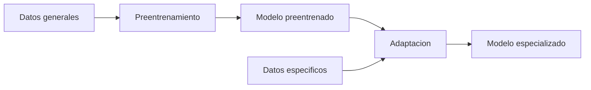

# Aprendizaje por transferencia (transfer learning)

## Introduccion

Entrenar una red neuronal grande desde cero requiere enormes cantidades de datos, computo y tiempo. Para la mayoria de los equipos eso es inviable. Por suerte, casi nunca hace falta empezar desde cero: ya existen modelos preentrenados sobre grandes corpus que han aprendido representaciones muy utiles del lenguaje, las imagenes o el audio. El aprendizaje por transferencia (transfer learning) es la disciplina de reutilizar ese conocimiento previo en una tarea nueva.

Este capitulo explica que es transfer learning, por que es la base practica de casi todos los sistemas de IA actuales y como se relaciona con el fine-tuning, LoRA y los modelos preentrenados.

---

## Definicion simple

El aprendizaje por transferencia es tomar un modelo que ya aprendio algo general y adaptarlo a una tarea nueva.

En simple: no se empieza desde cero, se aprovecha lo que el modelo ya sabe.

---

## Explicacion tecnica

La idea se basa en una observacion empirica: las primeras capas de una red entrenada sobre datos generales aprenden representaciones reutilizables. En vision, esas capas aprenden bordes y texturas. En lenguaje, aprenden gramatica, sintaxis y patrones semanticos generales. Esas representaciones suelen ser utiles para muchas tareas distintas.

Transfer learning aprovecha esto en dos pasos:

1. **Preentrenamiento:** un modelo se entrena en una tarea grande y general (predecir el siguiente token sobre todo internet, por ejemplo).
2. **Adaptacion a la tarea destino:** ese mismo modelo se ajusta o se reutiliza para una tarea especifica con mucho menos data.

### Estrategias comunes

- **Feature extraction:** se congelan los pesos del modelo preentrenado y se usan sus salidas como entradas para un clasificador nuevo y pequeno. Util cuando hay pocos datos.
- **Fine-tuning total:** se descongelan todas las capas y se reentrenan con un learning rate bajo sobre los datos de la tarea nueva. Util cuando hay datos suficientes.
- **Fine-tuning parcial:** se congelan las primeras capas y solo se ajustan las ultimas. Buen compromiso entre coste y rendimiento.
- **Fine-tuning eficiente en parametros (PEFT):** se introducen pequenas matrices nuevas (como en LoRA) para no tocar los pesos originales.

### Por que funciona

El conocimiento aprendido en una tarea grande se "transfiere" a la nueva si hay suficiente solapamiento de dominio. Un modelo de lenguaje preentrenado sobre internet ya entiende gramatica, hechos generales y formato; reentrenarlo para clasificar tickets de soporte es mucho mas facil que entrenar uno nuevo desde cero.

### Limites

Si la tarea destino es muy distinta del preentrenamiento (por ejemplo, datos sinteticos en un formato propio que el modelo nunca vio), el beneficio de transfer learning disminuye y a veces hace falta entrenamiento mas profundo o un modelo distinto.

---

## Ejemplo practico

Un equipo necesita un clasificador de sentimiento para resenas de productos en espanol. Tienen 5.000 ejemplos etiquetados, lo cual es muy poco para entrenar un modelo grande desde cero.

Solucion con transfer learning:

1. Toman un modelo de lenguaje multilingue preentrenado (por ejemplo XLM-Roberta).
2. Anaden una capa de clasificacion al final.
3. Reentrenan todo el conjunto durante 3 epochs sobre sus 5.000 ejemplos con learning rate bajo.

Resultado: precision superior al 90%, sin necesidad de millones de ejemplos ni semanas de entrenamiento.

---

## Analogia facil

Transfer learning se parece a contratar a alguien que ya sabe cocinar y ensenarle un menu nuevo, en lugar de buscar a alguien que nunca toco una sarten y ensenarle desde como prender el fuego. La persona ya entiende ingredientes, tiempos y tecnicas; solo hay que mostrarle las recetas particulares del restaurante.

---

## Diagrama

---

## Relacion con los demas conceptos

- Es la base conceptual del [Fine-tuning](07-fine-tuning.md): el fine-tuning es una forma concreta de transfer learning.
- [LoRA](23-lora.md) es una tecnica eficiente de transfer learning que entrena pequenas matrices adicionales en lugar de todos los pesos.
- Los [LLMs](05-llm.md) son productos directos del transfer learning: se preentrenan con cantidades masivas de texto general y luego se adaptan con SFT y RLHF.
- Los [Embeddings](06-embeddings.md) tambien usan modelos preentrenados que despues se especializan para dominios concretos.
- La [Cuantizacion](24-cuantizacion.md) y otras tecnicas de optimizacion suelen aplicarse despues de adaptar el modelo para hacerlo desplegable.

---

## Idea clave

No se entrena desde cero casi nunca. Se parte de un modelo preentrenado y se adapta. Esa unica decision es la que hace que la IA moderna sea practica para equipos de cualquier tamano, no solo para los que tienen miles de GPUs.

---

## Resumen del capitulo

El aprendizaje por transferencia consiste en reutilizar un modelo preentrenado en una tarea nueva. Permite entrenar sistemas utiles con pocos datos y poco computo, y es el principio detras de fine-tuning, LoRA y la forma en que se construyen los LLMs actuales. Entenderlo es clave para tomar buenas decisiones sobre cuando entrenar, cuando ajustar y cuando solo usar un modelo tal como esta.
