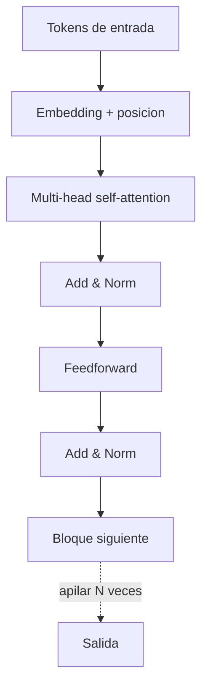

# Transformer y atencion

## Introduccion

Casi todos los modelos de lenguaje modernos —GPT, Claude, Llama, Gemini, Mistral— comparten la misma arquitectura subyacente: el Transformer. Fue introducida en 2017 en el articulo "Attention is All You Need" y desplazo rapidamente a las redes recurrentes (RNN, LSTM) como estandar para procesar secuencias. Su exito se debe a un mecanismo central: la atencion.

Este capitulo explica que es la atencion, como se compone un Transformer y por que esta arquitectura permitio el salto de calidad que vivimos desde 2018 en adelante.

---

## Definicion simple

El Transformer es la arquitectura de red neuronal que esta detras de los modelos de lenguaje modernos. Su idea central, la atencion, le permite a cada palabra de una entrada decidir cuanta importancia darle a las demas.

En simple: cada token mira a los otros y decide cuales son relevantes para entender su propio significado.

---

## Explicacion tecnica

Antes del Transformer, el lenguaje se procesaba secuencialmente, palabra por palabra, con redes recurrentes. Eso era lento y dificil de paralelizar, y las dependencias muy largas se perdian. El Transformer rompio con esa logica: procesa toda la secuencia a la vez y deja que cada token "atienda" directamente a cualquier otro.

### El mecanismo de atencion

Para cada token, el modelo calcula tres vectores:

- **Query (Q):** que estoy buscando.
- **Key (K):** que ofrezco yo a los demas.
- **Value (V):** que informacion entrego si me eligen.

La atencion compara la query de cada token con las keys de todos los demas, calcula puntuaciones de similitud (producto punto, escalado y luego softmax) y usa esas puntuaciones para ponderar los values. El resultado es una nueva representacion de cada token que combina informacion de toda la secuencia segun su relevancia.

Formula resumida:

```
Attention(Q, K, V) = softmax(Q * K^T / sqrt(d_k)) * V
```

### Multi-head attention

En lugar de calcular una sola atencion, el Transformer calcula varias en paralelo (cabezas), cada una con sus propias Q, K, V. Cada cabeza puede especializarse en un tipo de relacion: una en sintaxis, otra en correferencia, otra en relaciones semanticas. Los resultados se concatenan y se proyectan.

### Bloque Transformer

Un bloque Transformer estandar combina:

1. Multi-head self-attention
2. Una red feedforward por posicion
3. Conexiones residuales y layer normalization en cada subcapa

Los modelos grandes apilan decenas o cientos de bloques. Llama 3 70B, por ejemplo, tiene 80 capas; GPT-4 mucho mas.

### Positional encoding

Como la atencion es invariante al orden, el Transformer agrega informacion de posicion explicita (positional encoding) a cada token. Sin eso, el modelo no distinguiria "el perro mordio al hombre" de "el hombre mordio al perro". Versiones modernas usan codificaciones rotatorias (RoPE) o aprendidas.

### Encoder vs decoder

- **Encoder-only** (BERT): util para clasificacion y comprension.
- **Decoder-only** (GPT, Llama, Claude): genera texto token por token, atendiendo solo a tokens anteriores. Es la base de los LLMs modernos.
- **Encoder-decoder** (T5, modelos de traduccion): el encoder procesa la entrada, el decoder genera la salida.

---

## Ejemplo practico

Frase: "El abogado le dio el contrato a su cliente porque ella lo pidio".

Cuando el modelo procesa "ella", la atencion compara su query con las keys de todos los demas tokens. Las puntuaciones mas altas iran probablemente hacia "cliente", porque es el sustantivo femenino al que se refiere. El vector resultante para "ella" combina mucha informacion de "cliente" y poco de "abogado".

Esa capacidad de resolver dependencias a larga distancia, sin pasar por todas las palabras intermedias, es lo que permite al Transformer entender frases complejas, codigo o documentos enteros.

---

## Analogia facil

Imagina una mesa redonda donde cada participante tiene una pregunta y una respuesta. Antes de hablar, cada uno mira a todos los demas y decide a quienes prestar mas atencion segun lo que pueden aportar a su pregunta. Cuando finalmente habla, su intervencion ya integra lo que aprendio de los relevantes y casi ignora a los que no lo eran. Eso es self-attention: una conversacion paralela donde cada token escucha a todos pero pondera con cuidado.

---

## Diagrama



---

## Relacion con los demas conceptos

- Es la arquitectura que esta dentro del [LLM](05-llm.md): los modelos grandes son pilas de bloques Transformer.
- Recibe [Tokens](04-tokens.md) ya convertidos en [Embeddings](06-embeddings.md) como entrada.
- Es la base sobre la que se aplican el [Fine-tuning](07-fine-tuning.md), [LoRA](23-lora.md) y la [Cuantizacion](24-cuantizacion.md).
- Es un caso particular de [Red neuronal](17-redes-neuronales.md) profunda especializada en secuencias.
- La [Cadena de pensamiento](25-chain-of-thought.md) explota la capacidad del Transformer de mantener consistencia interna a lo largo de muchos tokens.

---

## Idea clave

La atencion es la idea matematica que cambio la IA moderna. Permite que cada token de una secuencia mire a todos los demas en paralelo y combine su informacion segun su relevancia. Sin atencion no hay LLM tal como lo conocemos.

---

## Resumen del capitulo

El Transformer es una arquitectura de red neuronal basada en atencion que procesa secuencias enteras en paralelo. Cada token decide cuanta importancia darle al resto mediante el mecanismo Query-Key-Value, y los bloques se apilan decenas o cientos de veces para construir modelos capaces de razonar sobre lenguaje, codigo, imagenes o audio. Entender el Transformer es entender la pieza central sobre la que se construye toda la generacion actual de modelos de lenguaje.
