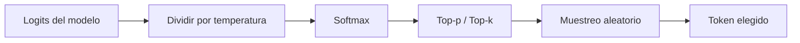

# Temperatura

## Introduccion

Cuando un LLM genera una respuesta no produce una unica salida deterministica: a cada paso elige el siguiente token de una distribucion de probabilidades. La temperatura es el parametro que controla cuanto se respeta esa distribucion al elegir. Es uno de los pocos botones que el usuario puede mover sin reentrenar nada y que cambia drasticamente el caracter de la respuesta.

Este capitulo explica que es la temperatura, como interactua con otros parametros de muestreo (top-p, top-k) y como elegir un valor adecuado segun la tarea.

---

## Definicion simple

La temperatura es un numero que controla cuanto varia el modelo en sus respuestas. Baja = focalizado y predecible. Alta = creativo y variado.

En simple: es el dial de creatividad del modelo.

---

## Explicacion tecnica

En cada paso de generacion, un LLM produce un vector de logits (puntuaciones) para cada posible token siguiente. Esos logits se transforman en probabilidades aplicando softmax. La temperatura `T` modifica los logits antes del softmax dividiendolos por su valor:

```
p_i = softmax(logits_i / T)
```

- Cuando `T = 1`, no se modifica la distribucion original.
- Cuando `T < 1` (por ejemplo 0.2), las probabilidades se concentran en los tokens mas probables. La salida se vuelve mas focalizada y repetible.
- Cuando `T > 1` (por ejemplo 1.5), la distribucion se aplana. Tokens menos probables ganan peso y el resultado se vuelve mas creativo, mas variado y, a menudo, menos coherente.
- Cuando `T = 0`, se elige siempre el token mas probable (modo greedy o deterministico).

### Top-p y top-k

La temperatura suele usarse junto con otras estrategias de muestreo:

- **Top-k:** se consideran solo los k tokens mas probables y se ignora el resto.
- **Top-p (nucleus sampling):** se consideran los tokens cuya probabilidad acumulada llega a `p` (por ejemplo 0.9), descartando la cola larga.

Estas tecnicas se combinan para evitar que el modelo elija tokens muy improbables incluso con temperaturas altas.

### Que valor usar

- **0 a 0.3:** tareas con respuesta correcta unica. Codigo, extraccion de datos, clasificacion, respuestas factuales.
- **0.4 a 0.7:** tareas conversacionales generales. Asistentes, resumenes, redaccion estandar.
- **0.8 a 1.2:** tareas creativas. Generacion de ideas, redaccion publicitaria, brainstorming.
- **> 1.5:** experimentacion. Suele producir texto incoherente.

### Por que importa

Una mala eleccion de temperatura puede arruinar un sistema que funciona bien en todo lo demas. Un asistente legal con temperatura 1 inventara articulos. Un generador de eslogans con temperatura 0 producira siempre el mismo eslogan aburrido. La temperatura es parte del diseno del producto, no un detalle tecnico.

---

## Ejemplo practico

Prompt: "Dame tres nombres para una cafeteria de barrio".

- Temperatura 0: "Cafe Central, Cafe del Barrio, Cafe Plaza" (todas veces casi lo mismo).
- Temperatura 0.7: "Granos del Barrio, Esquina Tostada, Cafe Lola" (variado pero razonable).
- Temperatura 1.5: "Tostadero Galaxia, El Vapor de las Tres, Cafetin Espiral del Tiempo" (creativo, a veces extrano).

Para una recomendacion factual ("cual es la capital de Australia") la respuesta correcta es siempre la misma sin importar la temperatura, pero a temperaturas muy altas aumenta el riesgo de respuestas incorrectas o disparatadas.

---

## Analogia facil

La temperatura se parece al volumen del freestyle de un musico. Con temperatura baja, toca la melodia escrita exactamente. Con temperatura media, improvisa con buen gusto sobre la estructura. Con temperatura muy alta, mete notas raras que a veces son geniales y a veces son ruido. El musico es el mismo; lo que cambia es cuanto se permite salir de lo mas probable.

---

## Diagrama



---

## Relacion con los demas conceptos

- Afecta la salida del [LLM](05-llm.md) en cada paso de generacion de [Tokens](04-tokens.md).
- Es uno de los parametros que un buen [Prompt engineering](02-prompt-engineering.md) elige conscientemente, no por defecto.
- Influye directamente en la probabilidad de [Alucinaciones](21-alucinaciones.md): temperaturas altas aumentan el riesgo.
- Las [Evaluaciones](12-evaluaciones.md) deben fijar la temperatura para que las metricas sean comparables entre corridas.
- Un [Agente](11-agente.md) suele usar temperatura baja en pasos de planificacion deterministica y temperatura mas alta en pasos creativos.
- En tareas con [RAG](14-rag.md), suele convenir temperatura baja para que el modelo respete la informacion recuperada.

---

## Idea clave

La temperatura no cambia el conocimiento del modelo, cambia cuanto se aleja del camino mas probable. Elegirla bien es decidir si quieres precision o creatividad, y esa decision pertenece al diseno del sistema, no a los valores por defecto del SDK.

---

## Resumen del capitulo

La temperatura es el parametro de muestreo que controla cuan focalizada o creativa es la salida de un LLM. Funciona escalando los logits antes del softmax y suele combinarse con top-p o top-k. Valores bajos producen respuestas estables y factuales; valores altos producen respuestas variadas y creativas pero mas riesgosas. Elegirla bien segun el tipo de tarea es una de las decisiones mas baratas y de mayor impacto en la calidad de un sistema de IA.
