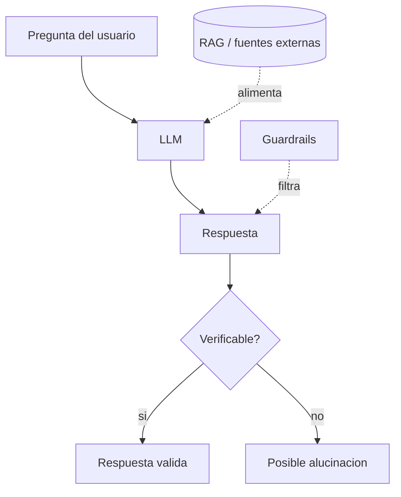

# Alucinaciones

## Introduccion

Una de las propiedades mas peligrosas de los modelos de lenguaje es que generan respuestas con un tono seguro incluso cuando lo que dicen es falso. A esto se le llama alucinacion: el modelo inventa hechos, fuentes, citas, codigo, APIs o personas con la misma fluidez con la que enuncia hechos verdaderos. Para cualquier sistema de IA en produccion, entender por que ocurren las alucinaciones y como mitigarlas es tan importante como entender el modelo mismo.

Este capitulo explica que es una alucinacion, por que es un comportamiento inherente a los LLMs y que estrategias existen para reducirla y detectarla.

---

## Definicion simple

Una alucinacion es una respuesta del modelo que suena bien pero es falsa o inventada.

En simple: el modelo dice cosas con confianza aunque no las sepa.

---

## Explicacion tecnica

Un LLM no esta optimizado para decir la verdad. Esta optimizado para predecir el siguiente token mas probable dado el contexto. Si los tokens que forman una respuesta plausible son similares a los que formarian una respuesta verdadera, el modelo no tiene un mecanismo interno que lo impida elegir los plausibles. De ahi salen las alucinaciones.

### Tipos comunes

- **Factuales:** invenciones de fechas, cifras, eventos o personas. "Marie Curie nacio en 1875" (en realidad 1867).
- **De fuentes:** citas, articulos, papers o libros que no existen, o que existen pero dicen otra cosa.
- **Tecnicas:** funciones, parametros o APIs que no existen en una libreria. Muy comun en generacion de codigo.
- **De razonamiento:** conclusiones que no se siguen de las premisas, aunque cada paso parezca razonable.
- **Contextuales:** el modelo contradice o ignora informacion presente en el propio prompt o en los documentos recuperados.

### Por que ocurren

- El modelo no tiene fuente de verdad: solo tiene patrones estadisticos del entrenamiento.
- Los datos de entrenamiento incluyen texto incorrecto, opiniones y ficcion mezclados.
- La presion por completar la respuesta hace que el modelo "rellene" cuando no sabe.
- Temperaturas altas amplifican el problema al permitir tokens menos probables.
- Cuando el contexto es largo, la informacion relevante puede quedar diluida y el modelo se apoya en el preentrenamiento.

### Estrategias de mitigacion

- **RAG:** recuperar documentos reales y pedir al modelo que se apoye en ellos. Reduce, no elimina, la alucinacion.
- **Citas obligatorias:** pedir explicitamente que cite la fuente para cada afirmacion. Las alucinaciones son mas dificiles de sostener cuando hay que mostrar de donde se sacan.
- **Temperatura baja:** menos creatividad, menos invencion.
- **Validacion programatica:** verificar URLs, cifras, nombres de funciones contra una fuente autorizada antes de mostrar la respuesta.
- **Guardrails:** filtros que detectan patrones tipicos de alucinacion (URLs inventadas, papers sin DOI, etc.).
- **Cadena de pensamiento explicita:** pedir al modelo que razone paso a paso ayuda a detectar saltos logicos.
- **Modelos especializados o fine-tuneados** sobre el dominio reducen la alucinacion cuando hay datos buenos.

### Lo que no funciona

- Pedir "no inventes": ayuda algo, pero no es suficiente.
- Confiar en la confianza expresada por el modelo: las alucinaciones suelen sonar tan seguras como las respuestas correctas.
- Usar un modelo mas grande: reduce algunos tipos de alucinacion pero introduce otros, especialmente en dominios muy especificos.

---

## Ejemplo practico

Prompt: "Citame tres papers academicos sobre fairness en algoritmos de scoring crediticio."

Respuesta tipica de un modelo sin RAG: tres titulos plausibles, con autores reales mezclados con autores inventados, anos verosimiles y revistas que existen. Al verificar uno por uno en Google Scholar: dos no existen y uno es real pero trata de otro tema.

La misma pregunta con RAG sobre una base de papers reales: el modelo cita tres referencias verificables que se pueden abrir y leer.

---

## Analogia facil

Una alucinacion se parece a un guia turistico muy elocuente que nunca dice "no se". Si le preguntas por la historia de un edificio que no conoce, igual te cuenta una historia entretenida y plausible. Suena experto, los detalles encajan, pero no es cierto. El problema no es la falta de conocimiento; es la ausencia de un freno cultural o cognitivo que diga "mejor no invento".

---

## Diagrama

---

## Relacion con los demas conceptos

- Es un comportamiento inherente del [LLM](05-llm.md), no un bug puntual.
- La [Temperatura](20-temperatura.md) alta aumenta su frecuencia.
- El [RAG](14-rag.md) es la mitigacion mas efectiva para preguntas factuales.
- Los [Guardrails](15-guardrails.md) pueden detectarlas y bloquearlas antes de mostrarlas al usuario.
- Las [Evaluaciones](12-evaluaciones.md) deben medir explicitamente la tasa de alucinaciones de un sistema, no solo su fluidez.
- Un buen [Prompt engineering](02-prompt-engineering.md) reduce alucinaciones pidiendo citas, ejemplos y razonamiento explicito.
- La [Cadena de pensamiento](25-chain-of-thought.md) ayuda a hacer visibles errores de razonamiento.

---

## Idea clave

Un LLM siempre puede alucinar. La pregunta correcta no es "como evito que alucine" sino "como construyo un sistema que detecta, mitiga y limita las alucinaciones a un nivel aceptable para el caso de uso". Sin esa mentalidad, cualquier asistente de IA en produccion es una bomba de tiempo.

---

## Resumen del capitulo

Las alucinaciones son respuestas falsas pero plausibles generadas por LLMs. Ocurren porque los modelos predicen tokens probables, no hechos verdaderos. Se mitigan con RAG, citas obligatorias, temperaturas bajas, validacion programatica, guardrails y evaluaciones que las midan explicitamente. Asumir que un LLM puede alucinar siempre es la base para disenar sistemas de IA confiables.
