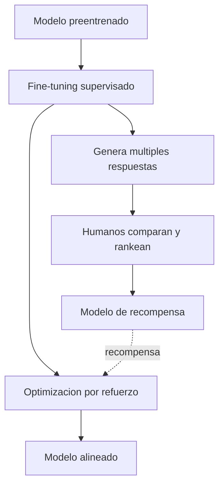

# RLHF (Reinforcement Learning from Human Feedback)

## Introduccion

Un modelo de lenguaje preentrenado solo aprendio a continuar texto. Es bueno completando frases, pero no necesariamente util, seguro o agradable para conversar. Para convertir un modelo base en un asistente que sigue instrucciones, ayuda y evita respuestas problematicas, hace falta una etapa de alineamiento. La tecnica que popularizaron OpenAI con InstructGPT y luego con ChatGPT se llama RLHF: aprendizaje por refuerzo con feedback humano.

Este capitulo explica que es RLHF, como se usa para alinear LLMs y por que es la diferencia entre un modelo base impresionante y un asistente realmente usable.

---

## Definicion simple

RLHF es un metodo para entrenar a un modelo de IA usando preferencias de personas. Las personas comparan respuestas del modelo y el modelo aprende a producir las que la gente prefiere.

En simple: humanos puntuan, el modelo aprende a gustar.

---

## Explicacion tecnica

RLHF se aplica despues del preentrenamiento y suele venir despues del fine-tuning supervisado (SFT). Tiene tres etapas principales:

### 1. Modelo base + SFT

El modelo base ya sabe completar texto. Se ajusta con ejemplos de instrucciones y respuestas ideales escritas por humanos. Despues de esto, el modelo ya sigue instrucciones razonablemente bien.

### 2. Modelo de recompensa

Para cada prompt, se generan varias respuestas con el modelo SFT. Anotadores humanos las ordenan de mejor a peor. Con esos rankings se entrena un modelo separado, llamado modelo de recompensa (reward model), que aprende a asignar una puntuacion a cualquier respuesta nueva imitando la preferencia humana.

### 3. Optimizacion por refuerzo

El modelo de lenguaje se reentrena para maximizar la puntuacion del modelo de recompensa, generalmente con el algoritmo PPO (Proximal Policy Optimization). Para evitar que el modelo se aleje demasiado del SFT y empiece a producir texto raro, se penaliza tambien la divergencia respecto al modelo base (KL penalty).

### Variantes y alternativas

- **DPO (Direct Preference Optimization):** evita entrenar un modelo de recompensa separado y entrena directamente sobre los pares de preferencias. Mas simple y estable.
- **RLAIF:** las preferencias las da otro modelo de IA en lugar de humanos. Mas barato y escalable.
- **Constitutional AI:** el modelo se autoevalua siguiendo una lista explicita de principios.

### Que aporta y que no

RLHF mejora:

- seguimiento de instrucciones
- estilo y utilidad de las respuestas
- rechazo de pedidos inapropiados
- tono conversacional

RLHF no soluciona:

- alucinaciones factuales (puede empeorarlas si los anotadores premian respuestas seguras)
- conocimiento que el modelo no tenia
- sesgos profundos del corpus de entrenamiento

---

## Ejemplo practico

Prompt: "Explicame que es la fotosintesis a un nino de 7 anos."

- Respuesta A (modelo solo SFT): "La fotosintesis es el proceso bioquimico mediante el cual organismos autotrofos convierten energia luminosa en energia quimica..."
- Respuesta B (mismo modelo despues de RLHF): "Las plantas son como pequenas cocineras: usan la luz del sol, agua y aire para preparar su propia comida. Por eso necesitan estar al sol y que las riegues."

Los dos modelos saben lo mismo. RLHF entreno al segundo a elegir la respuesta que un evaluador humano calificaria como mas util en ese contexto.

---

## Analogia facil

RLHF se parece a entrenar a un panadero nuevo no con un libro de recetas, sino dejandolo hornear varios panes y haciendo que clientes prueben pares de panes y digan cual prefieren. Despues de muchos pares, el panadero ya no necesita la receta: aprendio a cocinar lo que la gente disfruta. El panadero sigue siendo el mismo aprendiz, pero ahora sus decisiones estan calibradas a un gusto compartido.

---

## Diagrama

---

## Relacion con los demas conceptos

- Es la etapa final mas comun de un [LLM](05-llm.md) moderno antes de salir a produccion.
- Forma parte del proceso mas amplio de [Fine-tuning](07-fine-tuning.md): SFT primero, luego RLHF.
- Reduce algunas [Alucinaciones](21-alucinaciones.md) (las menos utiles), pero puede reforzar otras (las que suenan seguras).
- Sus resultados se miden con [Evaluaciones](12-evaluaciones.md) que comparan respuestas con preferencias humanas o con benchmarks.
- Se complementa con [Guardrails](15-guardrails.md): RLHF alinea, los guardrails ponen limites duros.
- Es la razon por la que un mismo modelo base puede producir asistentes con personalidades muy distintas segun como se haga el RLHF.

---

## Idea clave

Un modelo solo preentrenado sabe mucho pero no sabe ayudar. RLHF es lo que convierte conocimiento en utilidad. Por eso el "mismo" modelo de base puede sentirse como una herramienta brillante o como un chatbot frustrante segun el alineamiento que reciba.

---

## Resumen del capitulo

RLHF es la tecnica de alineamiento que usa preferencias humanas para entrenar a un LLM a producir respuestas mas utiles, seguras y agradables. Funciona en tres etapas: SFT, modelo de recompensa y optimizacion por refuerzo, generalmente con PPO. Es una de las razones principales del salto de calidad percibida entre modelos base y asistentes modernos como ChatGPT, Claude o Gemini, y es complementario al fine-tuning, los guardrails y las evaluaciones.
