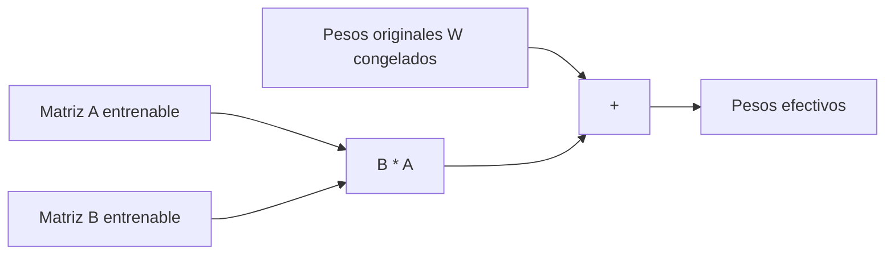

# LoRA (Low-Rank Adaptation)

## Introduccion

Hacer fine-tuning de un modelo grande tradicionalmente significaba reentrenar todos sus parametros: miles de millones de pesos, gigabytes de memoria, GPUs caras y dias o semanas de computo. Para la mayoria de los equipos eso es prohibitivo. LoRA es una tecnica que permite especializar modelos enormes ajustando solo una fraccion minuscula de sus parametros, con resultados sorprendentemente buenos. Es una de las razones por las que el ecosistema open source de LLMs explotó.

Este capitulo explica que es LoRA, por que funciona y como cambia la economia de adaptar modelos grandes.

---

## Definicion simple

LoRA es una tecnica de fine-tuning que entrena solo unas pocas matrices pequenas en lugar de todo el modelo. Es mucho mas rapido y barato.

En simple: ajustes pequenos pegados encima del modelo, sin tocar los pesos originales.

---

## Explicacion tecnica

LoRA (Low-Rank Adaptation) parte de una observacion empirica: cuando se hace fine-tuning de un modelo grande, los cambios que necesitan los pesos para adaptarse a una tarea suelen tener rango bajo. Es decir, no hace falta cambiar la matriz entera; basta con sumar una matriz de cambio que se puede expresar como producto de dos matrices mucho mas pequenas.

### La idea matematica

Para una capa con matriz de pesos `W` de tamano `d x d`, en vez de actualizar `W` directamente, LoRA propone:

```
W_efectivo = W + B * A
```

donde:

- `A` es de tamano `r x d`
- `B` es de tamano `d x r`
- `r` es el "rango" elegido, tipicamente entre 4 y 64

Si `d = 4096` y `r = 8`, entonces `W` tiene 16.777.216 parametros y `B*A` solo tiene 65.536. Una reduccion de mas de 250 veces. Durante el entrenamiento solo se ajustan `A` y `B`; `W` queda congelado.

### Por que funciona

Los modelos preentrenados ya capturan la mayoria de las representaciones necesarias. Adaptarlos a una tarea nueva no requiere reescribir su conocimiento, solo sesgarlo en una direccion concreta. Esa direccion suele ser una transformacion de rango bajo, que LoRA representa de forma eficiente.

### Ventajas practicas

- **Memoria:** entrenar solo las matrices LoRA usa una fraccion de la VRAM.
- **Storage:** una "cabeza" LoRA pesa pocos MB en lugar de varios GB; se pueden guardar muchas adaptaciones distintas para el mismo modelo base.
- **Velocidad:** entrenamiento mucho mas rapido y mas barato en GPU.
- **Composicion:** se pueden activar o desactivar adaptaciones LoRA en runtime, incluso combinarlas.
- **Sin perdida de la base:** como `W` no se toca, el modelo original sigue intacto y se puede revertir trivialmente.

### Variantes

- **QLoRA:** combina LoRA con cuantizacion del modelo base a 4 bits. Permite hacer fine-tuning de modelos de 70B en una sola GPU consumer.
- **AdaLoRA:** ajusta dinamicamente el rango por capa segun su importancia.
- **DoRA:** descompone los pesos en magnitud y direccion para mejorar la calidad.

---

## Ejemplo practico

Un equipo quiere especializar Llama 3 8B para responder consultas legales en espanol con vocabulario propio del despacho.

- Fine-tuning completo: 8B parametros, ~60 GB de VRAM, varios dias de entrenamiento, archivo final de 16 GB.
- Con LoRA (rango 16): se entrenan ~30 millones de parametros, cabe en una GPU de 24 GB, entrena en pocas horas, y la cabeza adaptada pesa unos 60 MB.

Despliegue: cargan el modelo base una vez en memoria y aplican distintas cabezas LoRA segun el tipo de consulta (laboral, civil, mercantil) sin duplicar el modelo.

---

## Analogia facil

LoRA se parece a no reescribir un libro entero para adaptarlo a un publico nuevo, sino agregar un cuadernillo pequeno de notas al margen. El libro original queda intacto, las notas son baratas de imprimir y un mismo libro puede tener muchas hojas de notas distintas para diferentes lectores. El lector lee el libro junto con las notas y obtiene una experiencia personalizada sin rehacer la edicion completa.

---

## Diagrama



---

## Relacion con los demas conceptos

- Es una forma especifica de [Aprendizaje por transferencia](18-transfer-learning.md) y [Fine-tuning](07-fine-tuning.md), llamada genericamente PEFT (parameter efficient fine-tuning).
- Se combina muy bien con [Cuantizacion](24-cuantizacion.md) en QLoRA para entrenar modelos enormes en hardware accesible.
- Mantiene el [LLM](05-llm.md) base intacto, lo que facilita versionado y despliegue de muchas adaptaciones simultaneas.
- Las [Evaluaciones](12-evaluaciones.md) son clave para comparar si una cabeza LoRA realmente mejora el sistema o introduce regresiones.
- Suele ser la primera opcion para equipos que quieren especializar un modelo open source antes de pensar en fine-tuning completo.

---

## Idea clave

LoRA cambio la economia del fine-tuning. Hizo posible que equipos pequenos especialicen modelos enormes con presupuestos modestos, y que un mismo modelo base sirva a muchos casos de uso solo cambiando una cabeza ligera. Es una de las razones practicas por las que el ecosistema de LLMs open source pudo crecer.

---

## Resumen del capitulo

LoRA entrena dos matrices pequenas que se suman a los pesos originales en lugar de reentrenar el modelo completo. Aprovecha que las adaptaciones suelen tener rango bajo y reduce drasticamente el coste de fine-tuning sin perdida significativa de calidad. Combinada con cuantizacion (QLoRA), permite especializar modelos de decenas de miles de millones de parametros en hardware accesible y desplegar multiples adaptaciones sobre un mismo modelo base.
