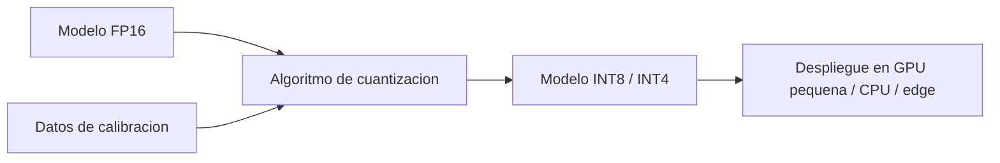

# Cuantizacion

## Introduccion

Los LLMs modernos almacenan sus pesos como numeros de punto flotante de 16 o 32 bits. Para un modelo de 70B parametros eso significa entre 140 y 280 GB de memoria solo para los pesos, sin contar el contexto ni los caches de inferencia. Esto los hace muy caros de servir y casi imposibles de correr en hardware comun. La cuantizacion es la tecnica que reduce la precision de esos numeros, encogiendo el modelo varias veces sin perder demasiada calidad.

Este capitulo explica que es la cuantizacion, como funciona y por que es una de las palancas mas importantes para hacer que la IA llegue a laptops, telefonos y servidores baratos.

---

## Definicion simple

Cuantizar es guardar los numeros del modelo con menos bits para que el modelo ocupe mucho menos espacio.

En simple: numeros mas chicos, modelo mas chico, corre en mas lugares.

---

## Explicacion tecnica

Cada peso de una red neuronal es un numero. Si normalmente se guarda con 16 bits (FP16), reducirlo a 8 bits (INT8) o 4 bits (INT4) divide la memoria entre 2 o entre 4. Eso significa que un modelo de 70B parametros, que en FP16 ocupa unos 140 GB, en 4 bits ocupa unos 35 GB y puede correr en una sola GPU de 48 GB o incluso en una laptop con 64 GB de RAM.

### Como se cuantiza

La cuantizacion mapea un rango continuo de valores a un conjunto discreto. Para un grupo de pesos, se calcula una escala y un cero, y luego cada peso se aproxima al entero mas cercano dentro de ese rango. La operacion se invierte (de-cuantiza) en runtime para hacer las multiplicaciones, o se hace todo el calculo directamente en enteros para ganar tambien velocidad.

### Granularidad

- **Per-tensor:** una sola escala para todo el tensor. Simple pero pierde precision.
- **Per-channel:** una escala por canal. Mejor compromiso para capas convolucionales o lineales.
- **Per-group:** se agrupan pesos en bloques pequenos (por ejemplo 64 o 128) y cada grupo tiene su escala. Tipico en LLMs (GPTQ, AWQ).

### Cuantizacion estatica vs dinamica

- **Post-training quantization (PTQ):** se cuantiza un modelo ya entrenado, sin reentrenar. Rapido y barato. La opcion mas comun para LLMs.
- **Quantization-aware training (QAT):** se entrena el modelo simulando la cuantizacion en cada paso. Mas costoso pero recupera mejor calidad, especialmente a 4 bits o menos.

### Algoritmos populares para LLMs

- **GPTQ:** post-training, optimiza el error capa por capa.
- **AWQ:** identifica los pesos mas "importantes" y los protege durante la cuantizacion.
- **BitsAndBytes (NF4):** formato de 4 bits disenado para los rangos tipicos de LLMs, base de QLoRA.
- **GGUF:** formato de archivo cuantizado popularizado por llama.cpp para correr modelos en CPU y hardware modesto.

### Que se gana y que se pierde

Se gana:

- memoria (de 2x a 8x menos)
- velocidad de inferencia, en muchos casos
- coste por token

Se pierde:

- algo de calidad, generalmente pequena hasta INT8, mas notoria en INT4 o menos
- precision en tareas muy sensibles (matematicas exactas, codigo complejo)

La calidad se mide con benchmarks comparando el modelo cuantizado contra el original. Para muchas tareas, INT8 es practicamente indistinguible y INT4 sigue siendo muy util.

---

## Ejemplo practico

Llama 3 70B:

- FP16: ~140 GB. Necesita varias GPUs A100 80GB.
- INT8: ~70 GB. Cabe en una H100 80GB.
- 4 bits (GGUF Q4_K_M): ~40 GB. Corre en una sola GPU consumer de 48 GB o en una Mac con 64 GB de memoria unificada.
- 4 bits con offload a CPU: corre en una laptop normal a velocidad reducida.

La diferencia de calidad medida en benchmarks tipicos suele ser de pocos puntos porcentuales, pero la diferencia de coste es de uno a dos ordenes de magnitud.

---

## Analogia facil

La cuantizacion se parece a comprimir fotos. Una foto en RAW pesa mucho y guarda toda la informacion del sensor. La misma foto en JPEG con alta calidad pesa una fraccion y se ve casi igual a ojo. Si comprimes mucho mas, empiezan a aparecer artefactos. Lo mismo con los modelos: hasta cierto punto se puede comprimir sin que se note, pasado ese punto la calidad se deteriora.

---

## Diagrama

---

## Relacion con los demas conceptos

- Es ortogonal a [LoRA](23-lora.md): se pueden combinar (QLoRA) para entrenar y servir modelos grandes en hardware modesto.
- Permite desplegar [LLMs](05-llm.md) en escenarios donde la version completa seria inviable: laptops, edge, ambientes air-gapped.
- No reemplaza al [Fine-tuning](07-fine-tuning.md): primero se especializa el modelo, despues se cuantiza para servirlo.
- Las [Evaluaciones](12-evaluaciones.md) son criticas para comparar la calidad del modelo cuantizado contra el original y decidir el nivel de compresion aceptable.
- Junto con la [Cadena de pensamiento](25-chain-of-thought.md) y otras tecnicas, ayuda a obtener buena calidad de razonamiento incluso con modelos pequenos.
- Reduce el coste de inferencia en [Agentes](11-agente.md) y sistemas con [RAG](14-rag.md), donde el numero de llamadas al modelo puede ser alto.

---

## Idea clave

La cuantizacion es lo que hace practica la IA en produccion. Sin ella, servir modelos grandes seria un lujo de pocos. Con ella, los mismos modelos corren en una fraccion del hardware con calidad muy cercana a la original.

---

## Resumen del capitulo

La cuantizacion reduce los bits que usa cada peso de un modelo, encogiendo memoria y coste de inferencia. Tecnicas como GPTQ, AWQ y formatos como GGUF permiten correr modelos de decenas de miles de millones de parametros en hardware modesto con poca perdida de calidad. Es una pieza clave del despliegue practico de LLMs y se combina con LoRA, fine-tuning y evaluaciones para encontrar el mejor punto entre coste y rendimiento.
