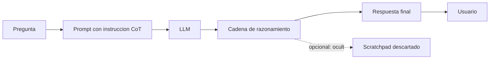

# Cadena de pensamiento (chain of thought)

## Introduccion

Cuando se le pide a un LLM que resuelva un problema complejo de un solo golpe, suele equivocarse. La misma pregunta, planteada con un "explica tu razonamiento paso a paso antes de responder", a menudo se resuelve correctamente. Esa diferencia, aparentemente trivial, es uno de los descubrimientos mas importantes de prompt engineering moderno: la cadena de pensamiento, conocida en ingles como chain of thought (CoT).

Este capitulo explica que es la cadena de pensamiento, por que mejora la calidad del razonamiento, sus variantes (few-shot CoT, self-consistency, ToT) y cuando conviene usarla.

---

## Definicion simple

La cadena de pensamiento es pedirle al modelo que piense paso a paso antes de dar la respuesta final.

En simple: razonar en voz alta antes de responder, en lugar de saltar al resultado.

---

## Explicacion tecnica

Un LLM genera tokens de izquierda a derecha. Cada token nuevo se condiciona en todos los anteriores. Si el modelo intenta producir directamente la respuesta a un problema dificil, no tiene espacio computacional para razonar: el calculo "cabe" en una sola ronda. Si en cambio se le pide que explicite los pasos intermedios, esos pasos pasan a formar parte del contexto y el modelo puede usarlos para llegar a una conclusion mejor.

En otras palabras: el razonamiento intermedio convierte un problema duro en una secuencia de problemas faciles, y eso ajusta mejor a como el modelo realmente computa.

### Variantes principales

- **Zero-shot CoT:** simplemente se agrega "pensemos paso a paso" o "razonemos antes de responder". Funciona sorprendentemente bien.
- **Few-shot CoT:** se incluyen en el prompt uno o dos ejemplos de problemas resueltos con razonamiento explicito antes de la pregunta real. Suele dar mejores resultados que zero-shot.
- **Self-consistency:** se pide al modelo varias respuestas con razonamiento (con temperatura > 0) y se elige por votacion la respuesta final mas frecuente. Mejora especialmente en problemas matematicos.
- **Tree of thoughts (ToT):** el modelo explora multiples caminos de razonamiento, evalua cuales son prometedores y profundiza solo en esos. Util para problemas con backtracking.
- **CoT estructurado / scratchpad:** el modelo escribe el razonamiento en un area separada que despues se descarta antes de mostrar la respuesta al usuario.

### Cuando ayuda

- Matematicas y razonamiento simbolico.
- Decisiones con varias condiciones o reglas.
- Logica multipaso, deducciones encadenadas.
- Generacion de codigo donde hay que decidir antes de escribir.
- Tareas de planificacion en agentes.

### Cuando no ayuda (o estorba)

- Preguntas factuales simples ("capital de Francia"). Solo agrega ruido.
- Tareas de extraccion estructurada. Mejor pedir solo el JSON.
- Tareas creativas puras donde lo que importa es el resultado final, no el proceso.
- Cuando hay limites estrictos de tokens o latencia: CoT cuesta mas tokens y mas tiempo.

### Coste

CoT siempre genera mas tokens que una respuesta directa, lo que aumenta latencia y coste por consulta. En muchos casos vale la pena, pero hay que medir el tradeoff. Modelos modernos (o3, Claude con extended thinking, DeepSeek-R1) hacen CoT internamente y solo muestran la respuesta final, ocultando el razonamiento al usuario pero pagando el coste de tokens.

---

## Ejemplo practico

Pregunta: "Si compro 3 cuadernos a 4.5 euros cada uno y pago con un billete de 20, ¿cuanto cambio recibo?"

Sin CoT: "Recibes 6.5 euros." (suele acertar pero no siempre)

Con zero-shot CoT (agregando "pensemos paso a paso"):

```
Paso 1: 3 cuadernos a 4.5 euros = 3 * 4.5 = 13.5 euros.
Paso 2: Pago con 20 euros.
Paso 3: Cambio = 20 - 13.5 = 6.5 euros.
Respuesta: recibes 6.5 euros de cambio.
```

En problemas mas complejos la diferencia puede ir de 30% a 70% de aciertos sin CoT a mas del 90% con CoT, segun el benchmark.

---

## Analogia facil

La cadena de pensamiento se parece a resolver un problema de matematicas en papel en vez de en la cabeza. Cualquiera puede multiplicar 3 por 7 mentalmente, pero pocos pueden multiplicar 347 por 89 sin escribir nada. No es que la persona se vuelva mas inteligente con el lapiz: es que escribir los pasos libera capacidad mental para no perder el hilo. El modelo tambien necesita ese papel.

---

## Diagrama



---

## Relacion con los demas conceptos

- Es una tecnica clave de [Prompt engineering](02-prompt-engineering.md): aprovecha el contexto disponible para mejorar el razonamiento.
- Aumenta el consumo de [Tokens](04-tokens.md) por respuesta y por lo tanto el coste.
- Reduce algunas [Alucinaciones](21-alucinaciones.md) al hacer visibles errores de logica antes del resultado.
- Es la base de muchos [Agentes](11-agente.md): el agente razona sobre que hacer antes de invocar una herramienta.
- En [RPI](12-rpi.md) y [QRSPI](13-qrspi.md), las fases de planificacion son una forma estructurada de cadena de pensamiento aplicada a desarrollo de software.
- Las [Evaluaciones](12-evaluaciones.md) deben distinguir si una respuesta correcta vino de buen razonamiento o de suerte; esto se ve en la cadena.
- Suele combinarse con [Temperatura](20-temperatura.md) baja para que el razonamiento sea estable y temperatura alta solo si se usa self-consistency.

---

## Idea clave

Pedir al modelo que piense en voz alta no es un truco menor: es darle el espacio computacional que necesita para resolver problemas que no caben en un solo paso. Es una de las palancas mas baratas y mas potentes de prompt engineering moderno.

---

## Resumen del capitulo

La cadena de pensamiento es la tecnica de hacer que el modelo razone paso a paso antes de responder. Mejora drasticamente la calidad en tareas de razonamiento multipaso, codigo, matematicas y planificacion, a costa de mas tokens y latencia. Tiene variantes como few-shot CoT, self-consistency y tree of thoughts. Hoy esta integrada de forma nativa en muchos modelos modernos y es la base conceptual del razonamiento estructurado en agentes.
