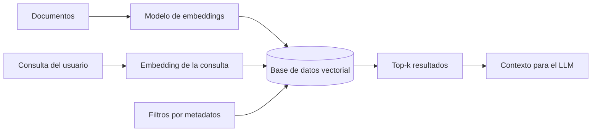

# Base de datos vectorial

## Introduccion

Una vez que se decide representar el significado del texto con embeddings, aparece un problema practico: ¿donde se guardan esos vectores y como se buscan rapidamente entre millones de ellos? Una base de datos relacional clasica no esta disenada para responder "dame los 10 vectores mas parecidos a este otro" en milisegundos. Para eso existen las bases de datos vectoriales: sistemas especializados en almacenar y buscar embeddings por similitud.

Este capitulo explica que es una base de datos vectorial, como funciona la busqueda por similitud, que opciones hay y por que es una pieza estandar en cualquier sistema con RAG.

---

## Definicion simple

Una base de datos vectorial es un almacen optimizado para guardar embeddings y encontrar rapidamente los mas parecidos a uno dado.

En simple: como un buscador, pero por significado en lugar de por palabras exactas.

---

## Explicacion tecnica

Una base de datos vectorial guarda vectores de alta dimension (tipicamente 384, 768, 1536 o 3072 numeros por vector) junto con metadatos asociados (id, texto original, fuente, fecha, autor, etc.). Su operacion central es la busqueda por similitud: dado un vector de consulta, devolver los k mas cercanos segun una metrica de distancia.

### Metricas de distancia

- **Coseno:** mide el angulo entre vectores. Es la mas comun para texto porque ignora la magnitud y compara solo direcciones.
- **Producto punto:** util si los vectores estan normalizados.
- **Distancia euclidiana:** util en algunos modelos de imagenes.

### El problema de la escala

Comparar un vector de consulta contra millones de vectores almacenados, uno por uno, es lento. Los algoritmos de busqueda exacta no escalan. Por eso las bases vectoriales usan tecnicas de busqueda aproximada (ANN, Approximate Nearest Neighbors) que sacrifican un poco de precision a cambio de mucha velocidad:

- **HNSW (Hierarchical Navigable Small World):** indice basado en grafos. Muy popular y rapido.
- **IVF (Inverted File Index):** agrupa vectores en clusters y solo busca dentro de los clusters mas relevantes.
- **PQ (Product Quantization):** comprime vectores para reducir memoria a costa de algo de precision.
- **ScaNN, DiskANN:** variantes optimizadas para distintos escenarios.

Estas tecnicas devuelven los k vecinos aproximados, no necesariamente los exactos, pero con muy alta probabilidad de coincidir.

### Filtrado por metadatos

Las bases vectoriales modernas combinan busqueda por similitud con filtros estructurados sobre los metadatos. Por ejemplo: "los 5 vectores mas parecidos a este, entre documentos del 2024, en idioma espanol y categoria 'soporte'". Esta combinacion (busqueda hibrida) es esencial en RAG sobre datos reales.

### Busqueda hibrida

Para muchos casos, la mejor calidad se obtiene combinando busqueda por embeddings (semantica) con busqueda por palabras clave (BM25, full-text). La busqueda hibrida fusiona ambas listas de resultados y suele superar a cualquiera de las dos por separado.

### Opciones populares

- **Open source:** FAISS (libreria), Chroma, Qdrant, Weaviate, Milvus, pgvector (extension de Postgres).
- **Cloud / managed:** Pinecone, Vespa, Azure AI Search, Vertex AI Vector Search.
- **Embebidas:** SQLite con sqlite-vec, DuckDB con extensions.

La eleccion depende de escala, latencia, presupuesto y de si ya hay una base de datos relacional en el stack (en cuyo caso pgvector suele ser la opcion mas simple).

---

## Ejemplo practico

Un sistema de soporte tecnico tiene 200.000 articulos en su base de conocimiento. Cuando un usuario hace una pregunta:

1. Se calcula el embedding de la pregunta.
2. Se consulta la base vectorial: "dame los 5 articulos cuyo embedding sea mas parecido a este, filtrando por idioma=es y producto=plataformaX".
3. La base devuelve los 5 articulos en menos de 50 ms, incluyendo titulo y url.
4. Esos articulos se inyectan como contexto en el prompt del LLM y este responde basandose en ellos.

Sin base de datos vectorial, ese paso 2 tomaria segundos o minutos a esa escala, haciendo el sistema inviable.

---

## Analogia facil

Una base de datos vectorial se parece a una biblioteca enorme donde los libros no estan ordenados por titulo ni por autor, sino por tema. Si llegas con una pregunta, el bibliotecario te lleva directamente al estante donde estan los libros mas parecidos al tema de tu pregunta, aunque no compartan ni una palabra del titulo. No busca por las letras de tu consulta, busca por el significado.

---

## Diagrama

---

## Relacion con los demas conceptos

- Es el almacen donde viven los [Embeddings](06-embeddings.md) en cualquier sistema de produccion.
- Es la pieza de infraestructura central del [RAG](14-rag.md): sin base vectorial, no hay recuperacion semantica eficiente.
- Aporta [Contexto](03-contexto.md) dinamico relevante a las llamadas al [LLM](05-llm.md).
- Un [Agente](11-agente.md) puede consultar la base vectorial como una de sus herramientas para responder preguntas con fundamento.
- En sistemas con [Guardrails](15-guardrails.md), la base vectorial puede usarse tambien para detectar similitud con prompts maliciosos conocidos.
- Las [Evaluaciones](12-evaluaciones.md) de un sistema RAG miden recall, precision y relevancia de los resultados que devuelve la base vectorial.

---

## Idea clave

Una base de datos vectorial no es una base de datos relacional con vectores: es un sistema disenado para responder rapido a "que se parece a esto" sobre millones de registros. Sin esta pieza, RAG y la busqueda semantica a escala serian imposibles de servir en tiempo real.

---

## Resumen del capitulo

Una base de datos vectorial almacena embeddings y permite encontrar los mas parecidos a un vector de consulta usando algoritmos de busqueda aproximada como HNSW o IVF. Combinada con filtros por metadatos y busqueda hibrida con palabras clave, es la infraestructura estandar para sistemas con RAG. Existen muchas opciones, desde extensiones para Postgres hasta servicios gestionados, y la eleccion depende del stack y de la escala del sistema.
