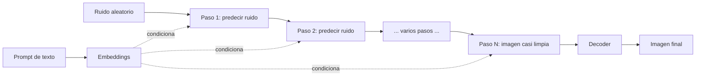

# Modelos de difusion

## Introduccion

Cuando se piensa en IA generativa, el primer ejemplo suele ser ChatGPT generando texto. Pero hay otra rama enorme de la IA generativa que produce imagenes, audio y video: los modelos de difusion. Son los que estan detras de Stable Diffusion, Midjourney, DALL-E, Sora y la mayoria de los generadores de imagenes y video modernos. Aunque su salida es muy distinta a la de un LLM, comparten varios principios fundamentales y conviene entenderlos para tener una vision completa de la IA actual.

Este capitulo explica que son los modelos de difusion, como funcionan a alto nivel y por que destronaron a las tecnicas anteriores en generacion de imagenes.

---

## Definicion simple

Un modelo de difusion aprende a quitar ruido a una imagen poco a poco. Para generar una imagen nueva, parte de ruido puro y lo va limpiando hasta que aparece una imagen.

En simple: empiezan con television en blanco y negro y la van aclarando hasta que aparece una foto.

---

## Explicacion tecnica

Los modelos de difusion se entrenan en dos procesos opuestos:

### Proceso forward (anadir ruido)

Se toma una imagen real y se le va anadiendo ruido gaussiano paso a paso, tipicamente durante cientos o miles de pasos, hasta que la imagen se convierte en ruido puro indistinguible. Este proceso es deterministico y no requiere aprendizaje.

### Proceso reverso (quitar ruido)

Se entrena una red neuronal (generalmente una U-Net o un Transformer) para predecir, dado un paso ruidoso, cual era el ruido que se le anadio. Si la red lo aprende bien, puede invertir el proceso: empezar desde ruido puro y, paso a paso, ir quitando ruido hasta producir una imagen nueva que se parece a las del conjunto de entrenamiento.

Cada paso de denoising no recupera la imagen original; va construyendo una imagen plausible que respeta lo que el modelo aprendio sobre el dominio (caras, paisajes, objetos, estilos artisticos).

### Condicionamiento

Para guiar la generacion no basta con quitar ruido al azar. Se condiciona el modelo con una entrada externa. Las formas mas comunes son:

- **Texto:** un prompt como "un astronauta a caballo en estilo van Gogh". El texto se convierte en embeddings (con un encoder tipo CLIP) y se inyecta en cada paso de denoising. Asi nace text-to-image.
- **Imagen base:** se parte no de ruido puro sino de una imagen ruidosa real, lo que permite editar (image-to-image).
- **Mascara:** se modifican solo zonas marcadas (inpainting).
- **ControlNet:** se condiciona con bordes, poses o profundidad para tener control fino.

### Latent diffusion

Los modelos modernos como Stable Diffusion no operan sobre pixeles directamente; operan en un espacio latente comprimido por un autoencoder. Eso reduce drasticamente el coste de computo y permite generar imagenes de alta resolucion en hardware razonable. La salida del proceso de difusion en el espacio latente se decodifica al final como pixeles.

### De imagenes a otros dominios

La misma idea se aplica a:

- **Audio:** musica, voz, efectos. Modelos como AudioLDM o MusicGen.
- **Video:** Sora, Veo, Runway. Anaden la dimension temporal y mantienen consistencia entre frames.
- **3D:** generacion de meshes y campos de radiacion neuronales.
- **Moleculas y proteinas:** difusion en espacios estructurales para diseno de farmacos.

---

## Ejemplo practico

Prompt: "Un faro en una costa rocosa al atardecer, estilo acuarela".

1. El texto se convierte en embeddings.
2. Se parte de un tensor de ruido aleatorio en el espacio latente.
3. Durante 30 a 50 pasos, el modelo predice cuanto ruido quitar en cada uno, condicionado por los embeddings del texto.
4. El tensor latente final se decodifica con el autoencoder a una imagen de 1024x1024 pixeles.
5. El resultado es una acuarela coherente con el prompt, que no existia antes.

Cada vez que se ejecuta el mismo prompt con un seed distinto se obtiene una imagen diferente pero todas del mismo "espiritu".

---

## Analogia facil

Imagina mirar una foto en una pantalla con muchisima estatica encima. Apenas se ve nada. Si alguien te dice "es un faro al atardecer", tu mente empieza a rellenar las formas que tiene sentido que esten ahi. Un modelo de difusion hace algo parecido pero en serio: parte de ruido puro y, con la pista del prompt, va decidiendo en cada paso que parte del ruido era "imagen de un faro" y la va revelando hasta que la imagen completa aparece.

---

## Diagrama

---

## Relacion con los demas conceptos

- Comparte la base de [Redes neuronales](17-redes-neuronales.md) profundas, especialmente U-Nets y [Transformers](19-transformer.md) (DiT).
- Usa [Embeddings](06-embeddings.md) de texto (tipo CLIP) para el condicionamiento, conectando lenguaje e imagen.
- Se beneficia del [Aprendizaje por transferencia](18-transfer-learning.md): hay miles de checkpoints derivados de Stable Diffusion para estilos especificos.
- Acepta [Fine-tuning](07-fine-tuning.md) y [LoRA](23-lora.md) para personalizar estilos, personajes o conceptos.
- La [Cuantizacion](24-cuantizacion.md) permite correrlos en GPUs de consumo o incluso en moviles.
- Los [Guardrails](15-guardrails.md) son criticos en estos modelos para evitar contenido inapropiado o infracciones de derechos.
- Un [Agente](11-agente.md) multimodal puede invocar modelos de difusion como herramienta cuando necesita generar imagenes.

---

## Idea clave

Generar imagenes no es dibujar de izquierda a derecha como un humano: es revelar una imagen que ya estaba escondida en el ruido, guiada por un prompt. Esa idea simple, llevada a escala industrial, es la base de toda la generacion visual moderna.

---

## Resumen del capitulo

Los modelos de difusion aprenden a invertir un proceso de adicion de ruido. Para generar contenido nuevo, parten de ruido aleatorio y lo van limpiando paso a paso, condicionados por un prompt. La variante mas comun, latent diffusion, opera en un espacio comprimido para reducir costo. Con esta arquitectura se generan imagenes, audio, video, 3D y estructuras moleculares. Junto con los LLMs, son la otra gran rama de la IA generativa moderna.
